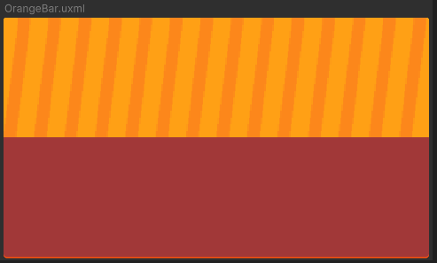
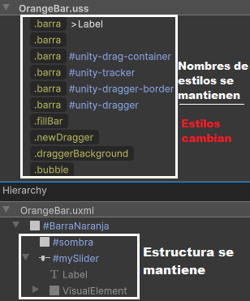
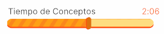
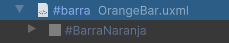

# Barras

Las barras son componentes visuales esenciales para mostrar progreso o valores en tiempo real, como el avance de una tarea o el nivel de un parámetro. Actualmente, existe solo un tipo de barra, que funciona como un slider interactivo. Estas barras se utilizan principalmente en configuraciones, permitiendo a los usuarios ajustar valores de manera intuitiva.

## Construcción General

Todas las barras, por construcción, siguen la misma estructura, siendo un componente de UiToolkit (Slider) adaptado para el diseño del juego. En este aspecto, todos los elementos configurables son cargados y manejados desde el USS, el cual es único para cada barra, ya que varían en colores y otros detalles visuales.



## Controlador

Las barras existentes utilizan el mismo controlador, que se encarga de dibujar dinámicamente tanto el fondo de la barra como el "dragger" (control deslizante). Este controlador adapta su comportamiento a cada barra, usando el USS único de la barra instanciada, lo que le permite aplicar dinámicamente los colores y estilos correspondientes. Además, el controlador incluye métodos adicionales que permiten gestionar el valor asociado a la barra, facilitando su actualización y manipulación en tiempo real, según las interacciones del usuario o el progreso de una acción.


```csharp
namespace UI.Controllers.Components.Elements
{
    public class BarComponent
    {
        private string _barName; //Nombre unico de la barra
        private Slider _slider; 
        private VisualElement _dragger; 
        private VisualElement _fillBar;
        private VisualElement _newDragger;
        private VisualElement _draggerBackground;

        // Evento que se disparará cuando el valor cambie
        public event System.Action<string, float> OnValueChanged;

        //Más métodos...
    }
}
```

## Uso

Esta barra se lleva al UIDocument de la interfaz como cualquier otro componente, pero al tener un controlador, es necesario instanciarla a través de su clase y una referencia. además, si es necesario, esta barra cuenta con la opción de agregar un identificador para el manejo de la lógica.



```csharp
//En interfaz
BarComponent barra; //Instanciado

barra = new BarComponent(root.Q<TemplateContainer>("barra"), nombreDeLaBarra /*opcional*/); //Se envia referencia a controlador
```

## Listado de elementos

| Nombre               | Visualización                                            |
|----------------------|-----------------------------------------------------------|
| Barra Azul       |  |
| Barra Naranja           |  |