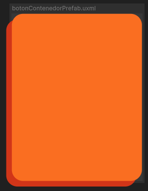
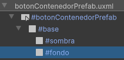
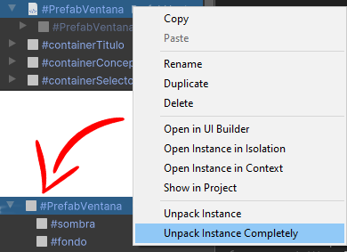

# Containers

Los **Botones tipo Container** son botones especiales diseñados para **aceptar otros elementos dentro de ellos**, ya sea textos, imágenes u otros componentes de UI. Estos botones actúan como "contenedores" dentro de la interfaz, permitiendo agrupar múltiples elementos o interacciones dentro de un único contenedor visual y funcional.

---

## Listado de Elementos

### BotonContenedorPrefab



El **BotonContenedorPrefab** es un tipo de botón contenedor que proporciona una estructura predefinida para contener otros botones o elementos interactivos. Este prefab puede ser personalizado según los requerimientos de la interfaz.


**Uso**

El **BotonContenedorPrefab** debe ser arrastrado a la escena y desempaquetado para permitir su edición. Una vez desempaquetado, se accede al **VisualElement "fondo"** del contenedor, donde se pueden agregar todos los elementos que se deseen, como otros botones, imágenes, textos o cualquier otro componente interactivo necesario para la interfaz. Igualmente, se puede renombrar el botón según guste.




```csharp
//En interfaz
Button button; //Instanciado

button = _root.Q<Button>("nombreDelBoton"); //Referencia directa
```