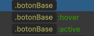

# Botones

Los **botones** son componentes esenciales en la interfaz de usuario, diseñados para permitir la interacción del usuario con la aplicación o juego. Sirven para ejecutar acciones específicas al hacer clic en ellos. Su apariencia y comportamiento pueden personalizarse según las necesidades de la interfaz, ofreciendo diferentes estilos y animaciones de interacción.

---

## Construcción general

Todos los botones tienen una construcción general que proviene de un **USS** genérico llamado `botones` (con excepción de los botones en otros casos específicos). Este USS proporciona la plantilla base para las animaciones de interactividad a través de **USS** (como los estados `:hover` y `:active`). 

En cuanto a la construcción del botón en sí, esta varía dependiendo del tipo de botón utilizado.

---

## Tipos de Botones

A continuación se describen los diferentes tipos de botones, que se diferencian en la forma en que son utilizados y configurados dentro del sistema:

- **[Containers](containers)**: Botones que se utilizan dentro de contenedores o estructuras específicas, donde actúan como elementos interactivos dentro de un contenedor más grande.
  
- **[Prefabs](prefabs)**: Botones predefinidos que se utilizan como prefabricados (prefabs) dentro de la interfaz. Estos prefabs están configurados con una estructura estándar que se puede reutilizar en diferentes partes de la interfaz.

- **[Otros](otros)**: Este tipo de botones abarca los que no se ajustan a los dos anteriores. Pueden incluir botones de estilo especial o botones personalizados con comportamientos únicos para funciones específicas.

---

