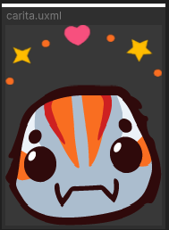
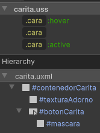

# Otros

Esta sección incluye botones que no encajan en ninguna categoría específica, pero que tienen un propósito único dentro de la interfaz. Estos botones están diseñados para casos especiales o funcionalidades particulares, y aunque siguen los mismos principios de diseño que los botones principales, pueden contar con características o comportamientos específicos que los distinguen. 

---

## Listado de Elementos

### AragniScore

 

Botón usado para la lógica de asignar el puntaje en MasterUI. Por construcción, utiliza su propio USS, pero sigue los mismos patrones que los otros botones. Cuenta con una porción para la textura de adorno y otra para el botón en sí.

Este botón, además, cuenta con su propio controlador llamado **AragniButtonComponent**.

```csharp
namespace UI.Controllers.Components.Elements
{
    public class AragniButtonComponent
    {
        private VisualElement _confetti;
        private VisualElement _mask;
        private Button _button;
        private int _position;

        //Más métodos...
    }
}
```

**Uso**

Este botón se lleva al UIDocument como cualquier otro, pero al tener un controlador, es necesario instanciarlo a través de su clase y una referencia. Este botón, para el manejo de su lógica, debe recibir además la posición en la que se encuentra, lo cual es importante para el manejo de las animaciones y el puntaje en sí.


```csharp
//En interfaz
AragniButtonComponent _aragniButtonComponent; //Instanciado

_aragniButtonComponent = new AragniButtonComponent(root.Q<VisualElement>("carita"), posicionBoton); //Se envia referencia a controlador
```


