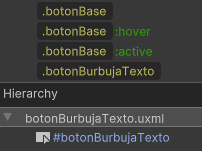

# Prefabs

Los **Prefabs** son elementos preconfigurados que se utilizan en la interfaz para facilitar la creación y reutilización de componentes. Estos elementos ya vienen con un estilo configurado y su logica puede ser modificada según las necesidades de la interfaz.

---

## Construcción

Todos los botones prefabricados están construidos en base al USS general "botones", y cada botón prefabricado además cuenta con una clase propia para el manejo de su textura. Por construcción, todos son simplemente un botón con su nombre correspondiente.




---

## Uso

Se arrastran directamente a la interfaz y se envuelven en un **TemplateContainer**. La gestión lógica de estos elementos es responsabilidad de la interfaz en cuestión, ya que cada botón o prefab puede tener un comportamiento diferente dependiendo de la interacción que se requiera.


```csharp
//En interfaz
Button button; //Instanciado

button = _root.Q<Button>("botonVer"); //Referencia directa
```

---

## Listado de Elementos


| Nombre               | Visualización                                            |
|----------------------|-----------------------------------------------------------|
| Boton Activar        |  |
| Boton Back           |  |
| Boton Book           |  |
| Boton Burbuja Texto  |  |
| Boton Cancelar       |  |
| Boton Cerrar         |  |
| Boton Config         |  |
| Boton Config Prefab  |  |
| Boton Confirmar      |  |
| Boton Home           |  |
| Boton Info           |  |
| Boton Next           |  |
| Boton Opciones       |  |
| Boton Pausa          |  |
| Boton Regresar       |  |
| Boton Ruleta         |  |
| Boton Salir          |  |
| Boton Seguir         |  |
| Boton Ver            |  |


