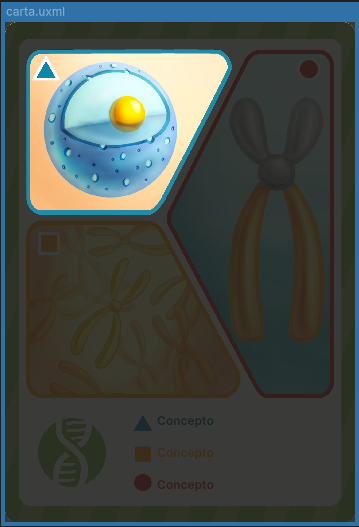
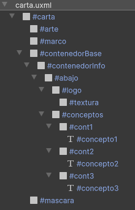

# Cartas

Las cartas son componentes que actúan como gestores de contenedores para los datos de las cartas del juego. Están diseñadas para almacenar y organizar información relevante, como atributos, imágenes y otros datos asociados a cada carta. Cada carta se presenta visualmente de manera única, permitiendo que los jugadores interactúen con ellas de forma dinámica. 

---

## Listado de Elementos

### Carta de Conceptos

La carta de conceptos es la carta genérica del juego, que sirve como plantilla base para representar los diferentes tipos de cartas en el sistema. Esta carta almacena los atributos y datos fundamentales, y su estructura es reutilizada para crear variaciones según el tipo de mazo que se esté jugando. 

**Construcción**



La carta, por construcción, contiene todo lo necesario para que una carta pueda ser mostrada correctamente. Tiene por separado el arte de la carta, el marco y el logo del mazo. Además, cuenta con tres **Labels** para el anclado de los diferentes conceptos. Finalmente, dispone de una máscara que permite la selección de un concepto o la visualización dinámica del reverso de la carta.

**Controlador**

Las cartas de concepto cuentan con su propio controlador, diseñado para gestionar y cargar los diferentes datos asociados a cada carta. Este controlador se encarga de organizar y actualizar los atributos, imágenes y otros elementos visuales de la carta, asegurando que se muestren correctamente en la interfaz del juego. Además, facilita la interacción con los datos dinámicos de la carta, como el cambio de conceptos y el tamaño de la fuente del mismo o la visualización de su sombreado al seleccionar un concepto.

```csharp
namespace UI.Controllers.Components.Elements
{
    public class CardComponent 
    {
        //fondo
        private VisualElement _art; //arte de la carta
        private VisualElement _frame; //marco de la carta
        private VisualElement _mask; //mascara de la carta
        private VisualElement _logo; //logo del mazo de la carta
        private bool _customTextSize; //Flag para ajustar tamaño unico de texto segun se necesite
        

        //informacion
        private List<Label> _concepts = new List<Label>();
    }
}
```


**Uso**

Este componente se lleva al UIDocument de la interfaz como cualquier otro componente, pero al tener un controlador, es necesario instanciarlo a través de su clase y una referencia. Además, si es necesario, cuenta con la opción de poder agregar una flag para ajustar el texto de los conceptos dinamicamente (esto se debe realizar manualmente según la interfaz).

```csharp
private CardComponent _card; // Componente para manejo de carta

_card = new CardComponent(_root.Q<TemplateContainer>("carta")); //Envio de referencia
```


