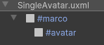
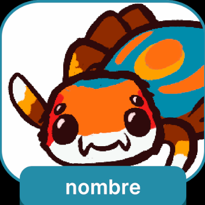
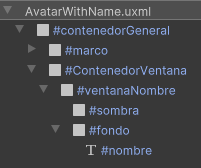

# Contenedores Avatar

Los **contenedores Avatar** son elementos diseñados para mostrar representaciones visuales de los jugadores dentro del juego en sí. Estos contenedores se utilizan para presentar una imagen o ícono que identifique a una entidad, y pueden incluir elementos adicionales como marcos o bordes para diferenciar a los jugadores o personajes entre sí. 

---

## Listado de elementos

### SingleAvatar

El **SingleAvatar** es un contenedor que incluye una imagen de avatar junto con un marco personalizado. Este marco puede tener un color distintivo para cada jugador, ayudando a identificar visualmente a los usuarios en el sistema. El diseño es simple, centrado en la imagen del avatar, pero se complementa con el marco para destacar la identidad del jugador.

**Uso**

Como cualquier otro componente visual, este se arrastra a la interfaz y se ajusta según sea necesario. El **SingleAvatar** es flexible y se puede posicionar o redimensionar de acuerdo con las necesidades de la interfaz. Este componente no cuenta con un controlador específico, por lo que su funcionalidad y comportamiento dependen completamente de cómo se configure en la interfaz.

---

### AvatarWithName

El **AvatarWithName** es un contenedor similar al **SingleAvatar**, pero con una característica adicional: incluye una ventana centrada que muestra el nombre del jugador. Este contenedor mantiene todas las propiedades de **SingleAvatar**, como la inclusión del avatar y el marco distintivo, pero además permite que el nombre del jugador sea visualizado de manera destacada junto a la imagen del avatar.

**Uso**

Como cualquier otro componente visual, este se arrastra a la interfaz y se ajusta según sea necesario. El **AvatarWithName** es flexible y se puede posicionar o redimensionar de acuerdo con las necesidades de la interfaz. Este componente no cuenta con un controlador específico, por lo que su funcionalidad y comportamiento dependen completamente de cómo se configure en la interfaz.

