# Contenedores ListView

Los **contenedores ListView** son componentes dinámicos diseñados para mostrar listas de elementos en la interfaz. Estos contenedores son especialmente útiles cuando se manejan colecciones de datos que pueden cambiar en tiempo real, como una lista de jugadores, mensajes o cualquier otro tipo de información que se actualice frecuentemente. Se utilizan en conjunto con un componente **ListView**, el cual facilita la organización y visualización de estos elementos de manera ordenada y eficiente.

---

## Uso

Para cargar un contenedor dinámicamente en un **ListView**, se deben seguir una serie de pasos para asegurar una implementación correcta:

---

### 1. Asignar un ListView al UIDocument

Primero, es necesario asignar el **ListView** al **UIDocument** de la interfaz. El **ListView** debe tener un nombre asignado para su identificación. Si se desea cambiar el estilo del **ListView** (por ejemplo, modificar el dragger), será necesario aplicar un estilo que modifique directamente las clases de la lista. Además, se debe tener en cuenta el tamaño que ocuparán los contenedores dentro del **ListView**. Esto se puede gestionar a través de **UIToolkit** modificando la variable `VirtualizationMethod`, la cual define el espacio que debe asignarse a los contenedores. Esta variable puede ser configurada como **Fixed** (fijo) o **Dynamic** (dinámico), según las necesidades de la interfaz.

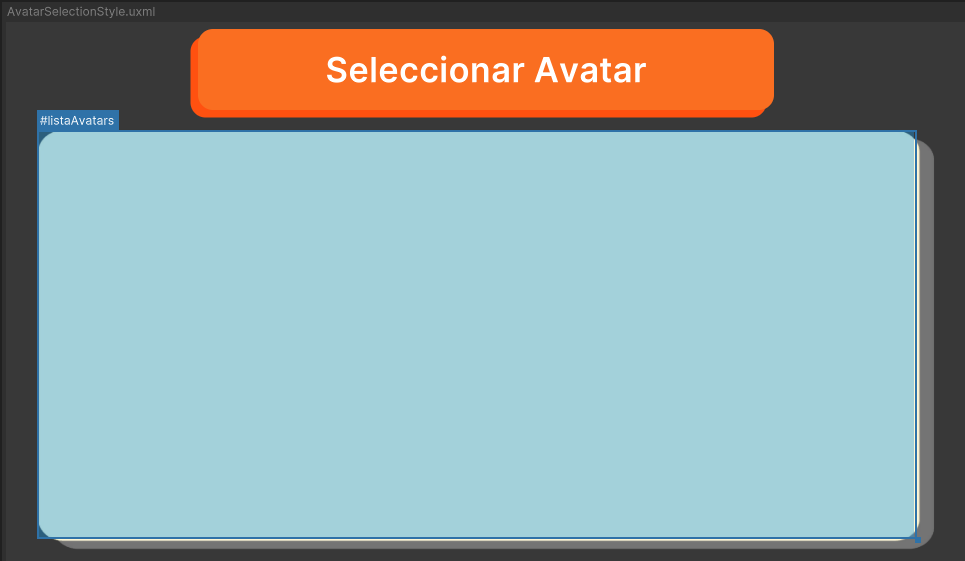

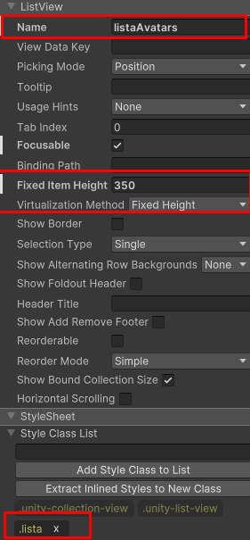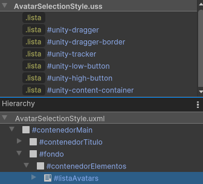

---

### 2. Preparar un contenedor para el ListView

A continuación, se debe diseñar y preparar un contenedor y su controlador para que el **ListView** pueda dibujarlo dinámicamente. Dependiendo de las necesidades de la interfaz, puede ser conveniente reutilizar un contenedor existente o crear uno específico para el **ListView**. Es importante considerar los datos que se van a mostrar dentro del **ListView** y si habrá elementos interactivos, como botones o toggles, dentro de estos contenedores.


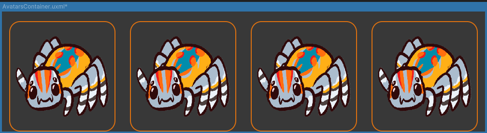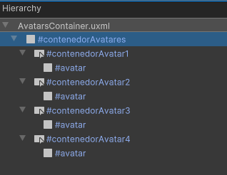


El controlador del contenedor debe seguir las prácticas de construcción de otros componentes, como recibir una referencia al contenedor. Este proceso es similar al que se realiza en cualquier otro controlador, con la diferencia de que se hace en una función en vez de un constructor. Además debe contar (si es necesario) con una función que reciba los datos y los coloque en la interfaz. 

```csharp
namespace UI.Controllers.Components.List.Containers
{
    public class AvatarsListViewController 
    {
        //Elementos UI del contenedor
        private List<Button> _avatarButtonsContainer = new List<Button>(); //Listado de botones
        private List<EventCallback<ClickEvent>> _clickCallbackList = new List<EventCallback<ClickEvent>>(); //Eventos de los botones

        //Inicailizado de Contenedor
        public void SetVisualElement(VisualElement rootContainer)
        {
            //Instanciado de elementos
            InitAvatarButtonsContainer(rootContainer);

            //instanciado de callbacks
            InitButtonCallbacks();
        }

        //Set de datos
        public void SetVisualElementData(List<(Sprite, string, Action<ClickEvent>)> containerAvatarsData)
        {
            for (int i = 0; i < _avatarButtonsContainer.Count; i++)
            {
                _avatarButtonsContainer[i].style.display = containerAvatarsData[i].Item1 == null ? DisplayStyle.None : DisplayStyle.Flex;

                if(containerAvatarsData[i].Item1 != null)
                {
                    _avatarButtonsContainer[i].Q<VisualElement>("avatar").style.backgroundImage = new StyleBackground(containerAvatarsData[i].Item1);
                    ManageCallback(i, containerAvatarsData[i].Item3);
                }
            }
        }
    }
}
```

Si no se desea tener un efecto de "hover" dentro del **ListView**, se debe incluir una clase en el **USS** del contenedor que elimine o haga transparente el efecto de hover y asignarlo dentro del controlador en el método que recibe las referencias.


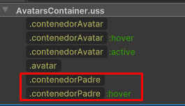

```csharp
//Inicailizado de Contenedor
public void SetVisualElement(VisualElement rootContainer)
{
    //Instanciado de elementos
    InitAvatarButtonsContainer(rootContainer);

    //instanciado de callbacks
    InitButtonCallbacks();

    //Eliminado de hover (LISTVIEW) 
    rootContainer.AddToClassList("contenedorPadre"); //Realizado solo si se desea eliminar hover
}
```

---

### 3. Uso desde la interfaz

Finalmente, en la interfaz, se debe referenciar directamente al **ListView** e inicializarlo. Para inicializar el **ListView**, se necesitan los datos que se mostrarán, ya preparados previamente, y el **VisualTreeAsset** del contenedor a dibujar dinámicamente. Este **VisualTreeAsset** debe ser cargado idealmente desde **Resources** para facilitar la vinculación con el **ListView** dada la naturaleza de las interfaces.

**Ejemplo**:

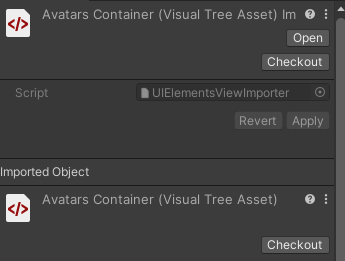

 El nombre del contenedor es "AvatarsContainer"

```csharp
public class AvatarSelectionUI : Core.UI
{
    private ListView _avatarsListView; //ListView de avatares

    public override void SetOpen<T>(T context) where T : class
    {
        _object.SetActive(true);
        var _root = _object.GetComponent<UIDocument>().rootVisualElement;


        _avatarsListView = _root.Q<ListView>("listaAvatars");

        //Inicializacion Datos
        GetAvatarSprites();

        //Mostrar Datos
        InitAvatarsListView();
    }

    //-----------MANEJO DE LIST VIEW-----------
    private void InitAvatarsListView()
    {
        // Cargar el archivo UXML desde Resources
        var assetRootContainer = Resources.Load<VisualTreeAsset>("AvatarsContainer"); // cargado de contenedor desde Resources
        if (assetRootContainer != null)
        {
            List<List<(Sprite, string)>> avatarContainersList = CreateAvatarContainerList(); //Preparacion de datos a mostrar
            MakeCardListItem(assetRootContainer); // Instanciado elemento Contenedor
            BindCardListItem(avatarContainersList); // Seteado y recorrido de sprites


            _avatarsListView.itemsSource = avatarContainersList;
            _avatarsListView.selectionType = SelectionType.None;


        }
        else
        {
            Debug.LogError("No se pudo cargar el archivo UXML.");
        }


    }

}
```


Luego, se utilizan los métodos `MakeItem` y `BindItem` del **ListView**. El método `MakeItem` es responsable de inicializar los contenedores, utilizando el método de instanciado de referencias del controlador del contenedor (el cual debería llamarse `SetVisualElement`). Por otro lado, `BindItem` toma los datos preparados y los asigna al contenedor recién creado utilizando el método del controlador `SetVisualElementData`. Este proceso se realiza dinámicamente según la cantidad de datos que deben mostrarse por contenedor.

```csharp
private void MakeCardListItem(VisualTreeAsset assetRootContainer)
{
    _avatarsListView.makeItem = () =>
    {
        //Instanciado de UXML (ContenedorCarta)
        var newContainer = assetRootContainer.Instantiate(); //Se instancia un contenedor Nuevo
        var listLogic = new AvatarsListViewController(); // Se instancia logica

        newContainer.userData = listLogic; //Se asocia container con logica
        listLogic.SetVisualElement(newContainer); //Se setean datos al container nuevo
        return newContainer;
    };
}

private void BindCardListItem(List<List<(Sprite, string)>> avatarContainersList)
{
    _avatarsListView.bindItem = (item, index) =>
    {
        // Auxiliares
        List<(Sprite, string)> avatarContainer = avatarContainersList[index]; // Contenedor actual (4 avatares)
        List<(Sprite, string, Action<ClickEvent>)> avatarContainerWithAction = new List<(Sprite, string, Action<ClickEvent>)>();

        // Iterar sobre los avatares en el contenedor y agregarles el Action
        for (int i = 0; i < avatarContainer.Count; i++)
        {
            Sprite sprite = avatarContainer[i].Item1;
            string avatarName = avatarContainer[i].Item2;

            // Cracion de clickEvent
            Action<ClickEvent> clickCallback = (e) =>
            {
                ClickAvatarOption(e, avatarName);
            };

            avatarContainerWithAction.Add((sprite, avatarName, clickCallback));
        }

        var containerLogic = item.userData as AvatarsListViewController;
        containerLogic.SetVisualElementData(avatarContainerWithAction); //Envio de logica
    };
}
```

---

### Consideraciones

Los **ListView** gestionan dinámicamente sus contenedores, pero no los crean desde cero. En realidad, lo que hace Unity es reutilizar los contenedores que no están siendo utilizados y reasignarles nuevos datos. Aunque por código parezca que se están creando contenedores nuevos, la reutilización de los contenedores puede generar una serie de problemas al intentar realizar operaciones específicas.

Por ejemplo, si un contenedor con cuatro elementos debe mostrar solo tres en un momento dado, la naturaleza de reutilización de los **ListView** puede causar artefactos visuales. Durante una fracción de segundo, el contenedor podría mostrar "datos fantasmas", ya que en el primer frame se estarán visualizando datos antiguos en el contenedor que deberían haberse actualizado. Esto significa que el número de elementos en el contenedor debe coincidir con la cantidad de datos disponibles para evitar que el **ListView** no actualice correctamente el contenedor y genere estos artefactos visuales.

Además, debido a la reutilización de contenedores, hay que tener cuidado al suscribir y registrar callbacks para los elementos interactivos dentro de cada contenedor. Como los contenedores se reutilizan, existe la posibilidad de que los callbacks se registren más de una vez si el mismo contenedor se reutiliza varias veces. Esto puede provocar que el método del callback se dispare múltiples veces de forma no deseada.

Para evitar este problema, es fundamental llevar un registro de si el contenedor ya ha registrado un callback. Así, el callback puede actualizarse dinámicamente conforme el contenedor se reutiliza. Una forma sencilla de hacer esto es mantener una variable que guarde el estado del callback y la use para verificar si se ha registrado o no.

---

## Listado de Elementos

### AvatarsContainer


Contenedor utilizado para la selección de avatares. Contiene cuatro botones, cada uno de los cuales devuelve el avatar correspondiente para actualizar la selección. Cada botón tiene la misma construcción.

**Controlador**  
El controlador maneja los datos a través de dos listas: una que guarda las referencias a los botones y otra que almacena los callbacks asociados a cada botón.

```csharp
namespace UI.Controllers.Components.List.Containers
{
    public class AvatarsListViewController 
    {
        private List<Button> _avatarButtonsContainer = new List<Button>(); //Listado de contenedor de cartas
        private List<EventCallback<ClickEvent>> _clickCallbackList = new List<EventCallback<ClickEvent>>(); //Listado de callbacks

        //Resto de métodos....
    }
}
```

---

### CardsContainer

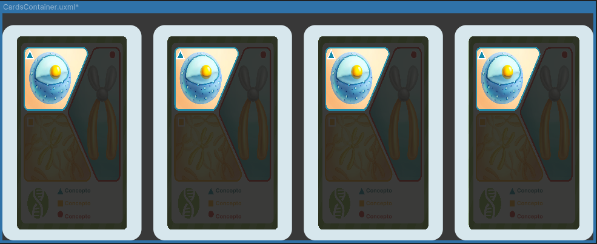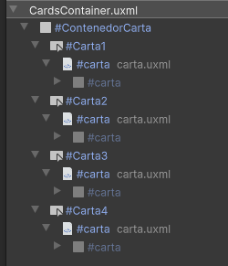

Contenedor diseñado para mostrar las cartas de un mazo, mostrando cuatro cartas por cada mazo. Utiliza el componente **Carta** para los datos de las cartas, por lo que cada carta es idéntica. Además, cada componente está envuelto en un botón, lo cual podría ser útil para implementaciones futuras.

**Controlador**  
El controlador maneja los datos mediante dos listas: una para las referencias al contenedor (que se asigna directamente a los botones) y otra para las referencias a las cartas. Las cartas son inicializadas y sus referencias se derivan al componente **CardComponent**.

```csharp
namespace UI.Controllers.Components.List.Containers
{
    public class CardsListViewController
    {

        //Elements UI
        private List<Button> _cardButtonsContainer = new List<Button>(); //Listado de contenedor de cartas
        private List<CardComponent> _cardsUI = new List<CardComponent>(); //Listado de datos de cartas

        //Resto de métodos....
    }
}
```

---

### PlayerSelectionDrainContainer

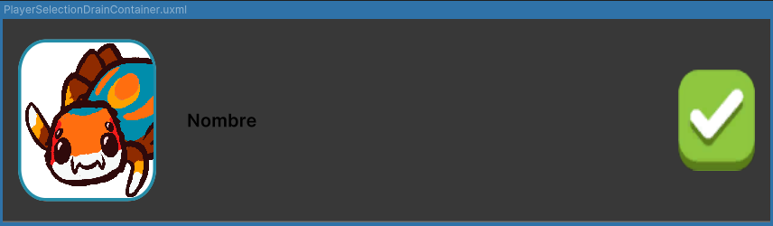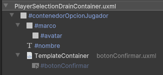

Contenedor utilizado para la selección de un jugador, específicamente para el modo de drenaje, aunque su construcción es lo suficientemente genérica como para usarse en otras circunstancias. El contenedor incluye un **SingleAvatar**, una **Label** para mostrar el nombre del jugador, y un botón para confirmar la selección.

**Controlador**  
El controlador maneja los datos mediante referencias directas, dado que cada contenedor solo debe mostrar los datos de un único jugador. Los callbacks también se almacenan para evitar errores relacionados con la reutilización de contenedores.

```csharp
namespace UI.Controllers.Components.List.Containers
{
    public class SelectPlayerDrainListViewController
    {
        //Datos de avatar
        private VisualElement _playerFrame;
        private VisualElement _playerAvatar;
        private Label _playerName;

        private Button _btnConfirm; //Boton
        private EventCallback<ClickEvent> _clickCallback; //Callback

        //Resto de métodos....
    }
}
```

---

### SubjectSelectionContainer

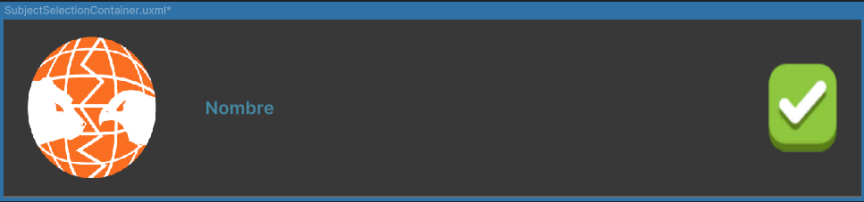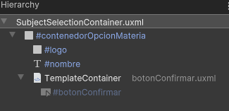

Contenedor diseñado para la selección de una materia. Su construcción es similar a la de **PlayerSelectionDrainContainer**, pero en lugar de mostrar los datos de un jugador, muestra el logo de la materia a seleccionar.

**Controlador**  
El controlador maneja los datos mediante referencias directas, dado que cada contenedor solo debe mostrar los datos de una única materia. Los callbacks también se almacenan para evitar errores, siguiendo el mismo principio que en el **PlayerSelectionDrainContainer**.

```csharp
namespace UI.Controllers.Components.List.Containers
{
    public class SelectSubjectListViewController
    {
        //Elementos materia
        private VisualElement _subjectIcon;
        private Label _subjectName;

        private Button _btnConfirm; //Boton
        private EventCallback<ClickEvent> _clickCallback;//Callback

        //Resto de métodos....
    }
}
```


