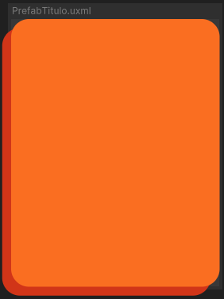

# Contenedores Prefab

Los **contenedores Prefab** son contenedores preconfigurados que sirven como plantillas reutilizables dentro de la interfaz. Estos componentes están diseñados para facilitar la creación de estructuras de diseño consistentes y eficientes que se pueden usar en diferentes partes de la interfaz.

---

## Uso

El uso de estos contenedores varía en comparación con otros componentes, ya que, aunque se deben arrastrar a la escena como cualquier otro elemento, para ser configurados adecuadamente, es necesario desempaquetar el componente en sí. Esto permite acceder a los elementos internos del contenedor y modificarlos según se estime conveniente. Una vez desempaquetado, es posible agregar, eliminar o modificar los elementos dentro del prefab, adaptando el contenido y comportamiento del componente a las necesidades específicas de la interfaz.

Lógicamente, debido a su naturaleza de plantillas reutilizables, estos componentes no cuentan con controladores propios, ya que se diseñan para ser manipulados y configurados directamente dentro de la escena según lo requiera el proyecto.

---

## Listado de elementos

### Prefab Titulo

Contenedor diseñado para ser utilizado como título en las interfaces de usuario.

**Construcción**

Este contenedor tiene una estructura simple, con un fondo y una sombra que se extiende hacia abajo a la izquierda. Los colores del fondo y la sombra se pueden modificar desde la interfaz. Si se desea agregar elementos dentro del contenedor, esto debe hacerse desde el `VisualElement` "fondo".

---

### Prefab Ventana

Contenedor usado como ventana para mostrar otros elementos dentro de una interfaz.

**Construcción**

Similar al **Prefab Titulo**, tiene un fondo y una sombra, pero la sombra se extiende hacia abajo. Los colores del fondo y la sombra son configurables desde la interfaz. Para agregar elementos dentro de este contenedor, se debe hacer desde el `VisualElement` "fondo".

---

### Prefab Sombra

Contenedor que sirve para crear efectos de sombra en la interfaz.

**Construcción**

Al igual que el **Prefab Ventana**, cuenta con un fondo y una sombra, pero la sombra es más sutil y semi-transparente. Los colores se pueden modificar desde la interfaz, y los elementos se agregan desde el `VisualElement` "fondo".

---

### Prefab Elementos

Contenedor compuesto utilizado para mostrar una ventana de opciones con otros contenedores dentro.

**Construcción**

Está dividido en dos secciones: el título y los elementos. El título tiene su propio color y sombreado, mientras que la sección de elementos tiene un color neutral. El área de elementos ocupa más espacio que la de título. Para agregar elementos a cada sección:

- El título se agrega dentro del contenedor **fondo** de **contenedorTitulo**.
- Los elementos se agregan directamente al **contenedorelementos**.
