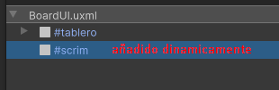
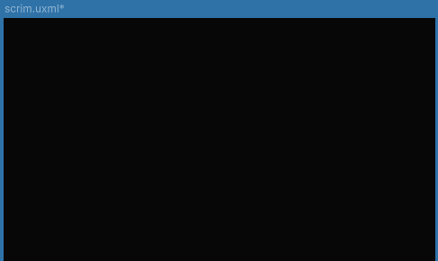
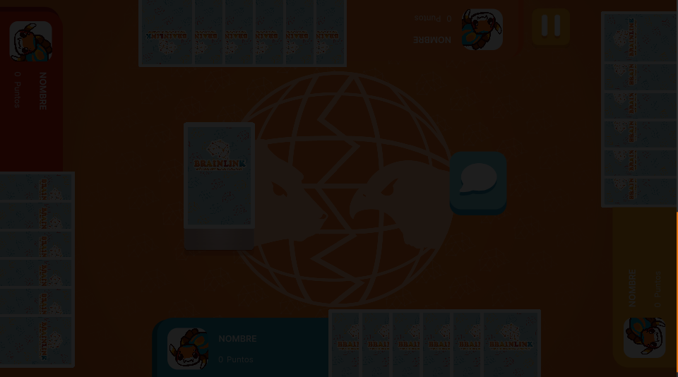

# Overlays

Los overlays son superficies transparentes o semi-transparentes que se superponen a otros elementos de la interfaz de usuario (UI). Se utilizan comúnmente para mostrar modales, pantallas de carga o cualquier elemento que necesite capturar la atención del usuario sin modificar el contenido subyacente. Estos componentes permiten ofrecer una experiencia interactiva sin interferir con la disposición general de la interfaz.

---

## Uso

A diferencia de otros componentes, los **overlays** NO requieren ser instanciados previamente en el **UIDocument**. En su lugar, se cargan dinámicamente desde el código, de manera similar a los contenedores **ListView**. Para implementarlos, es necesario cargar el **VisualTreeAsset** del overlay, aunque esta carga es manejada por la lógica del controlador del **overlay**, la interfaz en este caso, lo único que hace es instanciar la variable.

Para una correcta implementación de un **overlay**, se debe instanciar la clase del overlay en la interfaz que lo va a usar. Luego, en su constructor, el **overlay** recibe el **root** de la interfaz y crea un nuevo **VisualElement** en el que se cargará el **VisualTreeAsset**, aplicándose por encima de la interfaz en la jerarquía del **UIDocument**.

```csharp
//Desde Interfaz...
private ScrimOverlay _scrim; //Fondo oscuro al abrir un modal

_scrim = new ScrimOverlay(_root); //Inicializacion de scrim
```



---

## Listado de Elementos

### Scrim



El scrim es un tipo de overlay que se utiliza para oscurecer o atenuar áreas específicas de la interfaz de usuario, generalmente con el propósito de enfocar la atención en un componente particular. Es comúnmente empleado en modales o ventanas emergentes, ya que crea un fondo semi-transparente que bloquea la vista de los elementos subyacentes sin ocultarlos por completo.



**Controlador**:

```csharp
namespace UI.Controllers.Components.Elements
{
    public class ScrimOverlay
    {
        private VisualElement _scrim;

        public ScrimOverlay(VisualElement root)
        {

            // Cargar el archivo UXML desde Resources
            var visualTreeAsset = Resources.Load<VisualTreeAsset>("scrim");

            if (visualTreeAsset != null)
            {
                // Instanciar el VisualElement desde el archivo UXML
                _scrim = visualTreeAsset.CloneTree();


                // Inicializacion
                _scrim.style.position = Position.Absolute;
                _scrim.style.width = Length.Percent(100);
                _scrim.style.height = Length.Percent(100);
                _scrim.style.display = DisplayStyle.None;


                // Añadir el VisualElement cargado al rootVisualElement
                root.Add(_scrim);

            }
            else
            {
                Debug.LogError("No se pudo cargar el archivo UXML.");
            }
        }

        public void EnableOverlay(float duration = 0.3f)
        {
            _scrim.style.display = DisplayStyle.Flex;
            _scrim.style.opacity = 0f;
            _scrim.DoFade(1, duration);
        }

        public async Task DisableOverlay(float duration = 0.3f)
        {
            _scrim.DoFade(0, duration);
            await Task.Delay((int)(duration * 1000));
            _scrim.style.display = DisplayStyle.None;
            
        }

    }
}
```

---

### Aragni


**Aragni** es un overlay de transición utilizado durante los cambios de escena en Unity. Cubre la pantalla con un fondo negro mientras se carga la siguiente escena, proporcionando una transición suave. Lo distintivo de **Aragni** es el recorte de la mascota del juego, que aparece como parte de la transición, agregando un toque visual único mientras el contenido se carga en segundo plano.

**Controlador**:

```csharp
namespace UI.Controllers.Components.Elements
{
    public class AragniOverlay
    {
        private VisualElement _scrim;

        public AragniOverlay(VisualElement root)
        {

            // Cargar el archivo UXML desde Resources
            var visualTreeAsset = Resources.Load<VisualTreeAsset>("aragniOverlay");

            if (visualTreeAsset != null)
            {
                // Instanciar el VisualElement desde el archivo UXML
                _scrim = visualTreeAsset.CloneTree();


                // Inicializacion
                _scrim.style.position = Position.Absolute;
                _scrim.style.width = Length.Percent(100);
                _scrim.style.height = Length.Percent(100);
                _scrim.style.display = DisplayStyle.None;


                // Añadir el VisualElement cargado al rootVisualElement
                root.Add(_scrim);

            }
            else
            {
                Debug.LogError("No se pudo cargar el archivo UXML.");
            }
        }

        public void EnableOverlay(float duration = 1f)
        {
            _scrim.transform.scale = new Vector3(1500, 1500, 0); //set
            _scrim.style.display = DisplayStyle.Flex;
            _scrim.DoScale(new Vector3(1, 1, 0), duration);


        }

        public async Task DisableOverlay(float duration = 1f)
        {
            _scrim.style.display = DisplayStyle.Flex;
            _scrim.DoScale(new Vector3(1500,1500,0), duration);
            await Task.Delay((int)(duration * 1000));
            _scrim.style.display = DisplayStyle.None;

            _scrim.transform.scale = new Vector3(1,1,0); //reset

        }

    }
}
```


