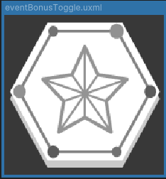
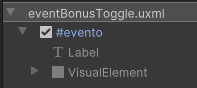
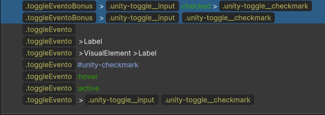
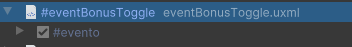

# Toggles de Evento

Los **Toggles de Evento** son elementos preconfigurados que se utilizan en la interfaz para el manejo de activación/desactivación de algún evento de las cartas de evento.

---

## Construcción

Todos los toggles de evento están construidos en base al USS "eventToggle", y cada Toggle prefabricado además cuenta con una clase propia para el manejo de su textura. Por construcción, todos son simplemente un toggle con su nombre correspondiente.





---

## Uso

Se arrastran directamente a la interfaz y se envuelven en un **TemplateContainer**. La gestión lógica de estos elementos es responsabilidad de la interfaz en cuestión, ya que cada Toggle puede llevar a un evento diferente dependiendo de la interacción que se requiera.



```csharp
//En interfaz
Toggle toggle; //Instanciado

toggle = _root.Q<Toggle>("evento"); //Referencia directa
```

---

## Listado de Elementos


| Nombre             | Estado Activo                                           | Estado Inactivo                                      |
|--------------------|---------------------------------------------------------|------------------------------------------------------|
| **BonusToggle**     |  |  |
| **HelpToggle**      |   |   |
| **QuestionToggle**  |  |  |
| **TimeToggle**      |   |   |
| **TrapToggle**      |  |  |


