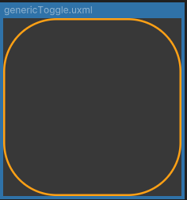
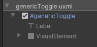
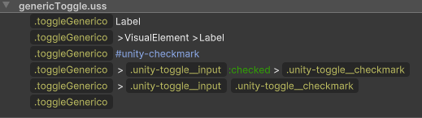
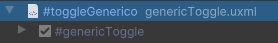

# Toggles Genericos

Los **Toggles Genericos** son elementos preconfigurados que se utilizan en la interfaz para el manejo de activación/desactivación de un contenedor, una Label o cualquier elemento.

---

## Construcción

Todos los toggles genéricos son simplemente el componente **Toggle** de UIToolkit. La única variación entre ellos es que cada uno cuenta con un **USS único** para el manejo de sus estilos. A excepción de esto, por construcción, todos los toggles son simplemente instancias del componente **Toggle**.






---

## Uso

Se arrastran directamente a la interfaz y se envuelven en un **TemplateContainer**. La gestión lógica de estos elementos es responsabilidad de la interfaz en cuestión, ya que cada Toggle puede llevar a un evento diferente dependiendo de la interacción que se requiera.



```csharp
//En interfaz
Toggle toggle; //Instanciado

toggle = _root.Q<Toggle>("genericToggle"); //Referencia directa
```

---

## Listado de Elementos

| Nombre             | Estado Activo                                           | Estado Inactivo                                      |
|--------------------|---------------------------------------------------------|------------------------------------------------------|
| **GenericToggle**     |  |  |
| **GenericToggleCircle**      |   |   |
