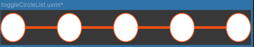
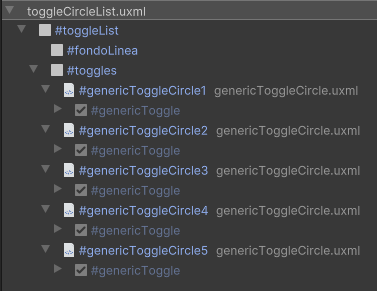
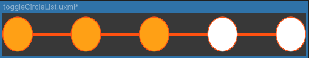

# Listado de Toggles

Los **Listados de Toggles** son elementos preconfigurados que se utilizan en la interfaz para el manejo de activación/desactivación de un contenedor, una Label o cualquier elemento. Con el agregado de mostrar multiples opciones para activación o desactivación en un "listado"

---

## Listado de Elementos


### Toggle Circle List





Este componente maneja una lista de cinco **GenericToggleCircle**, que están conectados visualmente por una línea. Cada toggle es distinguido de los demás por el contenedor que los envuelve. Este **Toggle Circle List** arroja valores asociados al toggle que se ha activado, y también activa o desactiva todos los toggles que le preceden o suceden en el proceso.



**Controlador**:

El controlador de este componente gestiona los toggles a través de una lista. Cada uno de estos toggles está asociado a un valor, el cual es igualmente gestionado mediante una lista. Estos valores pueden variar entre interfaces, por lo que su manejo debe ser adaptado caso por caso. Además, el controlador incluye lógica para hacer que un toggle sea inmune a la desactivación (cosa que tambien debe ser manualmente activado), así como para activar o desactivar los toggles que le preceden o siguen.

```csharp
namespace UI.Controllers.Components.Elements
{
    public class ToggleListComponent
    {
        private string _toggleListName; // Nombre asociado al componente (opcional)
        private List<Toggle> _toggles = new List<Toggle>(); // Lista referencia a toggles
        private List<int> _toggleValues = new List<int>(); // Lista de valores asociados a los toggles
        private HashSet<int> _nonDeactivableToggles = new HashSet<int>(); // Índices de toggles que no se pueden desactivar


        // Evento para notificar cuando un toggle ha sido activado
        public event System.Action<int> OnToggleActivated; // Pasa el valor asociado al toggle activado
    }
}
```
