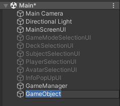
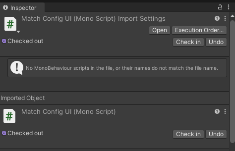
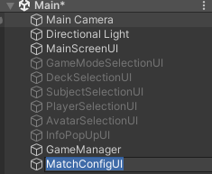
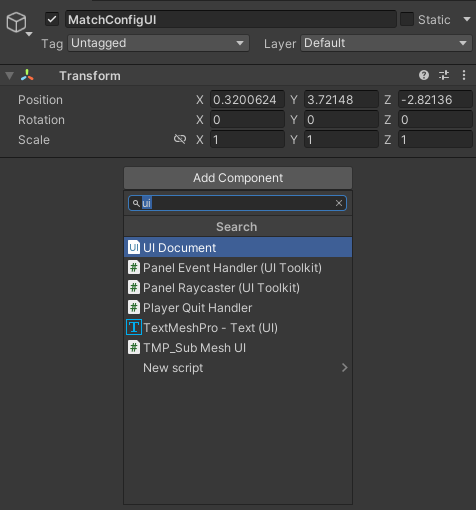
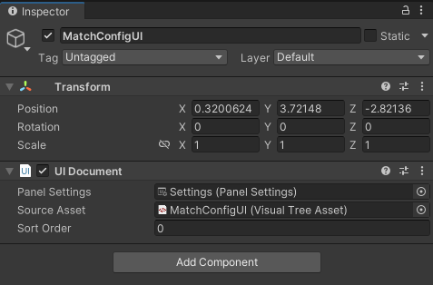
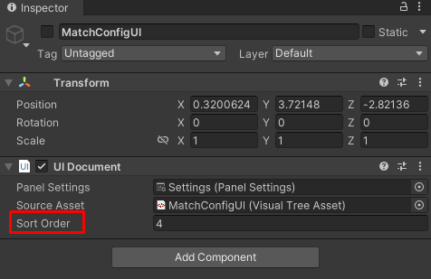
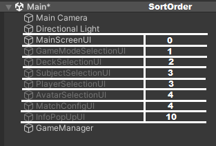
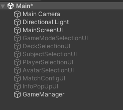
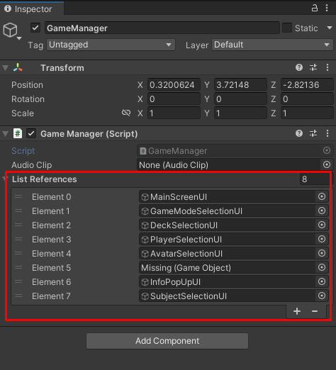
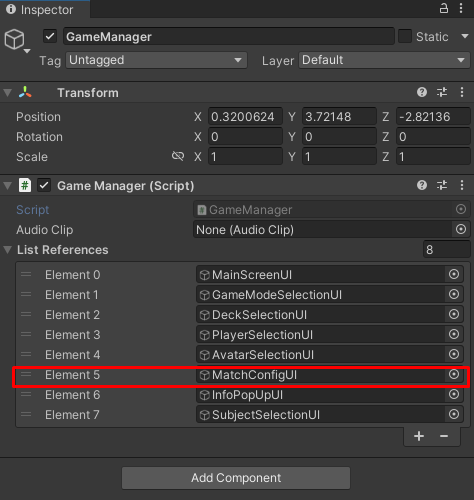

# 4. Asociado a la Escena Unity

En esta fase, el **UIDocument** y sus elementos visuales se integran con la escena de Unity a través de un **GameObject**, permitiendo que los componentes de la interfaz interactúen con el entorno del juego o aplicación. La correcta integración entre el **UIDocument** y la escena es fundamental para que la interfaz de usuario funcione correctamente durante el juego.

---

## Creacion del GameObject

La creación de un **GameObject** para el **UIDocument** es uno de los primeros pasos en la integración de la interfaz de usuario con la escena de Unity. Un **GameObject** sirve como un contenedor para los componentes que forman la UI y se asegura de que todos los elementos visuales se comporten correctamente en el contexto del juego.

---

### 1. Crear el GameObject en la Jerarquía
   
En Unity, el **UIDocument** generalmente se asocia a un `GameObject` dentro de la jerarquía de la escena. Para ello, se debe crear un nuevo `GameObject` vacío, que servirá como contenedor de la UI.



**Importante**: El `GameObject` en este punto **DEBE** tener el mismo nombre que el `controller` de la interfaz que va a tomar. No realizar esta acción provocará discrepancias cuando se intente vincular la lógica con el objeto, lo que impedirá que la vinculación se realice correctamente.



---

### 2. Asignación de Componentes UI

Una vez creado el **GameObject**, se le pueden asignar los componentes UI necesarios. Estos componentes están centralizados solo en un **UIDocument** (el de la interfaz a la que se va a vincular). Para ello, se debe acceder al **Inspector** de Unity y añadir un **UIDocument** como componente del **GameObject**.



Luego, se asocian los elementos correspondientes de la interfaz. Este proceso asegura que todos los elementos de la UI sean gestionados y renderizados correctamente dentro de la escena.



Como se mencionó anteriormente, se recomienda usar el mismo **PanelSettings** para mantener las configuraciones consistentes entre las interfaces. Esto permite que todas las interfaces compartan las mismas configuraciones y comportamientos, lo que facilita el mantenimiento y asegura una experiencia de usuario coherente a lo largo del juego o la aplicación.

---
      
### 3. Posicionamiento y Ajuste en la Escena

El **GameObject** que contiene el **UIDocument** debe ser posicionado correctamente en la escena, considerando el momento en que se va a mostrar en relación con otras interfaces. Para lograr esto, se debe ajustar el **SortOrder** del **UIDocument**, el cual actua como una "capa" que determina que interfaz se dibjua encima de otra, mientras más alto sea el número, mas prioridad tendra al ser dibujada. 



Las interfaces "base" generalmente mantienen un **SortOrder** de 0, lo que las posiciona al fondo o en el nivel de prioridad más bajo en la pila de interfaces. En cambio, los modales o ventanas emergentes variarán el **SortOrder** en función del orden en el cual serán mostrados. Esto asegura que los elementos modales o superpuestos aparezcan por encima de las interfaces base sin que se solapen de manera incorrecta, proporcionando una jerarquía visual clara y un control adecuado sobre la superposición de interfaces.

**Ejemplo**:
    

    
El **SortOrder** de esta escena tiene como interfaz principal a `MainScreenUI`, a partir de la cual se ordenan los demás elementos en función del flujo del juego. Por ejemplo, existen modales que pueden abrir a más de un modal, como es el caso de `DeckSelectionUI`, que puede abrir tanto a `SubjectSelectionUI` como a `PlayerSelectionUI`. Sin embargo, dado que **nunca** se dará el caso de que ambos modales estén abiertos simultáneamente, comparten el mismo **SortOrder**. 

Por otro lado, en el caso de modales genéricos que pueden ser abiertos por más de una interfaz, se asignan números de **SortOrder** más altos, como ocurre con `InfoPopUpUI`, para asegurarse de que se muestren adecuadamente sin interferir con otros elementos de la UI.

---

### 4. Limpieza final

Para finalizar, la escena debe contar con el **GameManager**, los modales y la interfaz base. Es importante que la interfaz base sea la única que tenga su objeto en estado **Enabled** al principio, ya que esta representa la pantalla principal o el estado inicial de la interfaz. Los modales y otras interfaces secundarias deben permanecer deshabilitados hasta que sea necesario activarlos según el flujo del juego o la interacción del usuario. Esto asegura un manejo adecuado de los elementos UI y evita posibles errores o interferencias durante la ejecución del juego.




---

## Vinculación con el sistema

Una vez que el **GameObject** y sus componentes visuales han sido creados y posicionados, es fundamental vincularlos al resto del sistema para que interactúen con los elementos de la escena y con la lógica del juego.

### 1. Preparación de variable 

Para comenzar, se prepara la variable a la que se asignará el **GameObject** recién creado. Esto se realiza en los **VisualAttributes** del **GameManager** para los menús principales y, alternativamente, en los correspondientes al modo de juego en cuestión. Cada conjunto de **VisualAttributes** cuenta con un apartado específico para la interfaz y los modales, lo que permite una asignación correcta de las referencias. Esto asegura que los elementos UI sean gestionados adecuadamente según el contexto de la escena.

**Ejemplo para GameManager**:

```csharp
public class GameManagerVisualAttributes // Pantallas que usara el modo
{
    public class InterfaceAttributes // Aqui se agrega la interfaz madre
    {
        public GameObject mainScreenUI;

        public InterfaceAttributes(GameObject tableroUI)
        {
            this.mainScreenUI = tableroUI;
        }
    }

    public class ModalAttributes // Aqui se agregan los modales
    {
        #region Variables
        public GameObject gameModeSelectionUI;
        public GameObject deckSelectionUI;
        public GameObject playerSelectionUI;
        public GameObject avatarSelectionUI;
        public GameObject matchConfigUI; //Añadir interfaz y referencia
        public GameObject infoPopUpUI;
        public GameObject SubjectSelectionUI;


        #endregion

        public ModalAttributes(GameObject gameModeSelectionUI, GameObject deckSelectionUI, GameObject playerSelectionUI, GameObject avatarSelectionUI, GameObject matchConfigUI, GameObject infoPopUpUI, GameObject SubjectSelectionUI)
        {
            this.gameModeSelectionUI = gameModeSelectionUI;
            this.deckSelectionUI = deckSelectionUI;
            this.playerSelectionUI = playerSelectionUI;
            this.avatarSelectionUI = avatarSelectionUI;
            this.matchConfigUI = matchConfigUI;
            this.infoPopUpUI = infoPopUpUI;
            this.SubjectSelectionUI = SubjectSelectionUI;
        }

    }

    public InterfaceAttributes interfaceAttributes;
    public ModalAttributes modalAttributes;

    public GameManagerVisualAttributes(InterfaceAttributes interfaceAttributes, ModalAttributes modalAttributes)
    {
        this.interfaceAttributes = interfaceAttributes;
        this.modalAttributes = modalAttributes;
    }

    public GameManagerVisualAttributes()
    {

    }
}
```

### 2. Referenciado de la variable

Una vez que la variable está preparada, el siguiente paso es referenciarla correctamente al **GameObject** que se ha creado. Esto implica asignar la referencia del **GameObject** a la variable previamente preparada en los **VisualAttributes**. Este proceso se realiza a través del constructor de **VisualAttributes**, que aloja todas las interfaces que se utilizarán en la escena. Las interfaces se identifican por su nombre para luego ser conectadas con su respectivo **controller**. Por esta razón, es crucial que el nombre del **GameObject** coincida exactamente con el nombre del **controller**, ya que cualquier discrepancia en los nombres puede evitar que la referencia se asigne correctamente, impidiendo la correcta vinculación entre la interfaz y su lógica.

**Ejemplo para GameManager**:

```csharp
attributes = new GameManagerAttributes(new GameManagerAttributes.GameManagerVisualAttributes(new GameManagerAttributes.GameManagerVisualAttributes.InterfaceAttributes(references["MainScreenUI"]),
new GameManagerAttributes.GameManagerVisualAttributes.ModalAttributes(references["GameModeSelectionUI"],
    references["DeckSelectionUI"], references["PlayerSelectionUI"], references["AvatarSelectionUI"],
    references["MatchConfigUI"], references["InfoPopUpUI"], references["SubjectSelectionUI"])),
    new GameManagerAttributes.GameManagerModelAttributes());
```

### 3. Vinculación del objeto

Finalmente, se vincula el **GameObject** creado en la escena al objeto **GameManager** desde el **Inspector**. Esto permite que el **GameManager** lea correctamente la referencia asignada, asegurando que la interfaz y sus elementos sean gestionados adecuadamente durante la ejecución del juego. Esta vinculación es fundamental para que el **GameManager** pueda interactuar con el **GameObject** y controlar su comportamiento de acuerdo con el flujo del juego, activando o desactivando las interfaces y modales según sea necesario.

 

