# 2. Construcción del UIDocument

En esta fase, se comienza a construir el UIDocument, que es el contenedor los elementos visuales y funcionales de la interfaz o componente de usuario en UIToolkit. El UIDocument proporciona el marco en el cual se organizarán todos los elementos visuales, permitiendo una interacción fluida y coherente con el usuario.

---
## Cargar el archivo USS

La construcción, diseño y modelado del **UIDocument** en UIToolkit debe comenzar con la carga del archivo **USS** correspondiente al `UIDocument`. Es fundamental tener en cuenta que el orden de carga influye en la prioridad de los estilos.

   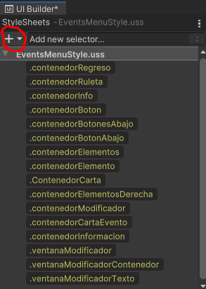

---

## Estructura recomendada de contenedores

Es ideal envolver los elementos en contenedores generales para una mejor organización y facilidad de manipulación:

1. **Contenedor Principal**: Este contenedor se encargará de agrupar todos los elementos para poder aplicar animaciones a futuro a todos los elementos de forma conjunta, cubre **toda** la pantalla (100% altura, 100% anchura).
   
2. **Contenedor de Fondo**: Este contenedor será responsable de manejar los detalles estáticos, como el fondo, el marco y los detalles de la interfaz.

3. **Contenedor de Elementos**: Este contenedor gestionará los elementos visuales interactuables, como botones, textos, y otros controles de la interfaz.

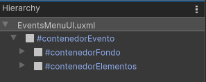

   - **Importante**: Los componentes tambien suelen seguir este tipo de estructura (sin usar Contenedor de Fondo). Salvo que, al ser usados e importados a otro UIDocument (como el de una interfaz), se envuelven en un contenedor especial de tipo `TemplateContainer`, que actuará como el **Contenedor Principal**.

   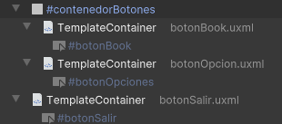

---

## Prácticas recomendadas para la construcción de elementos

### 1. Uso de VisualElements
Se recomienda usar principalmente **VisualElements** para los contenedores generales. En cuanto a la disposición y el tamaño de los contenedores, es importante que el tamaño de estos elementos se ajuste en base a porcentajes para mantener la **responsividad** en lo posible. En este caso, todas las interfaces están pensadas para pantallas con una relación de aspecto 16:9.

   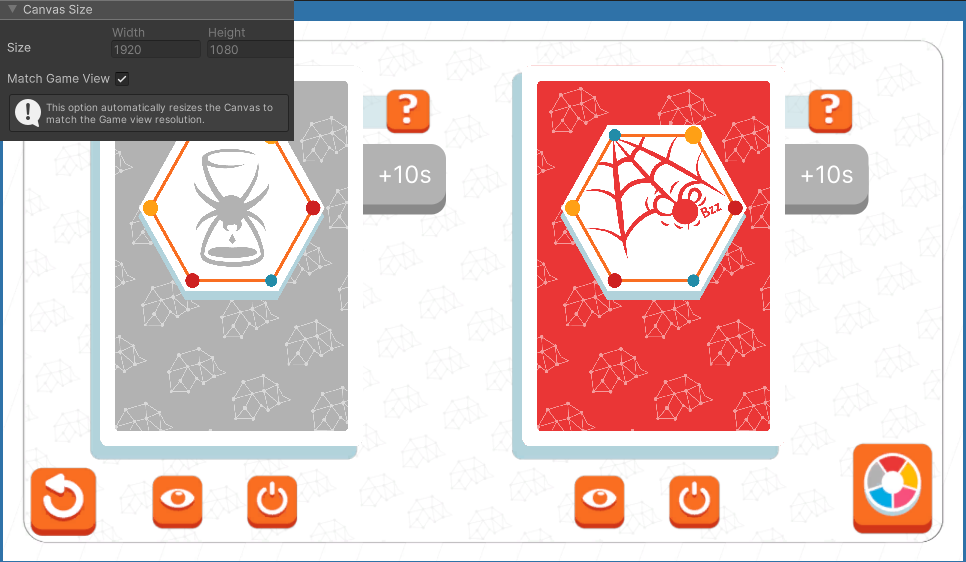
   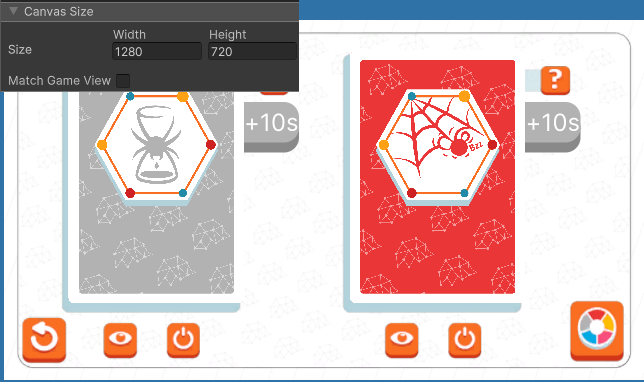

---

### 2. Uso de Flexbox 
Para la construcción de interfaces, se sigue el patrón de diseño **Flexbox** y se divide la pantalla en cuadrantes. Si hay más de dos cuadrantes o elementos que comparten estilos, se recomienda crear una clase compartida y aplicarla a ambos contenedores.

   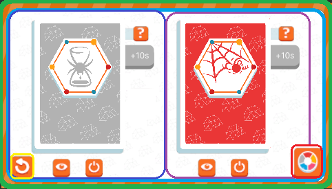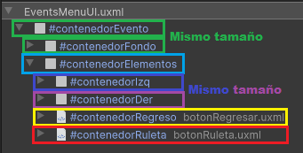

   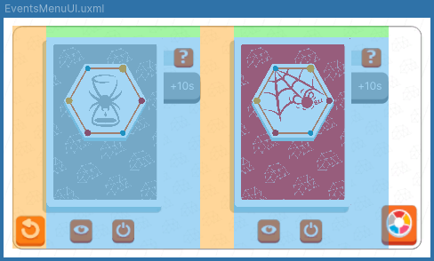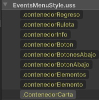

---

### 3. Reutilización de elementos 
Si hay dos elementos que, por construcción, son exactamente iguales, se debe generalizar su construcción y nombrar los elementos que lo componen de la misma forma, como si de un **componente** se tratase. Los elementos deben estar anidados en un contenedor madre, donde se pueda diferenciar su nombre (Que actuará como su identificador), lo cual facilitará la escalabilidad y la estructuración de la lógica más adelante.

   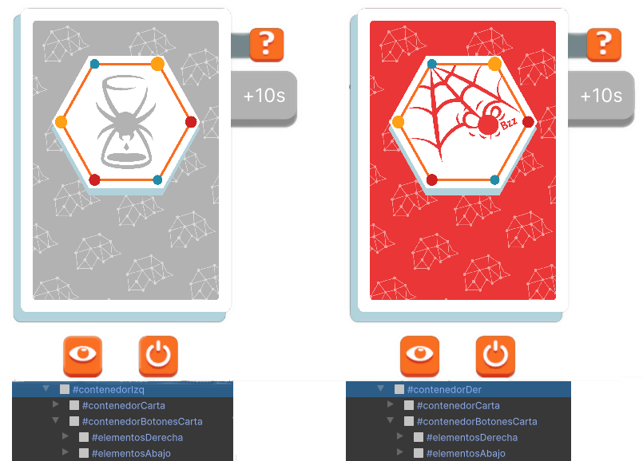

---

## Uso de componentes

### Uso de componenetes de UIToolkit 
UIToolkit cuenta con compontentes prefabricados, se recomienda encarecidamente el uso de estos para la construcción de las interfaces según se necesiten, pues estos componentes contarán con funciones y propiedades únicas al momento de programar su logica.

   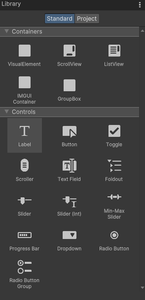

---

### Uso de componentes customizados
El proyecto igualmente cuenta y puede utilizar **UIDocuments** personalizados (componentes). Los componentes son tratados como otro tipo de elemento visual más dentro de la interfaz. Es importante tener en cuenta cómo usarlos en el diseño, ya que afectará la futura implementación de su lógica y controladores.

   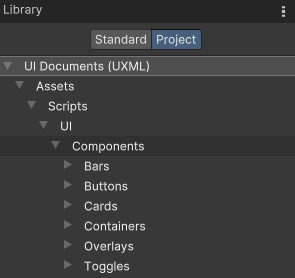

   - **Tipos de componentes**:

      - **Componentes prefabricados**: Están pensados para ser utilizados directamente sin necesidad de manipulación.

          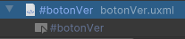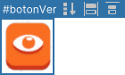 

      - **Componentes personalizados**: Requieren ser desempaquetados en la escena para ser manipulados, diseñados y poder agregar más elementos (Como lo pueden ser Labels, VisualElements, Sprites, etc).

         Si un componente personalizado utiliza un archivo **USS** propio, debe ser desempaquetado correctamente para importar sus estilos, de lo contrario, perderá todos sus estilos.

         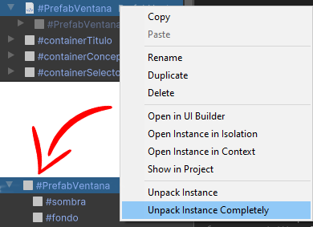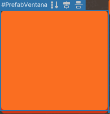

---

## Estilos: USS vs InlineStyle

Existen dos tipos de estilos que se aplican a los elementos de una interfaz:

### 1. USS (Unity Style Sheets)
Este archivo de estilo se carga **después** del **InlineStyle** y se aplica a través de clases, de manera similar a cómo funciona CSS en el navegador. 

   Es por este medio principalmente que se aplican animaciones simples gracias al uso de **transform** y las superclases proporcionadas por la herramienta **UIToolkit**, se recomienda encarecidamente su uso (en especial para animaciones de interactividad simples como `:hover` o `:active`). En caso de querer animaciones más elaboradas que requieran manipular un `VisualElement` (como lo puede ser mover de un lugar a otro) o esperar a que se realizce una acción, se recomienda el uso de **AnimatorCommand** junto a **DOTweenExtension**, pues **UIToolkit** tiene muchas limitaciones.
   
   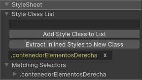

---

### 2. InlineStyle
Son los estilos que se aplican directamente a un `VisualElement` durante la construcción y en tiempo de ejecución. Los estilos **inline** no hacen uso de clases y pueden ser observados directamente desde el inspector. Se cargan junto al **UIDocument** y son sobrescritos por los **USS**.

   Es importante mencionar que, durante **runtime**, cualquier cambio dinámico que se realice a un `VisualElement` será aplicado directamente a su **InlineStyle**. Después de la carga y sobreescritura del **USS**, los **InlineStyle** tomarán **prioridad** sobre los **USS**, por lo que se debe tener especial cuidado al aplicar estilos inline y asegurarse de qué clase se está utilizando.

   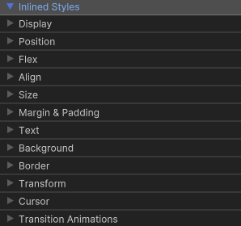

---

## Consideraciones

### 1. Animaciones y Transformaciones en VisualElements  
   Si se planea aplicar animaciones más elaboradas a un `VisualElement` en el futuro (por ejemplo, usando **AnimatorCommand**) y, al mismo tiempo, aplicar transformaciones mediante **USS**, se recomienda envolver el `VisualElement` en una capa adicional. Esto se debe a que **DOTween** no es compatible con las animaciones aplicadas a través de **USS**.

   - **Razón**: Si no se envuelve el `VisualElement`, **DOTween** modificará el estilo directamente en el **InlineStyle**, lo que sobrescribirá cualquier cambio hecho a través de **USS**. Esto puede generar conflictos si **DOTween** y **USS** intentan modificar la misma propiedad (por ejemplo, `position`, `rotation`, `color`, `scale`, etc.). En resumen, al usar **DOTween** y **USS** en el mismo `VisualElement`, si no se toma precaución, los cambios en **USS** serán ignorados.

   - **Ejemplo:**
   En el siguiente ejemplo, el `#boton` tiene una transformación `:hover` aplicada mediante **USS** en la propiedad `position`. Si se aplica una animación que modifique el `position` mediante **DOTween** directamente sobre este `VisualElement`, las transformaciones definidas por **USS** se romperan, ya que se está modificando la misma variable. Para evitar este conflicto, es necesario envolver el `#boton` en un `VisualElement` separado que se encargue del manejo de las animaciones, como se muestra en la siguiente imagen:

      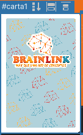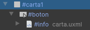

      En este caso, `#carta1` maneja las animaciones aplicadas desde **DOTween**, sin interferir con las transformaciones definidas por el **USS** aplicado a `#boton`.

---

### 2. Ajuste de Texto en Componentes de Tipo Label 
   Los componentes tipo **Label** no cuentan con una opción de ajuste automático de texto. Por lo tanto, será necesario preparar el `VisualElement` para que, en la lógica del programa, pueda ser manejado correctamente por la extensión **LabelExtensions**.

   Para ello, se debe asignar adecuadamente el espacio que el **Label** puede utilizar dentro del **UIDocument**. Recuerda que el **Label** es un contenedor que está envuelto en un controlador, por lo que su espacio disponible debe ser correctamente definido para evitar problemas en el ajuste de texto.

   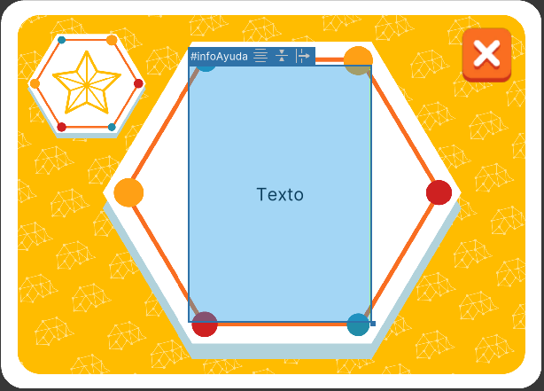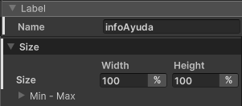

---

### 3. Jerarquización de Elementos 
   Dado que UIToolkit utiliza un sistema basado en **Flexbox**, los `VisualElement` que se encuentren más arriba en la jerarquía tendrán prioridad sobre aquellos que están más abajo. Esto significa que si un elemento se dibuja encima de otro, las interacciones (como clics, hover, etc.) en el elemento de abajo se verán obstruidas. En consecuencia, cualquier botón u otro **elemento interactuable** en la parte inferior dejará de funcionar.

   **Importante**: Si se desea que un elemento interactuable, como un botón, funcione correctamente, se debe asegurar que no esté siendo cubierto por otro elemento en la jerarquía. Si un elemento se superpone a otro, los eventos de interacción (como clics y hover) no se registrarán en el elemento inferior, sino que se registrarán en el de arriba.

   

---

### 4. Carga de "Contenedores" Dinámicos

   Cuando el `UIDocument` necesita mostrar elementos dinámicamente sobre otros dependiendo de alguna acción del usuario, es importante gestionar adecuadamente los **contenedores** de estos elementos. En lugar de crear o destruir elementos a medida que cambia la interfaz, se recomienda usar contenedores predefinidos que se llenen con los elementos correspondientes según la acción.

   - **Razón**: Si bien todos los elementos necesarios pueden estar cargados en el `UIDocument`, la lógica debe organizar y mostrar solo aquellos que son relevantes para la acción en curso. Para mantener el orden y la consistencia en la jerarquía, todos los contenedores deben estar contenidos dentro de un contenedor principal, como el **contenedorElementos**, o el equivalente, dentro del `UIDocument`.

   - **Ejemplo**:  Supongamos que estamos desarrollando la interfaz **EventHelpUI**, la cual necesita mostrar distintos elementos según el tipo de evento asociado a una carta. Algunos eventos pueden requerir mostrar un péndulo, otros un temporizador, y otros, incluso, una elección del usuario. Esta interfaz debe ser dinámica, mostrando sólo los contenedores relevantes para cada evento. Para ello, los contenedores se agrupan por tipo de acción y se gestionan desde la lógica del programa. Aquí, el contenedor general **contenido** mantiene el orden y la coherencia de la interfaz, con utilización de **flexbox**:

   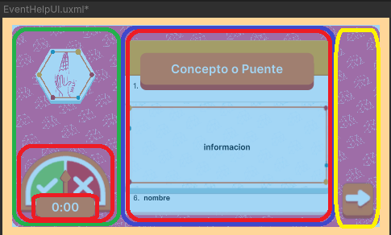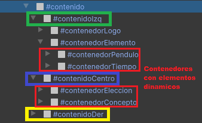

---