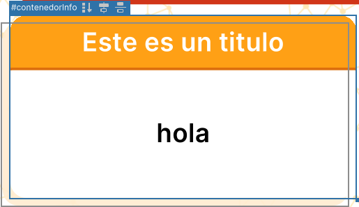
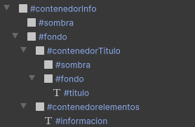
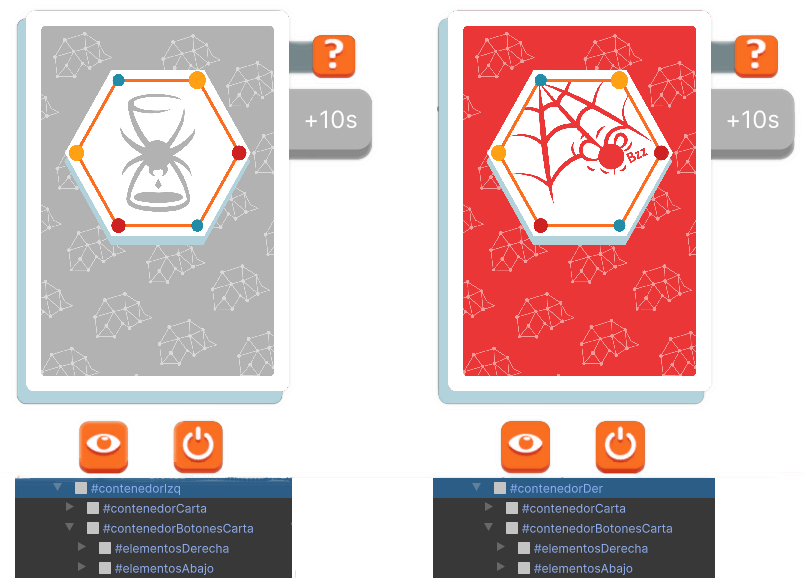
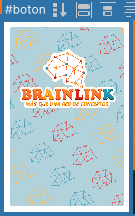
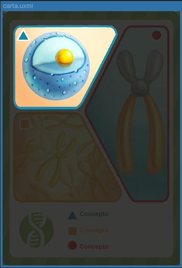
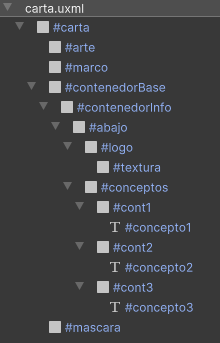
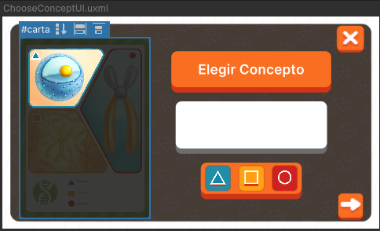
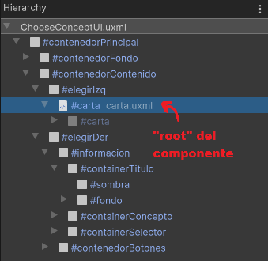

# 3. Implementación de la Lógica

En esta fase, se establece la forma en que los elementos visuales de la UI responden a las interacciones del usuario, permitiendo que estas acciones afecten el comportamiento y el flujo del sistema. Además, se configuran los eventos que activan las funcionalidades y se gestionan las condiciones que determinan cómo los componentes deben reaccionar a situaciones particulares. El objetivo es crear una experiencia de usuario coherente y dinámica que refleje el estado actual del sistema y permita su interacción de manera fluida y eficaz.


---

## Lógica de Interfaces

### Inicialización y Cerrado

En el caso de las interfaces, todas deben heredar de la clase `Core.UI` y deben tener en su namespace al menos el sufijo básico `UI.Controllers.Views`. Además, todas las interfaces deben aplicar la mayoría de los métodos proporcionados por `Core.UI`, aunque existe una regla específica para la correcta implementación, dependiendo del tipo de interfaz.

1. **Inicializacion Variables**

    Para comenzar, todos los controladores deben tener su `GameObject` como variable para ser referenciado e instanciado correctamente. También, se deben declarar todos los elementos que se usarán desde el `UIDocument`, junto con las variables auxiliares que se usarán para el manejo de la lógica del juego, siendo la más común la de `_attributes`, la cual recibirá todo el contexto actual de una partida y lo guardará como variable local.

    ```csharp
    namespace UI.Controllers.Views
    {
        public class NombreDeLaInterfazUI : Core.UI
        {
            private GameObject _object;

            //Declaracion Elementos UI

            //Auxiliares
            private TipoDelAttributo _attributes; //Contexto Local
        }
    }
    ```

2. **Inicializacion Flujo de Ejecucion**

    El flujo de juego se inicializa con el constructor, el cual requiere una suscripción a un evento a través del `GameEventBus`, para que la interfaz pueda recibir los datos del juego a través de los controladores de lógica del modo de juego. Aunque la interfaz puede estar suscrita a múltiples eventos, normalmente se requiere que al menos uno derive al método `Init`.


    ```csharp
    public NombreDeLaInterfazUI()
    {
        GameEventBus<TipoDelAttributo>.Subscribe("nombreDelEvento",Init);
        Debug.Log("CONSTRUYENDO: ");
    }
    ```

    Luego, se requiere que cada interfaz tenga el método `InitInstance` declarado. Este método es el encargado de vincular el `GameObject` al controlador para su manejo, y esto se realiza gracias al `UIManager`.


    ```csharp
    public override void InitInstance(GameObject ui)
    {
        _object = ui;
    }
    ```

    El método `Init` es el encargado de recibir los datos y el contexto actual de la partida. Estos se reciben a través del parámetro `object` gracias al `GameEventBus` declarado en el constructor. Cabe destacar que la recepción del contexto dependerá del tipo de este, es decir, si no se declara explícitamente el tipo de atributo recibido, el código fallará, por lo que se debe tener en cuenta.


    Este es el primer método en ser disparado cuando llega la señal desde una suscripción, por lo que puede comenzar la lógica del juego si es una interfaz simple, terminando el flujo de ejecución básico.


    ```csharp
    public override void Init(object attributes)
    {
        if (attributes.GetType() != typeof(TipoDelAttributo))
        {
            Debug.LogError("TIPO DE DATO DIFERENTE A TipoDelAtributo");
            return;
        }
        _attributes= attributes as TipoDelAttributo; // Guardado de contexto en interfaz

        //Si es una interfaz base, comenzar logica...
    }
    ```


    Para las interfaces consideradas modales, la inicialización de la lógica **NO** comienza en la fase de inicio, sino en el método `SetOpen`. La apertura de modales no se realiza a través del `UIManager`, sino por medio de `ModalManager`. Este último gestiona la apertura de modales y mantiene un conteo de cuántos modales están actualmente abiertos. La interfaz debe esperar una señal de otra interfaz antes de poder ser habilitada.

    Es importante destacar que el método `SetOpen` soporta el uso de un contexto único del modal que lo ha abierto, gracias a la utilización del genérico `<T>`. Esto permite que el método reciba contexto desde clases completas, proporcionando flexibilidad y la posibilidad de personalizar la configuración y comportamiento del modal según el caso específico.


    ```csharp
    public override void SetOpen<T>(T context /*= null (si no se desea recibir contexto)*/ ) where T : class
        {
            _object.SetActive(true); // habilitado de interfaz
            context as TipoDeDatoDelContexto //Solo para modales que reciban contexto de otra interfaz
            //Si es un modal, comenzar logica...
        }
    ```

    El modal recibe el contexto necesario a través del método `Init`, que se declara de forma similar a una interfaz base. Si se desea abrir un modal automáticamente en base a un evento de una suscripción en vez de otra interfaz, se puede declarar directamente su apertura en `Init`. Es importante mencionar que se debe usar la instancia correcta de `UIManager` a través del `GameEventBus`.

    ```csharp
    public override void Init(object attributes)
    {
        if (attributes.GetType() != typeof(TipoDelAttributo))
        {
            Debug.LogError("TIPO DE DATO DIFERENTE A TipoDelAtributo");
            return;
        }
        _attributes= attributes as TipoDelAttributo; // Guardado de contexto en interfaz

        //Si es un modal y se desea apertura automatica...
        GameEventBus<MododeJuego>.Instance.uiManager.modalManager.OpenModal<string>(typeof(NombreDeLaInterfazUI)); // Apertura Automatica
    }
    ```

3. **Cerrado de interfaces**

    El cierre de interfaces no es complicado, pero debe seguir ciertas reglas dependiendo del tipo de interfaz que se desee cerrar.

    Por su naturaleza, las interfaces **"base"** no pueden ser cerradas, ya que actúan como la interfaz madre que gestiona y llama a todas las demás interfaces. Estas interfaces solo se destruyen cuando se cambia de escena en Unity, lo que asegura que permanezcan activas durante toda la duración de la escena.

    Por otro lado, los **modales** pueden abrirse y cerrarse tantas veces como sea necesario. Esto es posible gracias al uso del `ModalManager`, que gestiona el estado de los modales abiertos. Para cerrar un modal, se debe hacer uso del `GameEventBus` con la instancia específica del **Modo de Juego** en el que se está ejecutando y llamando al método `CloseModal`

    ```csharp
    GameEventBus<MododeJuego>.Instance.uiManager.modalManager.CloseModal();
    ```
    
    Es importante mencionar que el método `CloseModal` envía automáticamente el nombre de la interfaz cerrada a todos los modales suscritos a `OnModalClosed`, lo que permite realizar eventos y acciones asociadas a ese cierre. Además, si es necesario, se puede enviar información adicional, como valores de tipo `bool` o `string`, para proporcionar más contexto a los modales o interfaces suscritas que necesitan reaccionar al cierre.

    ```csharp
    GameEventBus<MododeJuego>.Instance.uiManager.modalManager.CloseModal(_isNextClicked)
    ```


---


### Asignado de referencias UIDocument
La inicialización de las referencias ocurre **después** de la instancia y apertura de la interfaz. Las referencias se obtienen a través de `_root`, el cual es obtenido desde el `_object`, que contiene el `UIDocument` de la interfaz. Esta práctica asegura que las referencias a los elementos del `UIDocument` estén disponibles una vez que la interfaz esté completamente cargada y abierta, permitiendo una gestión eficiente de los elementos UI en el sistema.


```csharp
//Comienzo de logica inicial...

//Declaracion Root
var _root = _object.GetComponent<UIDocument>().rootVisualElement;

//Luego, con _root se referencian todos los elementos UI del UIDocument
```

Dependiendo del tipo de elemento en el `UIDocument`, se recomienda usar diferentes formas de referencia:


- **Elemento único**: Si se está referenciando un elemento único que por construcción no se repite en la interfaz, se recomienda obtener una referencia directa a su contenedor. De este modo, se evita manejar demasiadas variables, ya que con el contenedor se tiene acceso directo a todos los elementos dentro de él.

    

    ```csharp
    //Ejemplo de referencia elemento único
    _containerInfo = _root.Q<VisualElement>("contenedorInfo"); //Se referencia contenedor

    //Luego, se manipula el elemento
    _containerInfo.Q<Label>("informacion").text = "hola"; //Se accede directamente a contenidos
    _containerInfo.Q<Label>("titulo").text = "Este es un titulo";
    ```

    **Importante**: Esto es realizable solo si los elementos UI tienen nombres distintivos para cada uno. Si un nombre se llega a repetir, el UIDocument **no** podrá distinguir entre los dos elementos y se deberá especificar por contenedor madre (en caso de que lo tenga). Por ejemplo, si se quisiera referenciar `sombra` de `contenedorTitulo`, será necesario realizar lo siguiente:

    ```csharp
    //Ejemplo de referencia elemento único
    _containerInfo = _root.Q<VisualElement>("contenedorInfo"); //Se referencia contenedor

    //Luego, se manipula el elemento
    _containerInfo.Q<VisualElement>("contenedorTitulo").Q<VisualElement>("sombra"),style.display = DisplayStyle.none; //Se escpecifica contenedor, luego la referencia
    ```


- **Elemento compuesto**: Si se desea referenciar un elemento que, por su construcción y lógica, funciona de la misma forma, es recomendable utilizar listas (`List`) o diccionarios (`Dictionary`) para guardar sus referencias. Esto permite mantener un orden claro en la estructura de las variables y, lo más importante, manipular múltiples elementos UI con el mismo código. El uso de estas estructuras permite recorrer los contenidos con `foreach` o `for`. Sin embargo, esta práctica solo es válida si los contenidos que se van a manipular tienen la misma estructura. Cualquier cambio en la estructura (ya sea nombre, tipo de contenedor, etc.) puede hacer que las referencias se rompan en el código.

    

    ```csharp
    //Ejemplo de referencia elementos compuestos
    InitEventCardsUIContainers(_root);

    //Luego, se manipulan los elementos
    ChangeCardsVisibility()

   private void InitEventCardsUIContainers(VisualElement _root)
    {
        //Se instancian referencias
        _containersEventCardsUI = new List<VisualElement>(); // se crea una lista
        _containersEventCardsUI.Add(_root.Q<VisualElement>("contenedorIzq")); // se almacenan referencias
        _containersEventCardsUI.Add(_root.Q<VisualElement>("contenedorDer"));
    }

    private void ChangeCardsVisibility()
    {
        // Se recorren contenedores UI
        for (int i = 0; i < _containersEventCardsUI.Count; i++)
        {
            //Se manipulan sus elementos
            _containersEventCardsUI[i].Q<VisualElement>("contenedorCarta").style.display = DisplayStyle.None;
        }
    }
    ```
**Importante**: Las referencias en el código están estrechamente ligadas al nombre y tipo de los contenedores que se desean referenciar. Esto significa que cualquier cambio en los nombres de los elementos del UI o en su estructura jerárquica afectará directamente el código. Las referencias son **totalmente** dependientes de los elementos del `UIDocument`, por lo que es crucial tener en cuenta que modificaciones en la jerarquía, los nombres de los contenedores o cualquier estructura relacionada impactarán el correcto funcionamiento del código. Este comportamiento requiere una atención especial, ya que incluso un cambio menor podría causar errores difíciles de detectar. Es fundamental revisar y ajustar las referencias en el código cada vez que se realice una modificación en la UI.


---

### Carga de datos en los elementos visuales

La carga de datos se realiza mediante el contexto actual del juego, que se recibe a través de la variable `_attributes`. Utilizando las referencias a los elementos UI, se reemplazan los datos en los componentes visuales según sea necesario.

Para hacerlo, se accede a los elementos de la interfaz mediante su referencia (por ejemplo, `Label`, `Image`, `Button`, etc.) y luego se actualizan los valores visuales con la información contenida en `_attributes`, que representa el estado actual del juego o del sistema.

#### Ejemplo básico:

Si tenemos una interfaz con un `Label` que muestra el nombre del jugador, y ese nombre se encuentra en el atributo `playerName` de `_attributes`, se realiza lo siguiente:

```csharp
// Referencia al elemento visual de la interfaz
var playerNameLabel = _root.Q<Label>("playerNameLabel"); 

// Cargar el dato de nombre del jugador desde _attributes
playerNameLabel.text = _attributes.playerName;
```

De esta forma, el valor del nombre del jugador se actualiza dinámicamente en el `Label` cada vez que se modifica el atributo en `_attributes`.

---


### Animaciones

Como se menciona en la construcción del `UIDocument`, las animaciones se manejan de dos formas. A continuación, se describen ambas:

- **Animación USS**

    La forma más simple de manejar animaciones en `UIDocument` es mediante clases USS. Estas clases se utilizan principalmente para interacciones pequeñas y funcionan sin necesidad de intervención adicional. 

    Si se desea, se pueden activar o desactivar estas animaciones simplemente agregando o quitando la clase correspondiente que maneja la animación.

        

        ```csharp
        // Referencia al elemento visual de la interfaz
        Button boton = _root.Q<Button>("boton"); 

        // Activa/Desactiva la clase encargada de aplicar animación
        boton.ToggleInClassList("cartaBotonActivo");
        ```

        

- **Animación por AnimatorCommand**:

    Por otro lado, existen las animaciones gestionadas a través de `AnimatorCommand`, que son mucho más complejas, ofreciendo mayor control y flexibilidad, permitiendo gestionar y personalizar desde el flujo de la aplicación. 
    
    Para ello se requiere crear un `Command` específico para la acción o evento que se está llevando a cabo. se debe crear un C# único que derive de `IGameCommand` y utilice el namespace de la interfaz que lo vaya a utilizar, junto con la declaración de elementos que utilizará

        ```csharp
        namespace Commands.Views.Board
        {
            public class RotateCardsCommand : IGameCommand
            {
                List<VisualElement> _playerCards; //Listado de cartas del jugador
                private int _cardCount; //Cantidad de cartas a voltear
                private float _duration; //duracion de cada animacion
            }
        }
        ```
    
    Luego, en su constructor, recibira desde la interfaz todo lo necesario para llevar a cabo las animaciones.

        ```csharp
        public RotateCardsCommand(List<VisualElement> playerCards, int cardCount, float duration)
        {
            _playerCards = playerCards;
            _cardCount = cardCount;
            _duration = duration;
        }
        ```

    Para finalizar, se declarará la logica de como se debe llevar a cabo las animaciones en el método `Execute`, esto varía de evento a evento y normalmente se utiliza la ayuda de `DOTweenExtension` para la realización de las animaciones en sí. Importante tambien mencionar el uso de `await` despues de cada animación, sin esta linea de código, las animaciones se realizarán sin esperar a la otra.

        ```csharp
        public async Task Execute()
        {
            for (int i = 0; i < _cardCount; i++)
            {
                await RotateCard(i); // Pasar el índice de la carta a animar
            }
        }


        private async Task RotateCard(int index)
        {
            // Girar carta hasta la mitad
            _playerCards[index].DoScale(new Vector3(0f, 1f, 1f), _duration); // Uso de DOTween
            await Task.Delay((int)(_duration * 1000)); //Esperar termino de animación

            // activar info
            _playerCards[index].Q<VisualElement>("info").style.display = DisplayStyle.Flex;

            // Terminar de girar
            _playerCards[index].DoScale(new Vector3(1f, 1f, 1f), _duration); // Uso de DOTween
            await Task.Delay((int)(_duration * 1000)); //Esperar termino de animación
        }
        ```

    Luego, para activar la animación, se debe dirigirse al controlador de la interfaz en cuestión y crear la clase en cuestion usando el `AnimatorCommand` proporcionado desde el `GameEventBus`
 
    ```csharp
    GameEventBus<AnimatorCommand>.Instance.AddCommand(new RotateCardsCommand(_containersPlayerCardsUI[_playerPositions[0]], _attributes.players[0].givenCards.Count, 0.15f));
    ```


---

### Eventos

En Unity, los **eventos** son acciones que se desencadenan en respuesta a interacciones o cambios en la interfaz de usuario o en el comportamiento del juego. Los eventos permiten que el sistema reaccione a situaciones específicas, como cuando un jugador hace clic en un botón, mueve un objeto o cambia el valor de un toggle.

Esto se realiza mediante **Callbacks**, que son funciones que se registran para ser ejecutadas automáticamente cuando un evento específico ocurre. Al utilizar callbacks, Unity permite que el código reaccione de manera eficiente y organizada ante las acciones del usuario o los cambios en el sistema.

**Lógica de Callbacks**

En la lógica del código, los **callbacks** se registran desde las **interfaces**, que son responsables de albergar todos los métodos que se ejecutarán cuando un callback sea activado. Esto se aplica independientemente de si el evento es disparado por un componente o no, ya que los eventos están específicamente ligados a cada interfaz. Es decir, una interfaz es responsable de registrar las funciones que deben ejecutarse en respuesta a eventos.

**Tipos de Callbacks**

- **Callbacks Directos**: Son aquellos donde se asigna una función directamente a un componente. Este tipo de callback es común cuando se suscribe un método a un evento como el `onClick` de un botón o el `onValueChanged` de un toggle. En estos casos, se llama a la función directamente cuando el evento ocurre.

    **Ejemplo Simple**

    ```csharp
    _btnPause.RegisterCallback<ClickEvent>(ClickPause);

    private void ClickPause(ClickEvent e)
    {
        _scrim.EnableOverlay();
        GameEventBus<NormalMode>.Instance.uiManager.modalManager.OpenModal<string>(typeof(PauseUI));
    }
    ```
    **Ejemplo con parametros extra**

    ```csharp
    _containersPlayerCardsUI[playerPosition][i].Q<Button>("boton").RegisterCallback<ClickEvent>(evt => ClickCard(evt, currentIndex));

    private void ClickCard(ClickEvent e, int selectedCardIndex)
    {
        _scrim.EnableOverlay();
        GameEventBus<NormalMode>.Instance.uiManager.modalManager.OpenModal(typeof(ChooseConceptUI), _attributes.players[_attributes.turn].givenCards[selectedCardIndex]);
        _currentSelectedCardIndex = selectedCardIndex;
    }
    ```

    


- **Callbacks por subscripción**: Son aquellos en los que una función se registra para recibir notificaciones de un evento a través de `GameEventBus`. Los eventos en este caso no están necesariamente ligados a un componente específico de la UI o a un elemento en particular, sino que pueden ser gestionados de manera centralizada y reactiva. Estos **callbacks** pueden ser suscritos a eventos globales, lo que permite que diferentes partes del código respondan a un mismo evento.

    **Ejemplo**

    ```csharp
    GameEventBus<NormalMode>.Instance.uiManager.modalManager.OnModalClosed += ModalClosedHandler;

    void ModalClosedHandler()
    {
        Debug.Log("El modal ha sido cerrado.");
    }
    ```


**Consideraciones**

Dada la naturaleza recursiva de las interfaces y sus elementos/componentes, se debe tener especial cuidado al registrar y suscribir un callback. Si la referencia no se limpia adecuadamente, el callback puede ser suscrito o registrado más de una vez, lo que puede causar que el mismo método se dispare varias veces, generando comportamientos no deseados o afectando el rendimiento del sistema.

Es importante asegurarse de **desregistrar** los callbacks cuando ya no sean necesarios. Una forma de hacerlo es mantener una **flag** que revise si el callback ha sido registrado o, alternativamente, limpiar directamente la referencia a la variable. Esto es especialmente relevante en situaciones donde los objetos o interfaces pueden ser creados y destruidos dinámicamente. De esta forma, se evita que las suscripciones se dupliquen y se asegura que los eventos sean manejados correctamente.

---

### ListEvent

**ListEvent**, como se ha mencionado en otras secciones, es el encargado del manejo y gestión de los eventos dentro del juego. Su función principal es orquestar el flujo de eventos a través de una lista predefinida, asegurando que cada uno de ellos se ejecute en el orden correcto.

Es importante destacar que, para garantizar que cada evento se complete de manera adecuada, se recomienda que las interfaces que disparan estos eventos gestionen la transición entre ellos utilizando comandos específicos. Esto permite que las interfaces puedan completar su flujo de ejecución sin interrupciones ni conflictos, asegurando una experiencia de juego fluida.

**Ejemplo**

```csharp
GameEventBus<NormalModeController>.Instance.sequence_.InvokeNode<NormalModeAttributes.NormalModeInitGameAttributes>()
```

Además, puede darse el caso en que, en algunas circunstancias, una interfaz deba entregar un dato al controlador del modo de juego, el cual es el encargado de manejar la lista de eventos y el contexto general del juego. En tales casos, se puede utilizar el mismo comando empleado para cambiar al siguiente evento, lo que garantiza que el controlador reciba los datos necesarios para continuar con el flujo de ejecución del juego.

**Ejemplo**

```csharp
GameEventBus<NormalModeController>.Instance.sequence_.InvokeNode<NormalModeAttributes.NormalModeInitGameAttributes, List<int>>(_scores) // Se envia un listado de puntos
```

El uso adecuado de **ListEvent** facilita una transición suave entre eventos y permite que cada interfaz, como las que gestionan la selección de jugadores, los puntajes o las cartas de evento, pueda seguir su lógica de manera coherente. De esta manera, se asegura que el juego mantenga una estructura organizada y que los eventos sean gestionados de forma eficiente y sin sobresaltos, incluso cuando se necesita compartir información entre las interfaces y el controlador.


---

## Lógica de Componentes

### Construcción

A diferencia de las interfaces, los **componentes** no heredan de ninguna clase base, sino que son tratados como clases independientes. Sin embargo, todos los componentes que cuentan con un controlador siguen una estructura de construcción común que les permite ser gestionados de manera eficiente dentro del sistema, igualmente se requiere que tengan al menos el namespace `UI.Controllers.Components`

**Ejemplo**:

    

```csharp
namespace UI.Controllers.Components.Elements
{
    public class CardComponent 
    {
        private VisualElement _art; //arte de la carta
        private VisualElement _frame; //marco de la carta
        private VisualElement _mask; //mascara de la carta
        private VisualElement _logo; //logo del mazo de la carta
        private bool _customTextSize; //Flag para ajustar tamaño unico de texto segun se necesite
        private List<Label> _concepts = new List<Label>(); //Lista de Conceptos
    }
}
```

Cada componente está diseñado para recibir las referencias de los elementos de la interfaz de usuario (UI) a la que pertenece. Estas referencias son pasadas a través del **constructor** del componente, lo que les permite interactuar con la interfaz correspondiente sin necesidad de que cada componente sea completamente autónomo, está refernecia se recibe en forma del `root` o el equivalente, el cual es la referencia al `container` principal del componente en la interfaz.

    

```csharp
public CardComponent(VisualElement root /*recibira de referencia "carta"*/, bool customTextSize = false)
{
    //fondo
    _art = root.Q<VisualElement>("arte");
    _frame = root.Q<VisualElement>("marco");
    _mask = root.Q<VisualElement>("mascara");
    _logo = root.Q<VisualElement>("textura");
    _customTextSize = customTextSize;

    //informacion
    FillConceptsReferences(root);
}
```

### Carga de Datos en los Elementos Visuales

Una vez que los componentes reciben las referencias de los elementos visuales de la interfaz, pueden proceder a cargar o actualizar los datos en estos elementos. Los componentes se encargan de rellenar los elementos de la UI con la información correspondiente recibida desde la interfaz que los instanció, como texto, imágenes, valores de variables, entre otros.

```csharp
public void SetData(Card card /*datos recibidos desde interfaz*/)
{
    _art.style.backgroundImage = new StyleBackground(Resources.Load<Sprite>(card.cardCode)); //aplicado arte
    _logo.style.backgroundImage = new StyleBackground(Resources.Load<Sprite>("icon_" + card.deckCode)); //aplicado logo
    _frame.style.backgroundImage = new StyleBackground(Resources.Load<Sprite>(frameColors[card.deckCode])); //aplicado color a frame
    _mask.style.display = DisplayStyle.None;
    SetConcepts(card); //aplicado conceptos
}
```

### Funciones complementarias

Además de los elementos básicos que componen la interfaz de usuario, los componentes pueden contar con **funciones complementarias** que son específicas para su comportamiento o lógica interna. Estas funciones se implementan para manejar casos particulares que no se resuelven solo con la estructura del contenedor o los elementos visibles en la UI. 

Estas funciones complementarias son clave para garantizar el correcto funcionamiento y la interacción de los componentes en distintos escenarios. Por ejemplo, se pueden utilizar para gestionar activaciones, validar condiciones, generar eventos aleatorios o cualquier otra lógica específica que dependa del estado interno del componente.


**Ejemplo lógico de activacion de péndulo**:
```csharp
public static bool OnInvokePendulum()
{
    return Random.Range(0, 2) == 0;
}
```


---

### Uso desde la Interfaz

Como se mostró anteriormente, una interfaz puede crear y administrar sus propios componentes, pasando las referencias de los elementos UI relevantes para su construcción. Este enfoque permite una **separación de responsabilidades**, donde la interfaz se encarga de gestionar los componentes y de interactuar con ellos según sea necesario, mientras que los componentes se enfocan en la lógica específica de sus respectivos elementos de UI. 

Para lograr esto, se instancia una clase del componente dentro de la interfaz, lo que permite que dicha clase reciba las referencias a los elementos UI directamente desde la interfaz. De esta manera, la lógica del componente se mantiene encapsulada y no depende de otros elementos ajenos a su funcionamiento directo. A su vez, todas las funciones del componente son llamadas desde la interfaz, lo que asegura que el flujo de control y la interacción entre los elementos UI y sus componentes se gestione centralizadamente desde la interfaz.

**Ejemplo**:

```csharp
//Instanciado de la clase
private CardComponent _card; 

//Envio de referencias al constructor
_card = new CardComponent(_root.Q<TemplateContainer>("carta"));

//Manipulación desde interfaz
_card.SetData(attributes.card[0]) //envio de datos
```

Este enfoque modular asegura que las interfaces sean escalables y fáciles de mantener, permitiendo que los componentes sean reutilizados en diferentes partes del sistema sin necesidad de duplicar lógica. Además, los componentes pueden ser modificados o extendidos sin afectar otras partes de la interfaz.


---