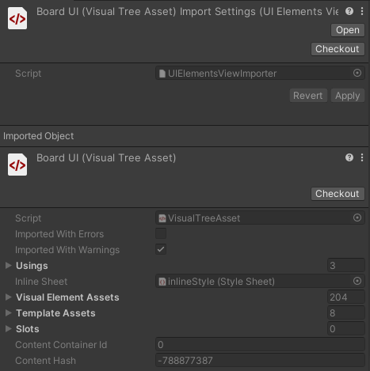
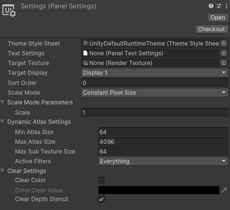
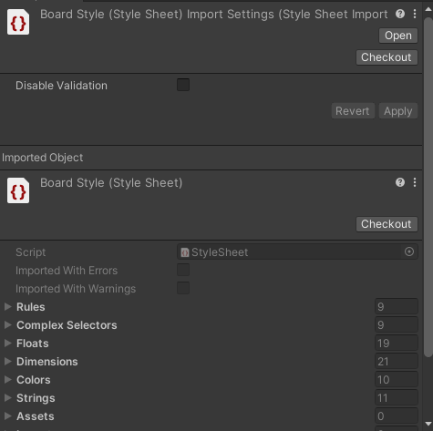
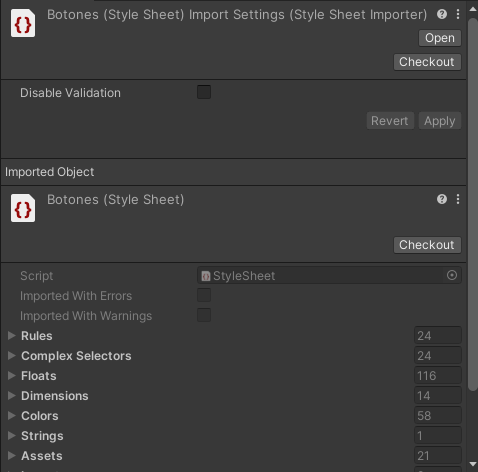
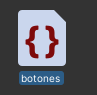
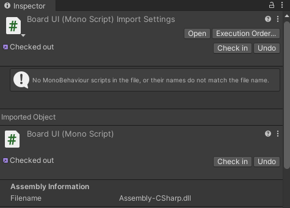
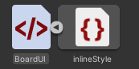

# 1. Preparación de Archivos

En esta fase inicial del proceso, se centra en la organización y preparación de todos los archivos necesarios para la construcción del elemento UI. Es esencial tener todos los archivos estructurados de manera eficiente para evitar posibles errores durante la implementación.

---

## UIDocument (UXML)

Cada interfaz o elemento de la UI debe contar con al menos un `UIDocument` (UXML) para ser modelado correctamente.  
- Si el `UIDocument` forma parte de un objeto (Como es el caso para las interfaces), se requiere un **Panel Settings** para asegurar su correcto renderizado.  
- El **Panel Settings** gestiona las configuraciones generales del `UIDocument`. En sistemas centralizados, se recomienda que todas las interfaces se rendericen a través del mismo **Panel Settings** para mantener la consistencia de las configuraciones.

---
## Archivos USS (Estilos)

Los archivos **USS** determinan los estilos del `UIDocument`. Estos estilos se cargan y se aplican **después** de los elementos definidos en el `UIDocument`. Dependiendo del caso, un `UIDocument` puede leer desde un **USS** general utilizado por varios `UIDocument`, o tener su propio **USS** único.

- **En el caso de interfaces**: Es recomendable que cada interfaz tenga su propio archivo **USS** (a menos que varias interfaces varíen solo en pequeños detalles).

   

- **En el caso de componentes**: Es preferible que los componentes deriven de una clase madre general que sea utilizada por todos sus componentes hermanos, para mantener la consistencia en los estilos.

   

---
## Código C#

El código C# se encarga del manejo lógico de un `UIDocument`, el cual es denominado **Controller** en este proyecto. **Todas** las interfaces cuentan con su propio controlador para gestionar su lógica, pero **no todos los elementos/componentes** tienen un controlador propio. Solo los componentes que son constantemente reutilizados o aquellos con una construcción compleja cuentan con su propio **Controller**.

   

---
## Consideraciones

- Los `UIDocument` cuentan con un **USS nativo**, conocido como **InlineStyle**, que se carga junto con el elemento. 

   Es importante tener en cuenta que el **InlineStyle** es más pesado de cargar que un archivo **USS** tradicional.

   

- Los C# de las interfaces deben mantener idelamente **el mismo nombre** que su UIDocument (Aunque en este punto no es obligatorio).

---