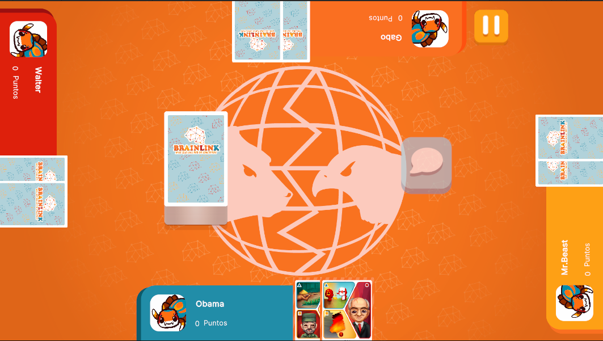

# BoardUI



## Descripción

La **BoardUI** es la interfaz principal de la escena de juego, y actúa como la interfaz madre que coordina la visualización de todos los elementos esenciales durante la partida. Esta interfaz está diseñada para mostrar información crítica de los jugadores activos, como sus cartas y su ranking si el modo de juego es online. A lo largo del flujo de juego, la **BoardUI** se adapta dinámicamente según el modo de juego seleccionado, actualizando la pantalla para reflejar los datos y contenedores pertinentes.

Dependiendo de la etapa del juego, esta interfaz puede mostrar los tableros de cartas, el progreso del juego, el estado actual de cada jugador, así como las interacciones de los eventos. También incluye componentes de actualización en tiempo real, como el puntaje o cualquier cambio importante dentro de la partida. En modo online, puede gestionar la visualización de las posiciones de los jugadores en el ranking y otros elementos relacionados con la competencia en línea.

En resumen, la **BoardUI** es la interfaz que centraliza la experiencia de juego, proporcionando al jugador toda la información necesaria para que siga y participe activamente en la partida, con flexibilidad para adaptarse a las variaciones del flujo del juego.

---

## Controlador: Modo Normal

Durante el flujo normal, **BoardUI** está suscrita a la mayoría de los eventos del **NormalModeController**. Se encarga de actualizar constantemente los atributos recibidos del controlador y es responsable de abrir múltiples modales para garantizar el avance correcto del modo de juego. Este proceso se realiza mediante botones o aperturas automáticas, dependiendo del flujo específico de cada juego. Cada flujo de juego tiene su propio conjunto de lógica para continuar con la partida, ya que esta interfaz permanece activa durante toda la escena.

El flujo es recursivo, ya que se repite en cada turno de cada jugador. **BoardUI** cuenta con varias variables auxiliares para el manejo de los contenedores y se encarga de gestionar la mayoría de las referencias del **UIDocument** a través de listas. Además, suele ser responsable de pasar los eventos al siguiente paso en el flujo de juego a traves del **GameEventBus**.

```csharp
namespace UI.Controllers.Views.Normal
{
    public class BoardUI : Core.UI
    {
        private GameObject _object;

        //Declaracion Elementos
        private ScrimOverlay _scrim; //Fondo oscuro al abrir un modal
        private AragniOverlay _aragni; //Overlay de entrada
        private VisualElement _deckCard; //Carta que es repartida

        private Dictionary<string, VisualElement> _containersPlayerUI = new Dictionary<string, VisualElement>(); // Diccionario con referencias al VisualElement del primer contenedor de un jugador
        private Dictionary<string, List<VisualElement>> _containersPlayerCardsUI = new Dictionary<string, List<VisualElement>>(); // Diccionario con referencias al VisualElement de las cartas de todos los jugadores
        private List<CardComponent> _activePlayerCardsComponent = new List<CardComponent>(); // Lista con referencias al componente "cartas" del jugador activo. 

        //Botones
        private Button _btnDiscussion;
        private Button _btnPause;

        //Auxiliares
        private int _totalCardReferences = 6; // Cartas totales a referenciar por contenedor (NO CAMBIAR A MENOS QUE SE CAMBIE EL TOTAL DE CARTAS QUE SE PUEDEN TENER POR MANO)
        private string[] _playerPositions = { "jugadorAbajo", "jugadorIzq", "jugadorDer", "jugadorArriba" }; // Nombres de referencia para diccionarios (NO CAMBIAR, SE UTILIZAN LOS NOMBRES DE LOS ELEMENTOS DEL UIDOCUMENT)
        private int _currentSelectedCardIndex = 0; //Index de carta seleccionada para concepto
        private NormalModeAttributes.NormalModeInitGameAttributes _attributes; // Atributos a manejar

        //Flags
        private bool _isCardCallbackSet = false; // Setter de callbacks 


        //----------FLUJO EJECUCION-----------
        public BoardUI()
        {
            GameEventBus<NormalModeAttributes.NormalModeInitGameAttributes>.Subscribe("InitGame",Init);
            GameEventBus<NormalModeAttributes.NormalModeInitGameAttributes>.Subscribe("InitPlayerTurn",InitPlayerTurn);
            GameEventBus<NormalModeAttributes.NormalModeInitGameAttributes>.Subscribe("SelectionConceptsPlayer", SelectionConceptsPlayer);
            GameEventBus<NormalModeAttributes.NormalModeInitGameAttributes>.Subscribe("ChooseEventCards", ChooseEventCards);
            GameEventBus<NormalModeAttributes.NormalModeInitGameAttributes>.Subscribe("ExplainConceptsPlayer", ExplainConceptsPlayer);
            GameEventBus<NormalModeAttributes.NormalModeInitGameAttributes>.Subscribe("AssignScores", AssignScores);
            GameEventBus<NormalModeAttributes.NormalModeInitGameAttributes>.Subscribe("NextTurn", NextTurn);

            Debug.Log("CONSTRUYENDO: BoardUI");

            
        }


        public override void InitInstance(GameObject ui)
        {
            _object = ui;
        }

        //más métodos...
    }
}
```

---

### Flujo de ejecución

- **InitGame**  
  Inicializa el tablero y sus referencias, prepara los elementos de la interfaz de usuario para ser mostrados y carga los datos según corresponda. También activa las animaciones de inicio, como la repartición de cartas, de acuerdo con las variables de los ajustes de la partida. Este proceso se realiza solo una vez al inicio del juego.

    ```csharp
    public override void Init(object attributes)
    {
        if (attributes.GetType() != typeof(NormalModeAttributes.NormalModeInitGameAttributes))
        {
            Debug.LogError("TIPO DE DATO DIFERENTE A NORMALMODE");
            return;
        }
        NormalModeAttributes.NormalModeInitGameAttributes initGameAttributes = attributes as NormalModeAttributes.NormalModeInitGameAttributes;
        _attributes = initGameAttributes;
        _object.SetActive(true);
        var _root = _object.GetComponent<UIDocument>().rootVisualElement;

        //Declaracion de elementos

        //Set de color del Fondo
        SetBackground(_root.Q<VisualElement>("contenedorFondo"), initGameAttributes.deck.deckCode);

        //Contenedores
        InitPlayerUIContainers(_root); //Contenedor de jugadores
        InitPlayerCardsUIContainers(); //Referencia directa a cartas de jugadores
        InitActivePlayerCardsComponent(); //Componte de cartas de jugador activo (maneja informacion)
        
        _scrim = new ScrimOverlay(_root); //Inicializacion de scrim
        _aragni = new AragniOverlay(_root); //Inicializacoin de overlay
        _deckCard = _root.Q<VisualElement>("cartaReparticion"); //Carta para reparticion (animacion)

        //Botones
        _btnDiscussion = _root.Q<Button>("botonBurbujaTexto");
        _btnPause = _root.Q<Button>("botonPausa");

        //Setters de visibilidad Iniciales
        SetAllCardsVisibility(false); //Desactiva visibilidad de cada carta
        SetAllPlayersVisibility(false); //Desactiva visibilidad de cada contenedor de jugador

        //CALLBACKS
        _btnDiscussion.RegisterCallback<ClickEvent>(ClickDiscussion);
        _btnPause.RegisterCallback<ClickEvent>(ClickPause);

        _btnPause.SetEnabled(false); 
        _btnDiscussion.SetEnabled(false); 

        //SUBSCRIPCION EVENTO 
        GameEventBus<NormalMode>.Instance.uiManager.modalManager.OnModalClosed += ModalClosedHandler; //Evento para cerrado de modales

        //Carga de datos en UI
        LoadUIData();
        SetAllPlayersVisibility(_attributes.players.Count);


        ActivateCoroutineExtension activation = GameObject.Find("ActivateCoroutine").GetComponent<ActivateCoroutineExtension>();
        activation.StartCoroutine(OnStartAnimation());
        //GameEventBus<GameManager>.Instance.StartCoroutine(OnStartAnimation()); //Manejo de animaciones Iniciales
    }
    ```

---

- **InitPlayerTurn**  
  Inicializa el turno del jugador actual de forma recursiva. Activa el botón de pausa y pasa al siguiente nodo de eventos. Este proceso es repetido para cada jugador a lo largo de la partida.

    ```csharp
    public void InitPlayerTurn(object attributes)
    {
        if (attributes.GetType() != typeof(NormalModeAttributes.NormalModeInitGameAttributes))
        {
            Debug.LogError("TIPO DE DATO DIFERENTE A NORMALMODE");
            return;
        }
        NormalModeAttributes.NormalModeInitGameAttributes initGameAttributes = attributes as NormalModeAttributes.NormalModeInitGameAttributes;
        _attributes = initGameAttributes; // Actualizar datos juego en view actual


        // Controlar botones
        Debug.Log("CORRE INIT PLAYER TURN!!!!!!!!!!!!!!!!!!!!!!!!!!!!!!!!!");
        GameEventBus<AnimatorCommand>.Instance.AddCommand(new ListEventCommand(() => _btnPause.SetEnabled(true)));
        GameEventBus<NormalModeController>.Instance.sequence_.InvokeNode<NormalModeAttributes.NormalModeInitGameAttributes>();
    }
    ```

---

- **SelectionConceptsPlayer**  
  Inicia la fase de selección de conceptos para el jugador actual. Si es la primera vez dentro de la recursividad, realiza el callback de las cartas del jugador y marca una bandera (flag) para evitar registrar el callback más de una vez. Esta fase no continúa hasta que el jugador haya seleccionado sus conceptos.

    ```csharp
    public void SelectionConceptsPlayer(object attributes)
    {
        if (attributes.GetType() != typeof(NormalModeAttributes.NormalModeInitGameAttributes))
        {
            Debug.LogError("TIPO DE DATO DIFERENTE A NORMALMODE");
            return;
        }
        NormalModeAttributes.NormalModeInitGameAttributes initGameAttributes = attributes as NormalModeAttributes.NormalModeInitGameAttributes;
        _attributes = initGameAttributes; // Actualizar datos juego en view actual

        // Controlar botones
        Debug.Log("CORRE SELECTION CONCEPTS!!!!!!!!!!!!!!!!!!!!!!!!!!!!!!!!!");

        // Asignar CallBack a cartas de jugador activo (SOLO SE REALIZA UNA VEZ)
        if (_isCardCallbackSet == false)
        {
            SetCardsCallback(_attributes.players[_attributes.turn]);
            _isCardCallbackSet = true;
        }
    }
    ```

---

- **ChooseEventCards**  
  Si se activan cartas de evento, **BoardUI** actualizará sus atributos correspondientes, reflejando los cambios en la interfaz y el flujo del juego.

    ```csharp
    public void ChooseEventCards(object attributes)
    {
        if (attributes.GetType() != typeof(NormalModeAttributes.NormalModeInitGameAttributes))
        {
            Debug.LogError("TIPO DE DATO DIFERENTE A NORMALMODE");
            return;
        }
        NormalModeAttributes.NormalModeInitGameAttributes initGameAttributes = attributes as NormalModeAttributes.NormalModeInitGameAttributes;
        _attributes = initGameAttributes; // Actualizar datos juego en view actual

    }
    ```

---

- **ExplainConceptsPlayer**  
  Actualiza el display del puntaje del jugador actual y activa el botón de discusiones, permitiendo que el jugador pase a la fase de exposición de conceptos. Esta etapa es crucial para asegurar que el jugador tenga toda la información sobre los conceptos seleccionados.

    ```csharp
    public void ExplainConceptsPlayer(object attributes)
    {
        if (attributes.GetType() != typeof(NormalModeAttributes.NormalModeInitGameAttributes))
        {
            Debug.LogError("TIPO DE DATO DIFERENTE A NORMALMODE");
            return;
        }
        NormalModeAttributes.NormalModeInitGameAttributes initGameAttributes = attributes as NormalModeAttributes.NormalModeInitGameAttributes;
        _attributes = initGameAttributes; // Actualizar datos juego en view actual

        Debug.Log("CORRE EXPLAIN CONCEPTS!!!!!!!!!!!!!!!!!!!!!!!!!!!!!!!!!");
        UpdateCurrentPlayerScore();

        // Controlar botones
        _btnDiscussion.SetEnabled(true);
    }
    ```

---

- **AssignScores**  
  Después de la asignación de puntajes realizada en **MasterUI**, el puntaje del jugador actual es recibido y actualizado, asegurando que el puntaje refleje las decisiones del jugador en las fases previas.

    ```csharp
    public void AssignScores(object attributes)
    {
        if (attributes.GetType() != typeof(NormalModeAttributes.NormalModeInitGameAttributes))
        {
            Debug.LogError("TIPO DE DATO DIFERENTE A NORMALMODE");
            return;
        }
        NormalModeAttributes.NormalModeInitGameAttributes initGameAttributes = attributes as NormalModeAttributes.NormalModeInitGameAttributes;
        _attributes = initGameAttributes; // Actualizar datos juego en view actual

        Debug.Log("CORRE ASSIGN!!!!!!!!!!!!!!!!!!!!!!!!!!!!!!!!!");

        // Actualizar Datos jugador actual
        UpdateCurrentPlayerScore();
    }
    ```
---

- **NextTurn**  
  Desactiva cualquier elemento interactuable y realiza las animaciones de cambio de turno. Durante esta fase, se redistribuyen y manejan los datos según el turno del jugador y los jugadores actualmente en la partida. Esta etapa limpia y prepara el flujo para el siguiente turno del jugador.

    ```csharp
    public void NextTurn(object attributes)
    {
        if (attributes.GetType() != typeof(NormalModeAttributes.NormalModeInitGameAttributes))
        {
            Debug.LogError("TIPO DE DATO DIFERENTE A NORMALMODE");
            return;
        }
        NormalModeAttributes.NormalModeInitGameAttributes initGameAttributes = attributes as NormalModeAttributes.NormalModeInitGameAttributes;
        _attributes = initGameAttributes; // Actualizar datos juego en view actual

        // Controlar botones
        Debug.Log("CORRE NEXT TURN!!!!!!!!!!!!!!!!!!!!!!!!!!!!!!!!!");


        _btnPause.SetEnabled(false);
        _btnDiscussion.SetEnabled(false);

        if(_attributes.turn != _attributes.players.Count)
        {
            // Manejo de animaciones
            GameEventBus<AnimatorCommand>.Instance.AddCommand(new PlayersEntranceCommand(_containersPlayerUI, true, 1f));

            GameEventBus<AnimatorCommand>.Instance.AddCommand(new ListEventCommand(() => LoadUIData()));
            GameEventBus<AnimatorCommand>.Instance.AddCommand(new ListEventCommand(() => EnableAllCards()));

            //Entrada
            GameEventBus<AnimatorCommand>.Instance.AddCommand(new PlayersEntranceCommand(_containersPlayerUI, false, 1f));
        }

        GameEventBus<NormalModeController>.Instance.sequence_.InvokeNode<NormalModeAttributes.NormalModeInitGameAttributes>();

    }
    ```

---

### Commands

Esta interfaz cuenta con los siguientes comandos únicos de **AnimatorCommand**: 
- **CardGiveCommand**: Usado al comienzo de la partida, para repartir cartas a los jugadores
- **PlayerEntranceCommand**: Usado para los cambios de turno, donde los jugadores entran y salen del tablero
- **RotateCardsCommand**: Usado al comienzo de la partida, para rotar las cartas del jugador activo
