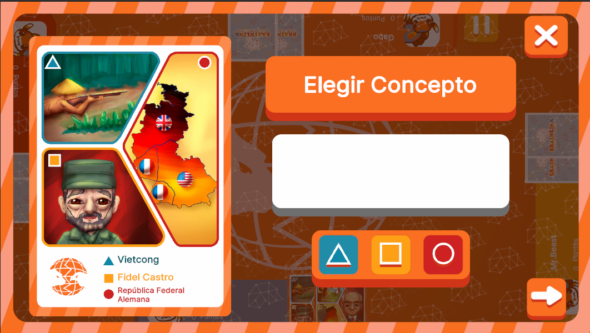

# ChooseConceptUI



## Descripción

**ConceptSelectionUI** es la interfaz encargada de gestionar la selección de conceptos de una carta dentro del juego. Está diseñada para ser abierta cuando un jugador selecciona una carta desde la **BoardUI**. 

Esta interfaz permite al jugador elegir entre los conceptos disponibles en la carta seleccionada, proporcionando una vista clara y ordenada de las opciones. Dependiendo de la fase del juego y la carta seleccionada, puede incluir diferentes tipos de interacción, como botones de selección o casillas de verificación.

---

## Controlador: Modo Normal

Durante el **Modo Normal**, **ConceptSelectionUI** se abre a través de un input desde la **BoardUI**. La interfaz está suscrita al evento **selectionConceptsPlayer**, y cuando se abre, recibe un contexto adicional desde **BoardUI** que contiene los datos de la carta seleccionada. Estos datos no provienen de los **attributes**, sino que se reciben directamente desde **BoardUI** a través del uso del contexto en el método **SetOpen**.

Además, si la carta seleccionada es activada, se envía una **flag** a **BoardUI** indicándole que la carta ha sido activada. Esto permite que **BoardUI** tome las medidas pertinentes a través del método **closeModal**, y también se maneja mediante una suscripción al evento **OnModalClosed** desde **BoardUI**, asegurando la correcta transición de la interfaz al cerrar el modal.


```csharp
namespace UI.Controllers.Views.Normal
{
    public class ChooseConceptUI : Core.UI
    {
        private GameObject _object;

        //Elementos UI
        private VisualElement _containerMain; // Contenedor Raiz
        private VisualElement _containerSelector; // Contenedor del selctor con figuras
        private VisualElement _containerSelectedConcept; // Contenedor del concepto

        private Button _btnNext;
        private Button _btnClose;
        private CardComponent _card; // Componente para manejo de carta
        

        //Auxiliar
        private Card _currentCard; // Datos de carta seleccionada
        private int _counterClickCard = 0; // Cantidad de cartas seleccionadas
        private List<Concept> _selectedConcepts; // Lista de posibles conceptos seleccionados (se retorna reordenada)
        private NormalModeAttributes.NormalModeInitGameAttributes _attributes; //Contexto local
        private bool _isNextClicked = false; //flag para saber si se selecciono la carta o no


        //----------FLUJO EJECUCION-----------

        public ChooseConceptUI()
        {
            GameEventBus<NormalModeAttributes.NormalModeInitGameAttributes>.Subscribe("SelectionConceptsPlayer", Init);
        }

        public override void InitInstance(GameObject ui)
        {
            _object = ui;
        }

        public override void Init(object attributes)
        {
            if (attributes.GetType() != typeof(NormalModeAttributes.NormalModeInitGameAttributes))
            {
                Debug.LogError("TIPO DE DATO DIFERENTE A NORMALMODE");
                return;
            }
            _attributes = attributes as NormalModeAttributes.NormalModeInitGameAttributes;
            
            _counterClickCard = 0; // Inicializacion contador

        }

        public override void SetOpen<T>(T context) where T : class
        {
            _object.SetActive(true);
            _currentCard = context as Card; // RECEPCION DE DATOS DESDE BOARD UI
            var _root = _object.GetComponent<UIDocument>().rootVisualElement;

            //Sigue flujo...
        }
        //Más métodos...
    }
}
```

---

### Commands

Esta interfaz cuenta con los siguientes comandos únicos de **AnimatorCommand**: 
- **ConceptRouletteCommand**: Usado para manejar las animaciones de la ruleta de selección de conceptos
- **ManageSelectionCommand**: Usado para manejar los cambios después de la selección del concepto (sombreado de carta y coloreado de contenedor)
