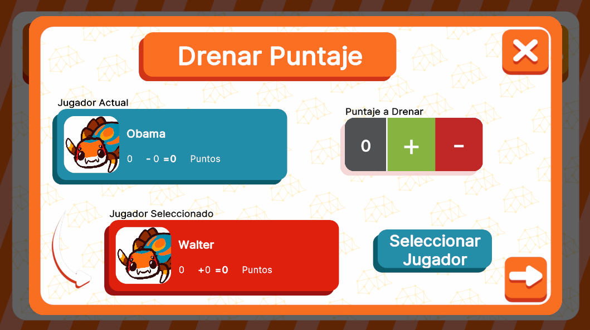

# DrainModeUI



## Descripción

**DrainModeUI** es la interfaz encargada de gestionar el modo drenaje. Está diseñada para ser abierta como un modal secundario dentro de otra pantalla, y cuenta con dos contenedores de información para los jugadores, permitiendo calcular dinámicamente los puntos que ambos jugadores distribuirán. Además, incluye botones personalizados para el manejo del drenaje y la posibilidad de abrir otro modal de selección de jugador, en caso de que se desee cambiar al jugador al cual asignar los puntos drenados. Esta interfaz ofrece flexibilidad en su activación dentro del flujo del juego, adaptándose a las necesidades del mismo en diferentes momentos.

---

## Controlador: Modo Normal

Durante el modo normal, esta interfaz es abierta por **MasterUI**, la cual, de por sí, cuenta con dos flujos separados activados por dos circunstancias diferentes. En este caso, el modal secundario también está subscrito a los mismos eventos que **MasterUI**, pero no cuenta con dos flujos separados. En cambio, mantiene el mismo flujo que deriva a la lógica del modo drenaje. Sin embargo, los datos entregados (atributos) son manejados de manera diferente, ya que **NormalModeAttributes** y **QuestionAttributes** son clases estructuralmente diferentes, aunque ambas alojan prácticamente la misma información.

---

### Flujo de ejecución

Durante la inicialización del modal, se determina el tipo de flujo en el que se encuentra el sistema revisando el tipo de dato del atributo. Este puede corresponder a dos tipos de flujos: el flujo "normal", representado por **NormalModeAttributes**, o el flujo de evento de pregunta, representado por **QuestionAttributes**. Según el tipo de flujo identificado, se proceden a almacenar en variables auxiliares los datos necesarios desde los atributos, permitiendo que el modal funcione correctamente, con los ajustes correspondientes para cada tipo de flujo.

```csharp
namespace UI.Controllers.Views.Normal
{
    public class DrainModeUI : Core.UI
    {
        private GameObject _object;

        //Elementos UI
        private List<VisualElement> _containerPlayerUI = new List<VisualElement>(); //Contenedor de info de jugaodres
        private VisualElement _containerMain; // Contenedor Principal
        private VisualElement _containerScoreCounter; //Contenedor del contador del ptje a drenar
        private ScrimOverlay _scrim; //Fondo oscuro al abrir un modal


        private Button _btnAddPointScore; //Boton +
        private Button _btnSubtractPointScore; //Boton -
        private Button _btnSelectPlayer; //Boton Seleccion Jugador
        private Button _btnClose;
        private Button _btnNext;

        //Auxiliar
        private int _drainedScore = 0; //Puntaje a drenar (Max 7)

        private bool _isEventSubscribed = false; // Flag para ver si se esta subscrito a evento (Cerrar modal)

        //Contexto de attributes
        private string _deckCode;
        private List<PlayerNormalMode> _players;
        private int _turn;


        //----------FLUJO EJECUCION-----------
        public DrainModeUI()
        {
            GameEventBus<QuestionCardAttributes>.Subscribe("InitMaster_QuestionCard", Init);
            GameEventBus<NormalModeAttributes.NormalModeInitGameAttributes>.Subscribe("InitMaster", Init);
            Debug.Log("CONSTRUYENDO: DrainModeUI");
        }

        public override void InitInstance(GameObject ui)
        {
            _object = ui;
        }

        public override void Init(object attributes)
        {
            //Manejo del flujo normal
            if (attributes.GetType() == typeof(NormalModeAttributes.NormalModeInitGameAttributes))
            {
                NormalModeAttributes.NormalModeInitGameAttributes data = attributes as NormalModeAttributes.NormalModeInitGameAttributes;
                
                //Guardado de datos
                _deckCode = data.deck.deckCode;
                _players = data.players;
                _turn = data.turn;
            }

            //Manejo del flujo Pregunta
            if (attributes.GetType() == typeof(QuestionCardAttributes))
            {
                QuestionCardAttributes data = attributes as QuestionCardAttributes;

                //Guardado de datos
                _deckCode = data.deckCode;
                _players = data.players;
                _turn = data.turn;

            }

        }

        public override void SetOpen<T>(T context) where T : class //Ambos flujos llegan al mismo SetOpen, sin ninguna diferenecia
        {
            //Sigue el flujo...
        }
        // Más métodos
    }
}
```


