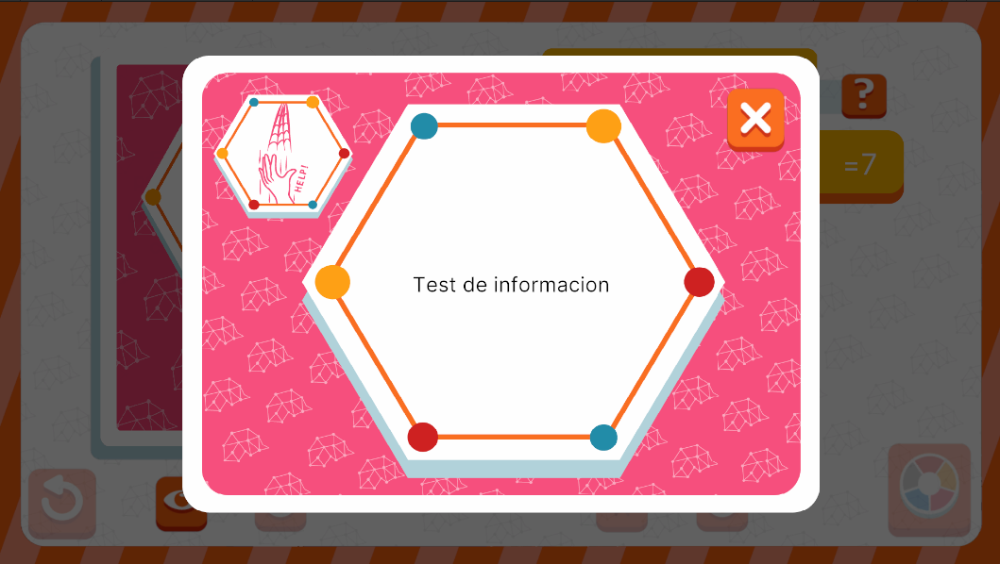

# EventInfoUI



## Descripción

**EventInfoUI** se encarga de mostrar una descripción general del tipo de evento asociado a una carta. Está pensada como un modal secundario, que se abre desde otra interfaz para trabajar en conjunto con esta. Su función principal es proporcionar información sobre el tipo de evento de la carta en cuestión, ayudando al jugador a comprender mejor el efecto o la mecánica asociada antes de tomar decisiones dentro del juego.

---

## Controlador: Modo Normal

### Flujo de ejecución

Durante el modo normal, esta interfaz es abierta exclusivamente por **EventCardManagementUI**, por lo que está suscrita al mismo evento de **ListEvent**, **ChooseEventCards**. **EventInfoUI** es una interfaz simple que cuenta con referencias directas al **UIDocument**. No está compuesta por elementos complejos y los únicos cambios dinámicos que realiza son en el fondo de información, el cual se adapta según la carta de evento seleccionada.

Es importante destacar que esta interfaz utiliza un contexto adicional llamado **SetOpen**, el cual es entregado por **EventCardManagementUI**. Este contexto proporciona la carta seleccionada al modal para que pueda obtener su tipo de evento y adaptar dinámicamente sus datos.

```csharp
namespace UI.Controllers.Views.Normal
{
    public class EventInfoUI : Core.UI
    {
        private GameObject _object;

        //Elementos UI

        private VisualElement _containerMain; //Contenedor Principal

        private Label _info; //Datos informacion carta evento
        private Button _btnClose;

        //Auxiliar
        private NormalModeAttributes.NormalModeInitGameAttributes _attributes;

        //----------FLUJO EJECUCION-----------

        public EventInfoUI()
        {
            GameEventBus<NormalModeAttributes.NormalModeInitGameAttributes>.Subscribe("ChooseEventCards", Init);
            Debug.Log("CONSTRUYENDO: EventInfoUI");
        }

        public override void InitInstance(GameObject ui)
        {
            _object = ui;
        }

        public override void Init(object attributes)
        {
            if (attributes.GetType() != typeof(NormalModeAttributes.NormalModeInitGameAttributes))
            {
                Debug.LogError("TIPO DE DATO DIFERENTE A NORMALMODE");
                return;
            }
            NormalModeAttributes.NormalModeInitGameAttributes initGameAttributes = attributes as NormalModeAttributes.NormalModeInitGameAttributes;
            _attributes = initGameAttributes;
        }

        public override void SetOpen<T>(T context) where T : class
        {
            var selectedCard = context as EventCard; // Obtencion de contexto
            //Sigue flujo...
        }
        //Más métodos...
    }
}

```

La interfaz se cierra simplemente mediante un botón y no envía datos de vuelta al ser cerrada.
