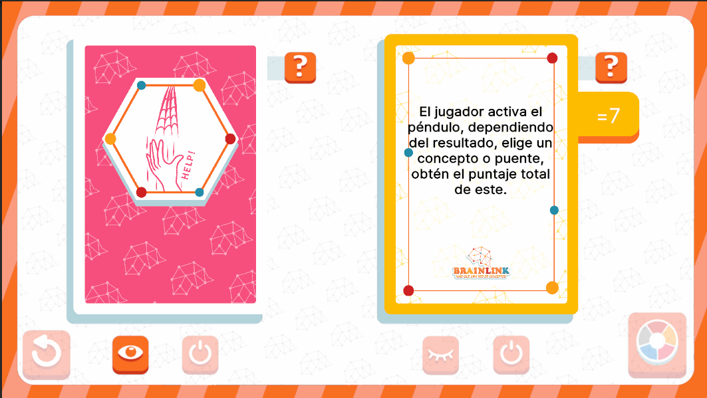

# EventsUI



## Descripción

**EventCardManagementUI** es una interfaz que actúa como un menú de gestión para las cartas de evento. Está pensada para abrir múltiples modales debido a las diferentes funcionalidades de las cartas de evento, como la visualización de información y la selección de las mismas. Esta interfaz proporciona una estructura flexible para interactuar con las cartas de evento dentro del flujo del juego, permitiendo una experiencia de usuario dinámica y adaptativa.

---

## Controlador: Modo Normal

Durante el modo normal, esta interfaz se abre automáticamente solo si, en las configuraciones, se decidió contar con las cartas de evento en la partida. Aunque actúa como el **manager** de las cartas, **EventCardManagementUI** solo está suscrita a un evento, que es **ChooseEventCards**. Posteriormente, cada carta maneja sus propios eventos de forma independiente a través del **ListEvent**.

```csharp
namespace UI.Controllers.Views.Normal
{
    public class EventsUI : Core.UI
    {
        private GameObject _object;

        //Declaracion UI
        private VisualElement _containerMain; //Contenedor Principal
        private ScrimOverlay _scrim; //Fondo oscuro al abrir un modal
        private List<VisualElement> _containersEventCardsUI; //Listado contenedores cartas evento

        private Button _btnReturn;
        private Button _btnRoulette;

        //Auxiliar
        private NormalModeAttributes.NormalModeInitGameAttributes _attributes; //Contexto local
        private int _activatedCards = 0; //Cantidad de cartas activadas
        private bool _isEventSubscribed = false; //Flag de subscripcion a evento externo (Cierre de modal en este caso)


        //----------FLUJO EJECUCION-----------
        public EventsUI()
        {
            GameEventBus<NormalModeAttributes.NormalModeInitGameAttributes>.Subscribe("ChooseEventCards", Init);
            Debug.Log("CONSTRUYENDO: EventsUI");
        }

        public override void InitInstance(GameObject ui)
        {
            _object = ui;
        }

        public override void Init(object attributes)
        {
            if (attributes.GetType() != typeof(NormalModeAttributes.NormalModeInitGameAttributes))
            {
                Debug.LogError("TIPO DE DATO DIFERENTE A NORMALMODE");
                return;
            }
            NormalModeAttributes.NormalModeInitGameAttributes initGameAttributes = attributes as NormalModeAttributes.NormalModeInitGameAttributes;
            _attributes = initGameAttributes;

            GameEventBus<NormalMode>.Instance.uiManager.modalManager.OpenModal<string>(typeof(EventsUI)); // Apertura Automatica
        }

        public override void SetOpen<T>(T context) where T : class
        {
            //Cotinua flujo
        }
        //Más Métodos
    }
}
```

---

### Flujo de ejecución

El flujo de esta interfaz dicta la activación del botón que lleva a **RouletteUI** para la selección de las cartas, y luego permite la activación de las mismas en cualquier orden. Cada carta también cuenta con información general del tipo de evento, la cual se adapta dinámicamente según los datos de la carta, los cuales son establecidos durante la inicialización del modal. El resto de la interfaz está compuesto principalmente por animaciones.

Igualmente, este modal está a la espera de señales de otros modales para la activación de las cartas, dado que no está suscrito a los eventos de estas. En el momento en que un evento se complete, el modal recibe una señal y ejecuta su método **OnComplete**, el cual maneja un chequeo para saber cuántas cartas han sido activadas. 

```csharp
// Evento que se dispara al completar un evento
private void OnComplete(){
    Debug.Log("Termino del los eventos, Eventos activados: "+_activatedCards);

    // Se revisa si se han activado todas las cartas
    if(_activatedCards == 2)
    {
        _btnReturn.SetEnabled(true);
    }
    
}
```

Una vez que todas las cartas hayan sido activadas, el modal permite la salida al activar el botón **Regresar**, enviando una señal para continuar con el siguiente nodo del **ListEvent**.

---

### Commands

Esta interfaz cuenta con los siguientes comandos únicos de **AnimatorCommand**: 
- **GiveEventCardsCommand**: Usado después de la selección de cartas de evento, para la entrega de ambas cartas y activación de botones.
- **RotateEventCardCommand**: Usado al clickear el mostrado de una carta, se encrga de la rotación de la carta y manejar la activación/desactivación de sus botones.


