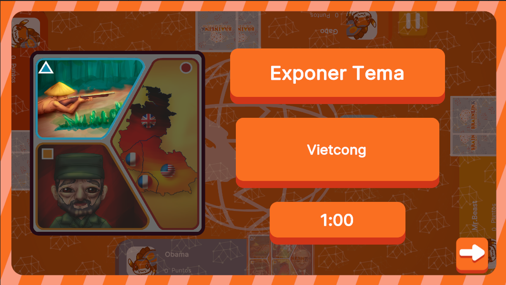

# ExplainConceptsUI



## Descripción

**ExplainConceptsUI** es la interfaz encargada de gestionar los conceptos y puentes que deben ser explicados durante el juego, junto con el tiempo disponible para la exposición. Su objetivo principal es proporcionar un espacio para que los jugadores presenten los conceptos seleccionados, gestionando tanto el contenido como el temporizador para asegurar que la exposición se realice dentro del tiempo asignado.

---

## Controlador: Modo Normal

Durante el **Modo Normal**, **ExplainConceptsUI** se abre mediante un input desde **BoardUI**, al seleccionar el botón de discusión para comenzar la exposición de los conceptos. Este proceso se activa a través del evento de suscripción **ExplainConceptsPlayer**.

La interfaz cuenta con contenedores dinámicos que muestran, dependiendo de los conceptos y puentes a explicar, dos o tres cartas junto con sus respectivas descripciones. El tiempo disponible para la exposición es manejado internamente por la pantalla. Cada vez que la pantalla se cambia, el temporizador se reinicia y se instancia nuevamente con el tiempo asignado para la exposición.

Al finalizar, **ExplainConceptsUI** envía una señal a **BoardUI** para que este se encargue de abrir automáticamente el siguiente modal dentro del flujo de juego.

```csharp
namespace UI.Controllers.Views.Normal
{
    public class ExplainConceptsUI : Core.UI
    {
        private GameObject _object;

        //Declaracion Elementos
        private VisualElement _containerMain; // contenedor Raiz
        private VisualElement _containerOneCard; // contenedor una carta
        private VisualElement _containerTwoCards;// contenedor dos cartas
        private VisualElement _containerTime; // Tiempo

        private Button _btnNext;
        private Label _conceptLabel;

        private List<CardComponent> _cardsUI = new List<CardComponent>(); // Listado de referencias a UI cartas, 0 = carta sola, 1 = carta arriba, 2 = carta abajo

        //Auxiliares
        private int _clickCount = 0; // Contador de clics
        private NormalModeAttributes.NormalModeInitGameAttributes _attributes;

        //----------FLUJO EJECUCION-----------
        public ExplainConceptsUI()
        {
            GameEventBus<NormalModeAttributes.NormalModeInitGameAttributes>.Subscribe("ExplainConceptsPlayer", Init);
        }

        public override void InitInstance(GameObject ui)
        {
            _object = ui;
        }

        public override void Init(object attributes)
        {
            if (attributes.GetType() != typeof(NormalModeAttributes.NormalModeInitGameAttributes))
            {
                Debug.LogError("TIPO DE DATO DIFERENTE A NORMALMODE");
                return;
            }
            NormalModeAttributes.NormalModeInitGameAttributes initGameAttributes = attributes as NormalModeAttributes.NormalModeInitGameAttributes;
            _attributes = initGameAttributes;

        }

        public override void SetOpen<T>(T context = null) where T : class
        {
            //Sigue Flujo
        }
        //Más métodos
    }
}
```

