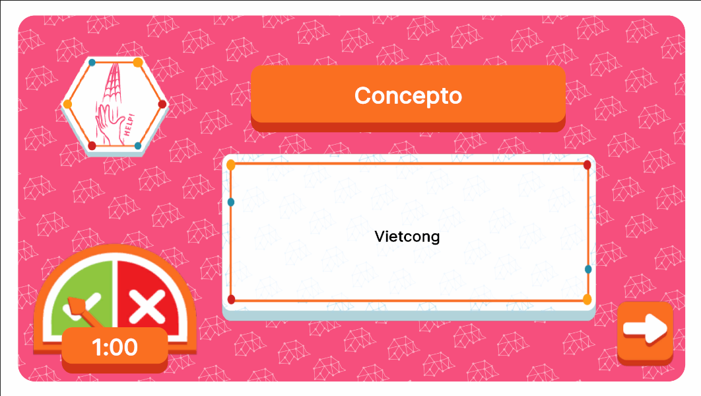

# HelpEventUI




## Descripción

**HelpEventUI** es la interfaz encargada de mostrar los eventos relacionados con las cartas de tipo **Help**. Estructuralmente, cuenta con múltiples contenedores dinámicos que muestran diferentes elementos e información según lo requiera el evento. Esto incluye un contenedor de información, un listado de opciones, un péndulo y un control de tiempo, todos diseñados para facilitar la interacción del jugador con el evento y proporcionar una experiencia dinámica según el juego lo necesite.

---

## Controlador: Modo Normal

Durante el modo normal, **HelpEventUI** se abre cuando se activa una carta de evento de tipo **Help** desde **EventCardManagementUI**. El controlador está suscrito a múltiples eventos, ya que cada evento deriva de una carta de evento de tipo **Help**, y cada carta realiza una acción y lógica diferente. Por esta razón, la interfaz cuenta con contenedores dinámicos que se ajustan según el tipo de evento.

Además, todos los eventos y sus respectivas suscripciones reciben sus datos del mismo atributo, que tiene el tipo **HelpCardAttributes**, garantizando que la lógica se maneje de manera uniforme independientemente del evento que se active.

```csharp
namespace UI.Controllers.Views.Normal
{
    public class HelpEventUI : Core.UI
    {
        private GameObject _object;

        //Elementos UI
        private VisualElement _containerMain; // contenedor Principal
        private VisualElement _containerChoose; // Contenedor de opciones
        private VisualElement _containerInfo; // Contenedor de Informacion
        private PendulumComponent _pendulum; // Contenedor Pendulo
        private VisualElement _containerTimer; // Contenedor Tiempo
        private VisualElement _containerBtnNext; // contenedor del boton Next
        private List<Button> _electionList; // Lista Eleccion

        private Button _btnNext;

        //Auxiliar
        private HelpCardAttributes _attributes; // contexto local
        private TypeConcept _currentTypeConcept; // tipo de concepto a manejar por el evento actual
        private string _selectedConcept; // concepto a mostrar por el evento actual
        private bool _isNextClicked; // flag para detener timer


        //----------FLUJO EJECUCION-----------
        public HelpEventUI()
        {
            GameEventBus<HelpCardAttributes>.Subscribe("HelpCard_E_A_1", HelpCard_E_A_1);
            GameEventBus<HelpCardAttributes>.Subscribe("HelpCard_E_A_2", HelpCard_E_A_2);
            GameEventBus<HelpCardAttributes>.Subscribe("HelpCard_E_A_3", HelpCard_E_A_3);
            GameEventBus<HelpCardAttributes>.Subscribe("HelpCard_E_A_4", HelpCard_E_A_4);
            GameEventBus<HelpCardAttributes>.Subscribe("HelpCard_E_A_5", HelpCard_E_A_5);
            Debug.Log("CONSTRUYENDO: HelpEventUI");
        }

        public override void InitInstance(GameObject ui)
        {
            _object = ui;
        }

        public override void Init(object attributes)
        {
            if (attributes.GetType() != typeof(HelpCardAttributes))
            {
                Debug.LogError("TIPO DE DATO DIFERENTE A NORMALMODE");
                return;
            }
            HelpCardAttributes initGameAttributes = attributes as HelpCardAttributes;
            _attributes = initGameAttributes;

            GameEventBus<NormalMode>.Instance.uiManager.modalManager.OpenModal<string>(typeof(HelpEventUI)); // Apertura Automatica

        }
                
        public override void SetOpen<T>(T context = null) where T : class
        {
            //Busqueda de referencias UI...
        }
        //Más Métodos...
    }
}
```

---

### Flujo de ejecución

El flujo de ejecución de este controlador varía dependiendo de la carta de evento en cuestión, pero todos los flujos pasan por **Init** al comenzar. Esto se debe a que **Init** se encarga de entregarle el contexto de la partida a la interfaz y se asegura de que el objeto se active llamando a **OpenModal** para la inicialización automática y buscqueda de las referencias UI de la interfaz una vez que el evento es disparado. 

La lógica de cada evento está separada individualmente por el ID de cada **HelpCard**, lo que permite que cada carta tenga su propia acción y flujo de ejecución. Al final de cada flujo, siempre se envían de vuelta los avisos correspondientes a **EventsUI** por **OnComplete**, indicando que el evento ha terminado y permitiendo que el flujo del juego continúe.

```csharp
 //----------LOGICA EVENTOS-----------
private void HelpCard_E_A_1(object attributes)
{
    Init(attributes); //Inicializa Init

    //Sigue flujo del evento...
}

private void HelpCard_E_A_2(object attributes)
{
    Init(attributes); //Inicializa Init

    //Sigue flujo del evento...
    
}
private void HelpCard_E_A_3(object attributes)
{
    Init(attributes); //Inicializa Init

    //Sigue flujo del evento...
}

private void HelpCard_E_A_4(object attributes)
{
    Init(attributes); //Inicializa Init

    //Sigue flujo del evento...
}

private void HelpCard_E_A_5(object attributes)
{
    Init(attributes); //Inicializa Init

    //Sigue flujo del evento...
}

//Al finalizar...
private void ClickNext(ClickEvent e)
{
    //Realiza animaciones y otros...
    GameEventBus<AnimatorCommand>.Instance.AddCommand(new ListEventCommand(_attributes.onComplete)); // Se da aviso a EventsUI
}
```

---
### Commands

Esta interfaz cuenta con los siguientes comandos únicos de **AnimatorCommand**: 
- **ShowElements**: Usado para transiciones entre fases del evento, para animar la entrada y salida de contenedores y elementos dinamicamente.
