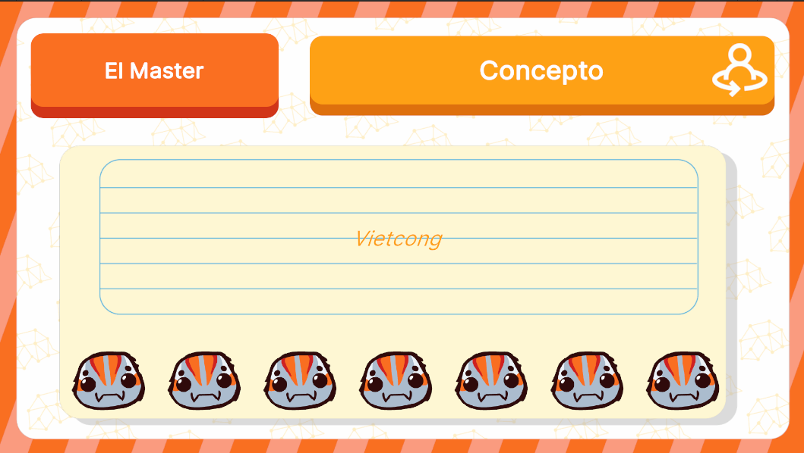

# MasterUI



## Descripción

**MasterUI** es la interfaz encargada de asignar puntajes a los jugadores. Contiene botones personalizados que permiten el ajuste de los puntajes y el manejo de las animaciones correspondientes. Además, cuenta con un botón que redirige a la interfaz de modo drenaje, permitiendo la transición entre diferentes modos del juego. Esta interfaz puede abrirse bajo diversas circunstancias dentro del flujo del juego, proporcionando flexibilidad en su activación según las necesidades del juego en ese momento.


---

## Controlador: Modo Normal

Durante el **Modo Normal**, **MasterUI** puede abrirse bajo dos circunstancias principales: 
1. Después de haber expuesto los conceptos a través de **ExplainConceptsUI**.
2. Después de haber respondido una pregunta desde una carta de evento **QuestionEventUI**.

Debido a estas dos situaciones, la lógica de **MasterUI** está modularizada en dos flujos separados, adaptándose a cada circunstancia según corresponda. Además, dependiendo de si el **modo drenaje** está activado en las configuraciones del juego, la interfaz maneja su comportamiento de acuerdo con este estado, asegurando que las interacciones y la experiencia del jugador se ajusten adecuadamente a las condiciones actuales del juego.

---

### Flujo de Ejecución

En ambos flujos, la inicialización se realiza de la misma manera, pero el flujo difiere solo en los datos que se muestran, dependiendo del tipo de dato que reciba en su inicialización. Los datos pueden ser de tipo **NormalModeAttributes** o **QuestionCardAttributes**. Las referencias al **UIDocument** se mantienen iguales en ambos casos, y el proceso de apertura (automatica), cierre del modal y manejo/envío de los datos es similar en ambas situaciones.

```csharp
namespace UI.Controllers.Views.Normal
{
    public class MasterUI : Core.UI
    {
        private GameObject _object;

        //Declaracion Elementos
        private VisualElement _containerMain; // Contenedor Principal
        private Label _conceptTypeLabel; // Tipo de concepto  
        private Label _conceptLabel; // concepto
        private List<AragniButtonComponent> _aragniButtonComponent = new List<AragniButtonComponent>(); //Listado de botones
        private Button _btnDrainMode; //Boton modo Drenaje
        private ScrimOverlay _scrim; //Fondo oscuro al abrir un modal


        //Auxiliar
        private List<int> _scores = new List<int>(); //Lista de puntajes dados
        private NormalModeAttributes.NormalModeInitGameAttributes _attributes; // Contexto Local
        private QuestionCardAttributes _eventAttributes; // Contexto Local
        private int _clickCount = 0; // Contador de clics
        private bool _isEventQuestion; // Flag para ver si se realiza flujo normal o flujo de evento
        private bool _isEventSubscribed; // Flag para ver si se esta subscrito a evento (Cerrar modal)
        private bool _isDrainModeActive;


        //----------FLUJO EJECUCION-----------
        public MasterUI()
        {
            //Eventos a subscribir
            GameEventBus<NormalModeAttributes.NormalModeInitGameAttributes>.Subscribe("InitMaster", Init);
            GameEventBus<QuestionCardAttributes>.Subscribe("InitMaster_QuestionCard", Init);
        }

        

        public override void InitInstance(GameObject ui)
        {
            _object = ui;
        }

        public override void Init(object attributes)
        {
            //FLUJO NORMAL ---------------
            if (attributes.GetType() == typeof(NormalModeAttributes.NormalModeInitGameAttributes))
            {
                NormalModeAttributes.NormalModeInitGameAttributes initGameAttributes = attributes as NormalModeAttributes.NormalModeInitGameAttributes;
                _attributes = initGameAttributes;
                _isEventQuestion = false;
                _isDrainModeActive = _attributes.drainMode;
                GameEventBus<NormalMode>.Instance.uiManager.modalManager.OpenModal<string>(typeof(MasterUI)); // Apertura Automatica
            }

            //FLUJO EVENTO (PREGUNTA) -------------
            if (attributes.GetType() == typeof(QuestionCardAttributes))
            {
                _eventAttributes = attributes as QuestionCardAttributes;
                _isEventQuestion = true;
                _isDrainModeActive = _eventAttributes.drainMode;
                GameEventBus<NormalMode>.Instance.uiManager.modalManager.OpenModal<string>(typeof(MasterUI)); // Apertura Automatica
            }
        }

        public override void SetOpen<T>(T context = null) where T : class
        {
            //Manejo de las referencias al UIDocument...

            //FLUJO DE DATOS
            if (_isEventQuestion == false) //Flujo Normal
                SetScreenDataNormal();
            else
                SetScreenDataQuestionEvent();

            //Manejo de display...
        }
        //Más métodos
    }
}
```

---

**InitMaster**

Este es el flujo "normal" que se ejecuta después de la exposición de conceptos. En este flujo, se cargan los datos relacionados con los conceptos y puentes, y se asignan los puntajes correspondientes a los jugadores.

```csharp
private void SetScreenDataNormal()
{
    // Mientras las cartas recorridas sea menor a las cartas que se deben presentar
    if (_clickCount < _attributes.players[_attributes.turn].selectedConcepts.Count)
    {
        // Mostrar pantalla dependiendo del tipo de concepto...
        switch (_attributes.players[_attributes.turn].selectedConcepts[_clickCount].typeConcept)
        {
            //Mostrar Pantalla Concepto
            case Enums.TypeConcept.CONCEPT:
                //Set de datos
                _conceptTypeLabel.text = "Concepto";
                _conceptLabel.text = _attributes.players[_attributes.turn].selectedConcepts[_clickCount].name;

                
                break;

            //Mostrar Pantalla Puente
            case Enums.TypeConcept.BRIDGE:
                //Set de datos
                _conceptTypeLabel.text = "Puente";
                _conceptLabel.text = _attributes.players[_attributes.turn].selectedConcepts[_clickCount].name;

                break;

            default:
                break;
        }

        return;
    }


    OnClosingAnimationsNormal();
    //GameEventBus<GameManager>.Instance.StartCoroutine(OnClosingAnimations());

}
```

---

**InitMaster_QuestionCard**

Este flujo se activa después de responder una pregunta proveniente de un evento. En este caso, se cargan los datos de la pregunta y se asigna el puntaje extra correspondiente al jugador que ha respondido correctamente.

```csharp
private void SetScreenDataQuestionEvent()
{
    if (_clickCount < 1)
    {
        _conceptTypeLabel.text = "Pregunta";
        _conceptLabel.text = _eventAttributes.question;
        return;
    }


    OnClosingAnimationsQuestionEvent();
}
```