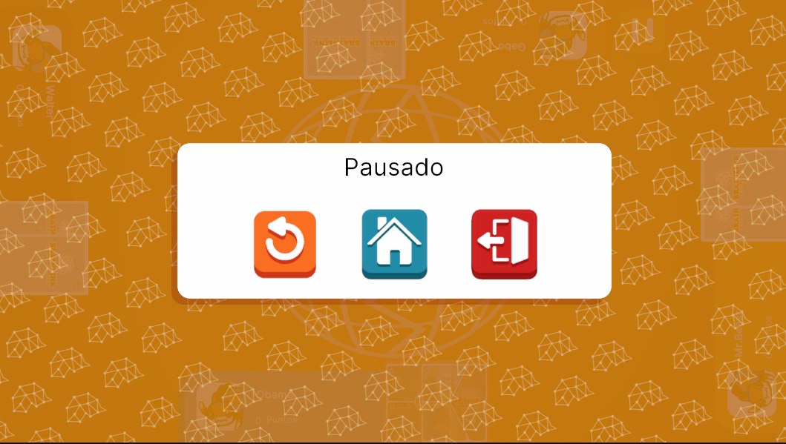

# PauseUI



## Descripción

**PauseUI** es la interfaz encargada de mostrar el menú de pausa del juego. Está diseñada para ser activada a través de un botón o input, funcionando como un modal que interactúa con otras interfaces del juego. Su construcción es similar a un overlay, combinado con un popup de información, el cual presenta un fondo semitransparente y una ventana que gestiona las opciones para continuar el juego o salir del mismo.

---
## Controlador: Modo Normal

**PauseUI** es una interfaz simple que no requiere de información extra para su funcionamiento. Cuenta con contenedores dinámicos para mostrar las diferentes opciones y permitir al jugador pasar de un lugar a otro, actuando como un overlay. Por lógica, tiene referencias directas a los elementos de la interfaz y se maneja a sí misma sin la ayuda de otros controladores.

Esta interfaz se abre a partir del botón de pausa desde **BoardUI** (cuando este botón está habilitado). Debido a su naturaleza, **PauseUI** no cuenta con un flujo de ejecución adicional más allá del que ya tiene establecido para gestionar sus opciones de pausa y transición dentro del juego.

```csharp
namespace UI.Controllers.Views.Normal
{
    public class PauseUI : Core.UI
    {
        private GameObject _object;

        //Declaracion Elementos
        private VisualElement _containerOptions;
        private VisualElement _containerConfirm;

        private Button _btnReturn;
        private Button _btnHome;
        private Button _btnExit;
        private Button _btnConfirm;
        private Button _btnCancel;

        private Label _title;


        //----------FLUJO EJECUCION-----------
        public PauseUI()
        {
            Debug.Log("CONSTRUYENDO: PauseUI");
        }

        public override void InitInstance(GameObject ui)
        {
            _object = ui;
        }

        public override void SetOpen<T>(T additionalData = null)
        {
            _object.SetActive(true);
            //Referencias Ui...
        }
        //Más metodos
    }
}
```


