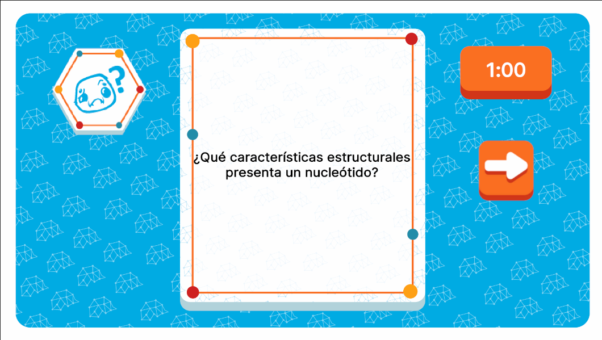

# QuestionEventUI



## Descripción

**QuestionEventUI** es la interfaz encargada de mostrar los eventos relacionados con las cartas de tipo **Question**. Estructuralmente, cuenta con un contenedor que presenta la pregunta a responder, un temporizador para medir el tiempo disponible para la respuesta, y un botón para continuar una vez que el jugador haya completado la interacción. Esta interfaz permite gestionar la mecánica de preguntas dentro del flujo del juego.

---
## Controlador: Modo Normal

Durante el modo normal, **QuestionEventUI** se abre cuando se activa una carta de evento de tipo **Question** desde **EventsUI**. Dado que todos los eventos de pregunta se manejan de la misma forma, esta interfaz está suscrita únicamente al evento del **ListEvent** llamado **QuestionCard**, que gestiona la activación y el flujo de los eventos de pregunta dentro del juego. Los atributos, al igual que todos los eventos, tienen un tipo unico para el evento en sí (en este caso **QuestionCardAttributes**).

---

### Flujo de ejecución

Una vez el evento es publicado, **QuestionEventUI** se abre automáticamente, establece sus datos y se convierte en una interfaz meramente visual. Desde esta interfaz, una vez que el jugador haya respondido la pregunta, se ceirra la interfaz y se llama a **MasterUI** para gestionar el puntaje correspondiente por la respuesta. Este proceso se realiza mediante otro evento del **ListEvent** que, es llamado desde **QuestionEventUI** al invocar al siguiente nodo de eventos, además de enviar el aviso de evento "terminado" a **EventsUI**, asegurando que el flujo del juego continúe sin interrupciones.

```csharp
namespace UI.Controllers.Views.Normal
{
    public class QuestionEventUI : Core.UI
    {
        private GameObject _object;

        //Elementos UI
        private VisualElement _containerMain; // contenedor Principal
        private VisualElement _containerTimer; // Contenedor Tiempo

        private Button _btnNext;
        private Label _questionText;

        //Auxiliar
        private QuestionCardAttributes _attributes; // contexto local
        private bool _isNextClicked; // flag para detener timer
        

        //----------FLUJO EJECUCION-----------
        public QuestionEventUI()
        {
            GameEventBus<QuestionCardAttributes>.Subscribe("QuestionCard", Init);
            Debug.Log("CONSTRUYENDO: QuestionEventUI");
        }

        public override void InitInstance(GameObject ui)
        {
            _object = ui;
        }

        public override void Init(object attributes)
        {
            if (attributes.GetType() != typeof(QuestionCardAttributes))
            {
                Debug.LogError("TIPO DE DATO DIFERENTE A NORMALMODE");
                return;
            }
            QuestionCardAttributes initGameAttributes = attributes as QuestionCardAttributes;
            _attributes = initGameAttributes;

            GameEventBus<NormalMode>.Instance.uiManager.modalManager.OpenModal<string>(typeof(QuestionEventUI)); // Apertura 

            
        }

        public override void SetOpen<T>(T context = null) where T : class
        {
            //Sigue flujo...
        }
        //Más métodos
    }
}
```

---