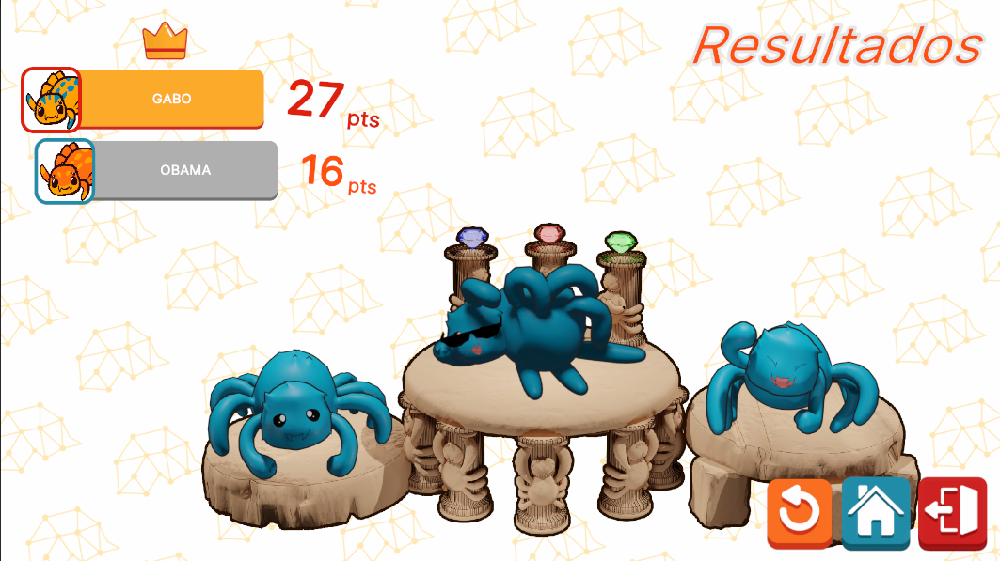

# ResultsUI



## Descripción

**ResultsUI** es la interfaz encargada de mostrar los resultados de la partida de un juego. Esta interfaz presenta los resultados hasta para 4 jugadores y puede ser reutilizada en múltiples modos de juego, ya que su diseño es relativamente genérico. Esto permite que **ResultsUI** se adapte a diferentes escenarios sin necesidad de modificaciones significativas, proporcionando una visualización clara de los resultados para los jugadores al final de cada partida.


---
## Controlador: Modo Normal

**ResultsUI**, durante el modo de juego normal, es la última interfaz mostrada al finalizar la partida. Se abre automáticamente una vez que se dispara el evento de finalización de la partida. Dentro de su proceso de inicialización (**init**), recibe el contexto necesario para mostrar a los jugadores y sus puntajes de manera adecuada.

Esta interfaz actúa meramente de forma visual y no maneja lógica adicional. Además, es desde **ResultsUI** donde se realiza la transición final de la escena del juego a la escena principal, la cual aloja el menú principal del juego.

```csharp
namespace UI.Controllers.Views.Normal
{
    public class ResultsUI : Core.UI
    {
        private GameObject _object;

        //Elementos UI
        private AragniOverlay _aragni; //Overlay de entrada
        private VisualElement _containerMain; //Contenedor principal
        private VisualElement _containerStatsUI; //Contenedor principal de estadisticas
        private List<VisualElement> _containersPlayerStatsUI = new List<VisualElement>(); //Listado de contenedores de jugadores
        private List<VisualElement> _containersSpidersUI = new List<VisualElement>(); //Listado de contenedores de ara�as

        private Button _btnReturn;
        private Button _btnHome;
        private Button _btnExit;

        //Auxiliar
        private NormalModeAttributes.NormalModeInitGameAttributes _attributes; //Contexto local

        //----------FLUJO EJECUCION-----------
        public ResultsUI()
        {
            GameEventBus<NormalModeAttributes.NormalModeInitGameAttributes>.Subscribe("EndGame", Init);
            Debug.Log("CONSTRUYENDO: ResultsUI");
        }

        public override void InitInstance(GameObject ui)
        {
            _object = ui;
        }

        public override void Init(object attributes)
        {
            if (attributes.GetType() != typeof(NormalModeAttributes.NormalModeInitGameAttributes))
            {
                Debug.LogError("TIPO DE DATO DIFERENTE A NORMALMODE");
                return;
            }
            NormalModeAttributes.NormalModeInitGameAttributes initGameAttributes = attributes as NormalModeAttributes.NormalModeInitGameAttributes;
            _attributes = initGameAttributes;
            GameEventBus<NormalMode>.Instance.uiManager.modalManager.OpenModal<string>(typeof(ResultsUI)); // Apertura Automatica
        }

        public override void SetOpen<T>(T context) where T : class
        {
            _object.SetActive(true);
            //Referencias Ui...
        }
        //Más metodos
    }
}
```


