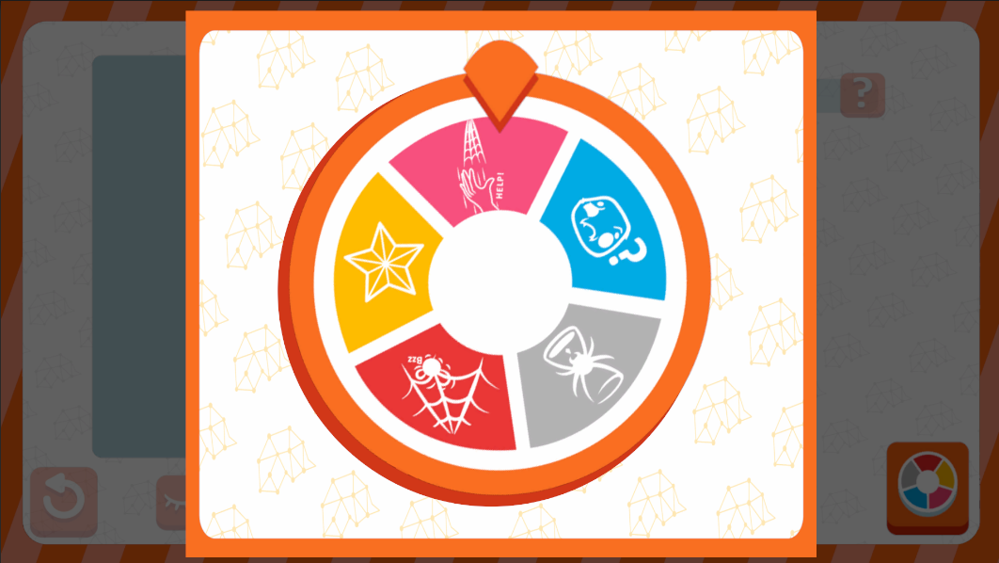

# RouletteUI



## Descripción

**RouletteUI** es la interfaz encargada de mostrar la selección de cartas de evento dentro del juego. Está diseñada como un modal secundario, que se abre desde otra interfaz para trabajar de manera conjunta con ella. La principal funcionalidad de esta interfaz es una ruleta, que gira para determinar qué tipo de cartas de evento se seleccionan.

---

## Controlador: Modo Normal

Durante el modo normal, esta interfaz es abierta exclusivamente por **EventCardManagementUI** a través del botón **Ruleta**. Por lo tanto, está suscrita al mismo evento **ChooseEventCards**. **RouletteUI** no requiere de contexto adicional, ya que las cartas seleccionadas son obtenidas directamente desde los atributos. Su principal función es actuar como un componente visual para las animaciones, girando la ruleta y mostrando el tipo de carta de evento que corresponde. Esta interfaz no gestiona ningún tipo de lógica o flujo adicional.

---

### Flujo de ejecución

Una vez la interfaz es abierta, **RouletteUI** inicializa sus referencias y aplica dos animaciones de giro, las cuales son manejadas por un **command**. Estas animaciones simulan el giro de la ruleta para mostrar el tipo de carta de evento seleccionado. Una vez que las animaciones se completan, la interfaz termina su ejecución y se cierra automáticamente, permitiendo que el flujo del juego continúe sin interrupciones.

```csharp
namespace UI.Controllers.Views.Normal
{
    public class RouletteUI : Core.UI
    {
        private GameObject _object;

        //Elementos UI
        private VisualElement _containerMain; //Contenedor Principal
        private VisualElement _roulette; //Ruleta
        private VisualElement _rouletteArrow; // Flecha Ruleta

        //Auxiliar
        private NormalModeAttributes.NormalModeInitGameAttributes _attributes;


        //----------FLUJO EJECUCION-----------
        public RouletteUI()
        {
            GameEventBus<NormalModeAttributes.NormalModeInitGameAttributes>.Subscribe("ChooseEventCards", Init);
            Debug.Log("CONSTRUYENDO: RouletteUI");
        }

        public override void InitInstance(GameObject ui)
        {
            _object = ui;
        }

        public override void Init(object attributes)
        {
            if (attributes.GetType() != typeof(NormalModeAttributes.NormalModeInitGameAttributes))
            {
                Debug.LogError("TIPO DE DATO DIFERENTE A NORMALMODE");
                return;
            }
            NormalModeAttributes.NormalModeInitGameAttributes initGameAttributes = attributes as NormalModeAttributes.NormalModeInitGameAttributes;
            _attributes = initGameAttributes;
            
        }

        public override void SetOpen<T>(T context) where T : class
        {
            //Flujo Natrual
        }
        //Más métodos
    }
}
```

---

### Commands
Esta interfaz cuenta con los siguientes comandos únicos de **AnimatorCommand**: 
- **RotateRouletteCommand**: Usado durante el flujo de vida de la interfaz, se encarga de realizar un giro de la ruleta.


