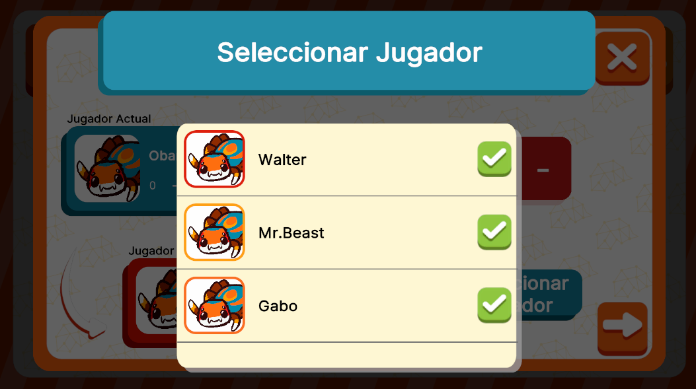

# SelectPlayerDrainUI



## Descripción

**SelectPlayerDrainUI** es una interfaz diseñada para mostrar y seleccionar a un jugador de un listado de jugadores. Recibe el nombre de **selectPlayerDrain** porque se utiliza únicamente en el modo drenaje, aunque su construcción es genérica y puede ser utilizada en conjunto con otra interfaz completamente diferente. Está pensada como un modal secundario que trabaja en conjunto con otra interfaz principal y es abierto por esta.

---

## Controlador: Modo Normal

Durante el modo normal, esta interfaz se abre a través del botón "Seleccionar Jugador" en la interfaz de **Modo Drenaje**. Maneja un **ListView** para mostrar los jugadores disponibles y, de manera interna, se encarga de filtrar la lista de datos para evitar la selección del jugador que está en el turno actual. 

Similar a **DrainModeUI**, esta interfaz debe manejar dos flujos de datos diferentes, aunque ambos flujos convergen en la misma lógica. Los datos que se reciben, ya sea de **NormalModeAttributes** o **QuestionAttributes**, se gestionan de la misma manera. Estos datos se almacenan en variables auxiliares para garantizar que el flujo natural y la lógica del modal no se vean interrumpidos.

```csharp
namespace UI.Controllers.Views.Normal
{
    public class SelectPlayerDrainUI : Core.UI
    {
        private GameObject _object;

        //Elementos UI
        private VisualElement _containerMain; //Contenedor Principal
        private ListView _playerListView;

        //Auxiliar
        private List<PlayerNormalMode> _playersDataListView = new List<PlayerNormalMode>(); // Datos de jugadores a mostrar

        //Contexto de attributes
        private List<PlayerNormalMode> _players;
        private int _turn;

        //----------FLUJO EJECUCION-----------
        public SelectPlayerDrainUI()
        {
            GameEventBus<QuestionCardAttributes>.Subscribe("InitMaster_QuestionCard", Init);
            GameEventBus<NormalModeAttributes.NormalModeInitGameAttributes>.Subscribe("InitMaster", Init);
            Debug.Log("CONSTRUYENDO: SelectPlayerDrainUI");
        }

        public override void InitInstance(GameObject ui)
        {
            _object = ui;
        }

        public override void Init(object attributes)
        {
            //Si es Flujo Normal
            if (attributes.GetType() == typeof(NormalModeAttributes.NormalModeInitGameAttributes))
            {
                NormalModeAttributes.NormalModeInitGameAttributes data = attributes as NormalModeAttributes.NormalModeInitGameAttributes;

                //Almacenado de datos
                _players = data.players;
                _turn = data.turn;
            }

            //Si es Flujo Evento
            if (attributes.GetType() == typeof(QuestionCardAttributes))
            {
                QuestionCardAttributes data = attributes as QuestionCardAttributes;

                //Almacenado de datos
                _players = data.players;
                _turn = data.turn;
            }

        }

        public override void SetOpen<T>(T context) where T : class
        {
            //Flujo natural
        }
        //Más métodos...
    }
}
```

Al seleccionar un jugador, esta interfaz se cierra automáticamente y envía una señal a través de **OnModalClosed**, proporcionando el identificador del jugador seleccionado para su posterior uso.

