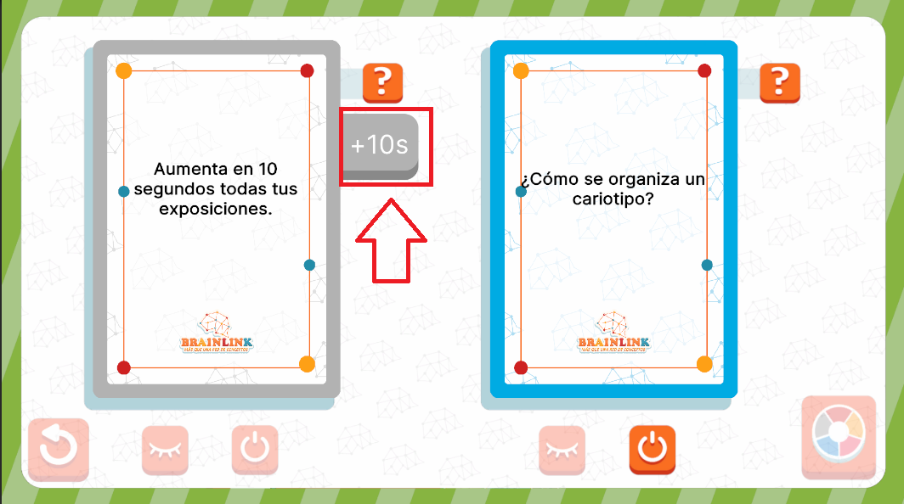

# TimeEventUI



## Descripción

**TimeEventUI** es una "interfaz" especial, ya que NO es una interfaz ni un modal como tal, sino un componente que forma parte de otra interfaz (en este caso, forma parte del modificador de **EventCardManagementUI**). Su función principal es mostrar que las cartas de evento de tipo **Time** han sido activadas. **TimeEventUI** no cuenta con ningún elemento interactivo, ya que su único propósito es proporcionar una representación visual de los eventos de tiempo sin requerir la intervención del jugador.

---

## Controlador: Modo Normal

Durante el modo normal, **TimeEventUI** es activada una vez se presiona el botón de **Activar Carta**. La carta en sí debe ser de tipo **Time** para que se dispare el evento asociado a la carta **Time**. Todos los eventos asociados a esta carta son iguales en el sentido de que agregan o quitan tiempo del jugador. Por lo tanto, **TimeEventUI** solo está suscrita a un evento: **TimeCard**, el cual maneja las interacciones y cambios de tiempo relacionados con la carta activa gracias a los atributes que recibe (que son de tipo **TimeCardAttributes**).

---

### Flujo de ejecución

El controlador recibe la señal para ser activado tan pronto como el evento es publicado. Dado que **TimeEventUI** no es una interfaz tradicional, este controlador recibe directamente la referencia del modificador que debe aparecer de **EventsUI** y aplica su lógica en el lugar respectivo para activar el modificador. Todo este proceso es realizado directamente en **Init** y es meramente visual, sin interacción ni lógica adicional.

```csharp
namespace UI.Controllers.Views.Normal
{
    public class TimeEventUI : Core.UI
    {
        private GameObject _object;

        //Auxiliar
        private TimeCardAttributes _attributes;

        public TimeEventUI()
        {
            GameEventBus<TimeCardAttributes>.Subscribe("TimeCard", Init);
            Debug.Log("CONSTRUYENDO: TimeEventUI");
        }

        public override void InitInstance(GameObject ui)
        {
            _object = ui;
        }

        public override void Init(object attributes)
        {
            if (attributes.GetType() != typeof(TimeCardAttributes))
            {
                return;
            }
            TimeCardAttributes initGameAttributes = attributes as TimeCardAttributes;
            _attributes = initGameAttributes;
            //Sigue Flujo...
        }
        //Mas métodos...
    }
}
```

Una vez que se aplican las animaciones correspondientes, el controlador avanza al siguiente evento del **EventList**, se envia la señal de evento terminado a **EventsUI** y el objeto deja de ejecutarse. No se cierra como tal, ya que no hay nada que cerrar, simplemente se detiene la ejecución una vez completada la animación y el flujo de eventos continúa.

---

### Commands

Esta interfaz cuenta con los siguientes comandos únicos de **AnimatorCommand**: 
- **ManageModifierCommand**: Usado al activar el evento de EventsUI, aplica las animaciones para hacer al modificador aparecer al lado derecho de la carta.
