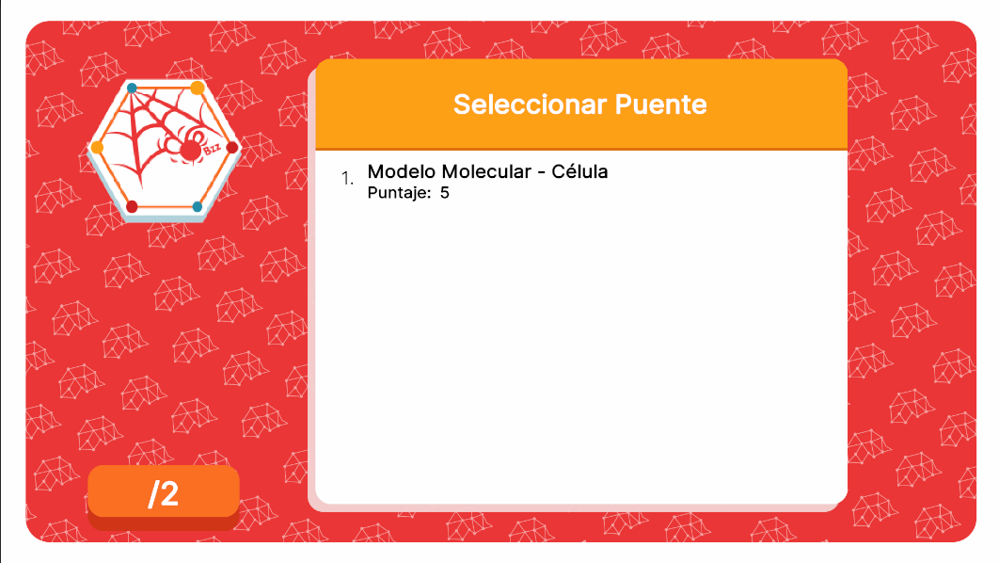
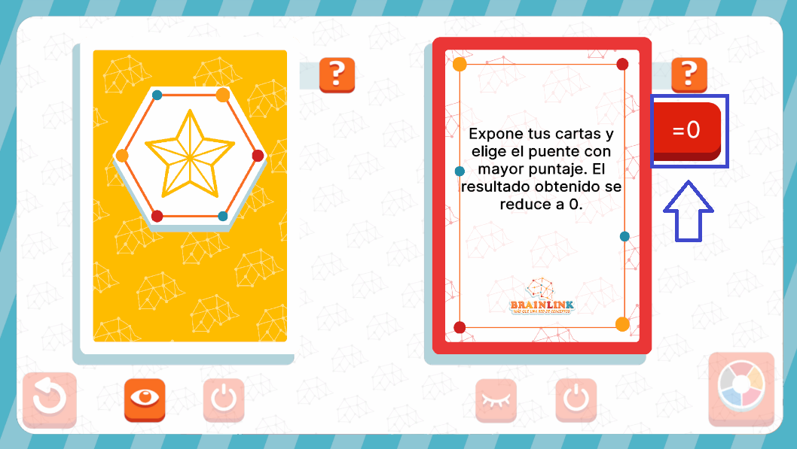

# TrapEventUI



## Descripción

**TrapEventUI** es la interfaz encargada de mostrar los eventos relacionados con las cartas de tipo **Trap**. Estructuralmente, cuenta con múltiples contenedores dinámicos que muestran diferentes elementos e información según lo requiera el evento. Esto incluye un contenedor de información, un listado de opciones, un péndulo y un control de modificador, todos diseñados para facilitar la interacción del jugador con el evento y proporcionar una experiencia dinámica según el juego lo necesite.

---

## Controlador: Modo Normal

Durante el modo normal, **TrapEventUI** se dispara bajo dos condiciones completamente diferentes, lo que provoca que su lógica varíe considerablemente. Este evento aplica sus modificadores después de salir de **EventsUI**. Las dos condiciones en las que este controlador y evento entran en acción son:

- Cuando la carta de evento **Trap** es activada desde **EventsUI**.
- Cuando se está a punto de finalizar el turno, después de que se hayan dado los puntajes desde **MasterUI**.

Dependiendo del caso, el flujo de ejecución varía, así como el tipo de dato que se recibe desde los atributos.

```csharp
namespace UI.Controllers.Views.Normal
{
    public class TrapEventUI : Core.UI
    {
        private GameObject _object;

        //Elementos UI
        private VisualElement _containerMain; // contenedor Principal
        private VisualElement _containerChoose; // Contenedor de opciones
        private VisualElement _containerInfo; // Contenedor de Informacion
        private PendulumComponent _pendulum; // Contenedor Pendulo
        private VisualElement _containerModifier; // Contenedor modificador
        private VisualElement _containerBtnNext; // contenedor del boton Next
        private List<Button> _electionList; // Lista Eleccion

        private Button _btnNext;

        //Auxiliar
        private TrapCardAttributes _attributes; // contexto local
        private TypeConcept _currentTypeConcept; // tipo de concepto a manejar por el evento actual
        private string _selectedConcept; // concepto a mostrar por el evento actual


        //----------FLUJO EJECUCION-----------
        public TrapEventUI()

        {
            GameEventBus<TrapCardAttributes>.Subscribe("TrapCard", InitModifier);
            GameEventBus<NormalModeAttributes.NormalModeInitGameAttributes>.Subscribe("TrapCard_E_TA_1", TrapCard_E_TA_1);
            GameEventBus<NormalModeAttributes.NormalModeInitGameAttributes>.Subscribe("TrapCard_E_TA_2", TrapCard_E_TA_2);
            GameEventBus<NormalModeAttributes.NormalModeInitGameAttributes>.Subscribe("TrapCard_E_TA_3", TrapCard_E_TA_3);
            GameEventBus<NormalModeAttributes.NormalModeInitGameAttributes>.Subscribe("TrapCard_E_TA_4", TrapCard_E_TA_4);
            GameEventBus<NormalModeAttributes.NormalModeInitGameAttributes>.Subscribe("TrapCard_E_TA_5", TrapCard_E_TA_5);
            Debug.Log("CONSTRUYENDO: TrapEventUI");
        }

        public override void InitInstance(GameObject ui)
        {
            _object = ui;
        }
        //Más Metodos...
    }
}
```

---

### Flujo de ejecución

**Flujo "Modificador"**



Durante el flujo de **Modificador**, **TrapEventUI** actúa como un componente, similar a **TimeEventUI**, y no activa una interfaz completa. En su lugar, manipula directamente el elemento UI **modificador** de la carta que fue activada desde **EventsUI**. 

Una vez que el evento se ha completado, se envía una señal de **OnComplete** para que **EventsUI** pueda continuar con su lógica. Esta circunstancia se dispara por una suscripción especial llamada **TrapCard**, la cual activa específicamente un inicializador especial diseñado exclusivamente para la modificación del modificador: **InitModifier**.

```csharp
GameEventBus<TrapCardAttributes>.Subscribe("TrapCard", InitModifier);

public void InitModifier(object attributes)
{
    Debug.Log("INIT!");

    if (attributes.GetType() != typeof(TrapCardAttributes))
    {
        Debug.LogError("TIPO DE DATO DIFERENTE A NORMALMODE");
        return;
    }
    TrapCardAttributes initGameAttributes = attributes as TrapCardAttributes;
    _attributes = initGameAttributes;

    //Logica de manejo del componente...
}
```

En este momento, los datos de contexto son recibidos directamente, igual que en cualquier otro evento, pero con su tipo particular: **TrapCardAttributes**. Esto permite que el modificador se aplique adecuadamente según los atributos específicos de la carta **Trap** activada.

---

**Flujo Activación**

Durante el flujo de activación, se activa la interfaz en sí. El flujo de ejecución varía dependiendo de la carta de evento en cuestión, pero todos los flujos pasan por **Init** al comenzar. Esto se debe a que **Init** se encarga de entregar el contexto de la partida a la interfaz y se asegura de que el objeto se active llamando a **OpenModal** para la inicialización automática y la búsqueda de las referencias UI de la interfaz una vez que el evento es disparado.

Es importante destacar que, en las suscripciones, **Init** en vez de recibir un **TrapCardAttributes**, recibe un **NormalModeAttributes**. Esto se debe a que, a estas alturas, técnicamente ya se está fuera de la fase de eventos. Sin embargo, esto NO quiere decir que no se entreguen los datos necesarios, ya que, en realidad, lo que se entrega es un **TrapCardAttributes** envuelto en un **NormalModeAttributes**. Esta estructura asegura que la lógica y los datos del evento se manejen adecuadamente durante el flujo del juego.

```csharp
public override void Init(object attributes)
{
    if (attributes.GetType() != typeof(NormalModeAttributes.NormalModeInitGameAttributes))
    {
        Debug.LogError("TIPO DE DATO DIFERENTE A NORMALMODE");
        return;
    }
    NormalModeAttributes.NormalModeInitGameAttributes initGameAttributes = attributes as NormalModeAttributes.NormalModeInitGameAttributes; //Envoltorio
    _attributes = initGameAttributes.trapCardAttributes; // Recepción de datos

    GameEventBus<NormalMode>.Instance.uiManager.modalManager.OpenModal<string>(typeof(TrapEventUI)); // Apertura Automatica

}
```

Igualmente, la lógica de cada evento está separada individualmente por el ID de cada **TrapCard**, lo que permite que cada carta tenga su propia acción y flujo de ejecución. Al final de cada flujo, se cierra el modal y se pasa al siguiente **ListEvent**, permitiendo que el flujo del juego continúe.

```csharp
 //----------LOGICA EVENTOS-----------
private void TrapCard_E_TA_1(object attributes)
{
    Init(attributes); //Inicializa Init

    //Sigue flujo del evento...
}

private void TrapCard_E_TA_2(object attributes)
{
    Init(attributes); //Inicializa Init

    //Sigue flujo del evento...
    
}
private void TrapCard_E_TA_3(object attributes)
{
    Init(attributes); //Inicializa Init

    //Sigue flujo del evento...
}

private void TrapCard_E_TA_4(object attributes)
{
    Init(attributes); //Inicializa Init

    //Sigue flujo del evento...
}

private void TrapCard_E_TA_5(object attributes)
{
    Init(attributes); //Inicializa Init

    //Sigue flujo del evento...
}
```

---

### Commands

Esta interfaz cuenta con los siguientes comandos únicos de **AnimatorCommand**: 
- **ManageModifierCommand**: Usado al activar el evento de EventsUI, aplica las animaciones para hacer al modificador aparecer al lado derecho de la carta.
- **ShowElements**: Usado para transiciones entre fases del evento, para animar la entrada y salida de contenedores y elementos dinamicamente.
