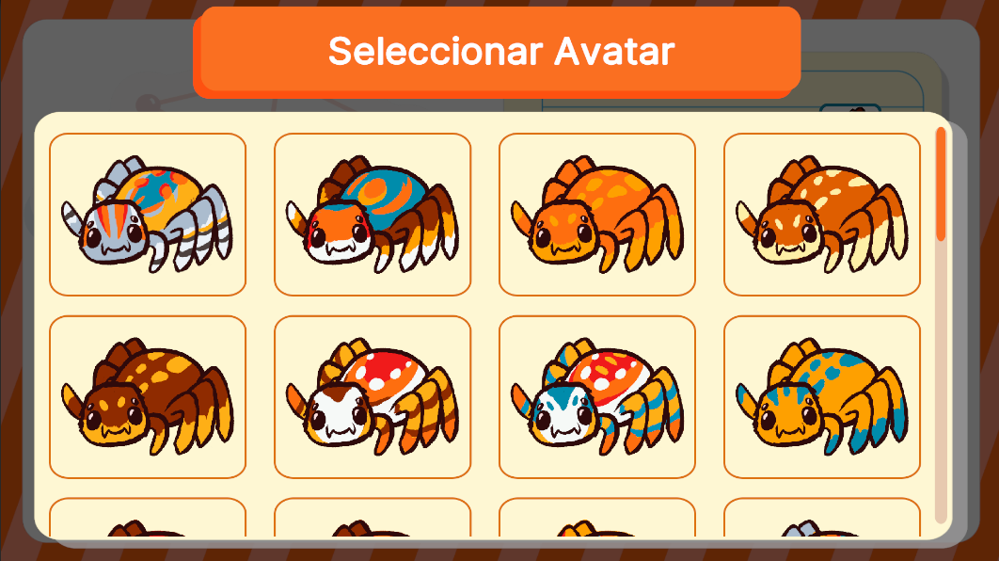

# AvatarSelectionUI



## Descripción

**AvatarSelectionUI** está diseñada para permitir la selección del avatar de un jugador. Esta interfaz está pensada para trabajar en conjunto con otras interfaces que requieran mostrar o realizar una selección de avatar, como parte de un flujo de configuración de partida o de personalización de jugador.

Esta interfaz se comporta de manera diferente según el flujo de ejecución al que pertenezca, ya que su funcionalidad varía dependiendo del controlador que la gestione. El controlador determina qué datos se muestran y cómo se interactúa con las opciones disponibles, permitiendo adaptaciones específicas según el contexto del juego o modalidad seleccionada. 

---

## Controlador: Modo Normal

Durante el flujo normal, **AvatarSelectionUI** se abre exclusivamente desde **PlayerSelectionUI** cuando se selecciona el avatar de un jugador para ser cambiado. Esta interfaz maneja un **ListView** que muestra todos los avatares disponibles en el juego para su selección. Una vez el usuario elige un avatar, la interfaz envía el nombre del avatar seleccionado de vuelta al modal anterior, para que esta interfaz maneje el cambio de avatar correspondiente. Las variables manejadas en este controlador son simples, ya que se limitan a los avatares disponibles para ser mostrados.

```csharp
namespace UI.Controllers.Views.Menu
{
    public class AvatarSelectionUI : Core.UI
    {
        private GameObject _object;

        //Declaracion Elementos
        private VisualElement _containerMain; //Contenedor Principal
        private ListView _avatarsListView; //ListView de avatares

        //Auxiliar
        private List<Sprite> _avatarSprites = new List<Sprite>();
        private GameManagerAttributes.GameManagerModelAttributes _attributes; // Contexto local

        //----------FLUJO EJECUCION-----------
        public AvatarSelectionUI()
        {
            GameEventBus<GameManagerAttributes.GameManagerModelAttributes>.Subscribe("PlayerSelection", Init);
            Debug.Log("CONSTRUYENDO: AvatarSelectionUI");
        }

        public override void InitInstance(GameObject ui)
        {
            _object = ui;
        }

        public override void Init(object attributes)
        {
            if (attributes.GetType() != typeof(GameManagerAttributes.GameManagerModelAttributes))
            {
                Debug.LogError("TIPO DE DATO DIFERENTE A NORMALMODE");
                return;
            }
            _attributes = attributes as GameManagerAttributes.GameManagerModelAttributes;

        }

        public override void SetOpen<T>(T context) where T : class
        {
            //Flujo ejecucion...
        }

        //Más métodos...
    }
}
```