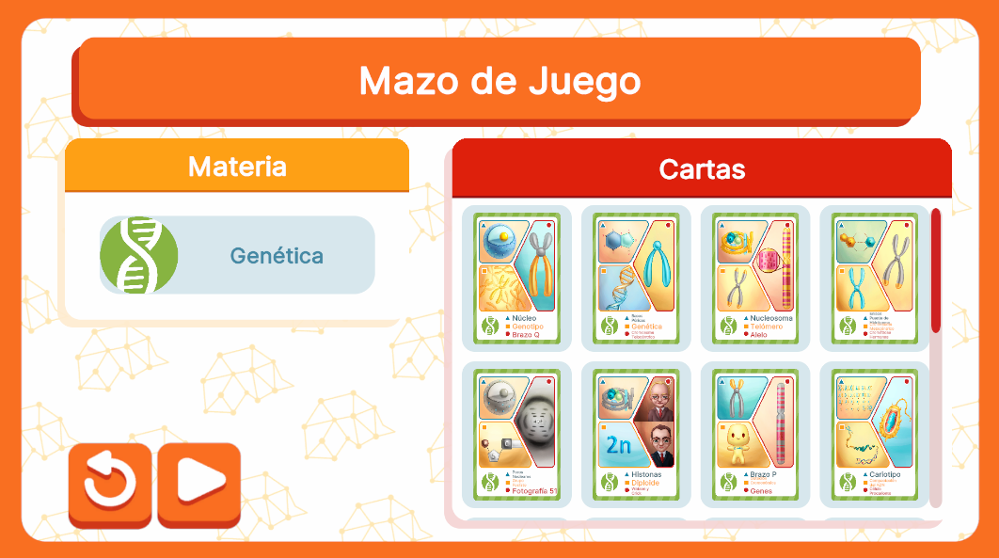

# DeckSelectionUI



## Descripción

La interfaz **DeckSelectionUI** está diseñada para permitir la selección del mazo que se utilizará en la partida. Los jugadores pueden elegir la materia asociada al mazo y visualizar las cartas que lo componen, facilitando la personalización del mazo antes del juego.

Esta interfaz se comporta de manera diferente según el flujo de ejecución al que pertenezca, ya que su funcionalidad varía dependiendo del controlador que la gestione. El controlador determina qué datos se muestran y cómo se interactúa con las opciones disponibles, permitiendo adaptaciones específicas según el contexto del juego o modalidad seleccionada. 

---

## Controlador: Modo Normal

El controlador de **DeckSelectionUI** en el flujo normal gestiona la primera pantalla del flujo, que se abre a través de la opción "offline" de **GameModeSelectionUI**. Este controlador maneja la interacción con los componentes de la interfaz y facilita la navegación entre las diferentes pantallas.

### Variables
- **Componente Scrim**: Un componente de superposición que oscurece el fondo para enfocar la atención en la interfaz de selección del mazo.
- **ListView**: Utilizado para mostrar dinámicamente las cartas asociadas al mazo seleccionado. Este ListView es gestionado para actualizarse con los datos de manera eficiente.
- **Referencias directas a botones**: Se tienen referencias a los botones de selección, regreso y otros botones interactivos en la interfaz.
- **Auxiliares básicos para el manejo de datos**: Se utilizan auxiliares que facilitan la manipulación y carga de los datos, como las cartas del mazo y las materias seleccionadas.

### Funciones
- **Abrir SubjectSelectionUI**: El controlador permite abrir la interfaz **SubjectSelectionUI** cuando el usuario selecciona un mazo, gestionando la transición a la pantalla siguiente.
- **Navegación de regreso**: Proporciona un botón para regresar a **GameModeSelectionUI**, lo que permite al usuario cambiar la opción de flujo.
- **Transición a PlayerSelectionUI**: Una vez seleccionados el mazo y la materia, el controlador gestiona la transición a **PlayerSelectionUI** para continuar con el proceso de selección.

Este controlador organiza la lógica y la navegación en el flujo normal, garantizando que las interacciones del usuario sean fluidas y se actualicen correctamente con los datos necesarios.


```csharp
namespace UI.Controllers.Views.Menu
{
    public class DeckSelectionUI : Core.UI
    {
        private GameObject _object;

        //Elementos UI

        //Contenedores
        private VisualElement _containerMain; //Contenedor Principal
        private ScrimOverlay _scrim; //Fondo oscuro al abrir un modal
        private ListView _cardListView; 

        private Button _btnSelectSubject;
        private Button _btnReturn;
        private Button _btnNext;

        //Auxiliar
        private GameManagerAttributes.GameManagerModelAttributes _attributes; //contexto local
        private bool _isEventSubscribed; // Flag para ver si se esta subscrito a evento (Cerrar modal)
        private Deck _selectedDeck; //Deck seleccionado de las opciones


        //----------FLUJO EJECUCION-----------
        public DeckSelectionUI()
        {
            GameEventBus<GameManagerAttributes.GameManagerModelAttributes>.Subscribe("DeckSelection", Init);
            Debug.Log("CONSTRUYENDO: DeckSelectionUI");
        }

        public override void InitInstance(GameObject ui)
        {
            _object = ui;
        }

        public override void Init(object attributes)
        {
            if (attributes.GetType() != typeof(GameManagerAttributes.GameManagerModelAttributes))
            {
                Debug.LogError("TIPO DE DATO DIFERENTE A NORMALMODE");
                return;
            }
             _attributes = attributes as GameManagerAttributes.GameManagerModelAttributes;<>
        }

        public override void SetOpen<T>(T context) where T : class
        {
            //Flujo ejecucion...
        }

        //Más métodos...
    }
}
```

