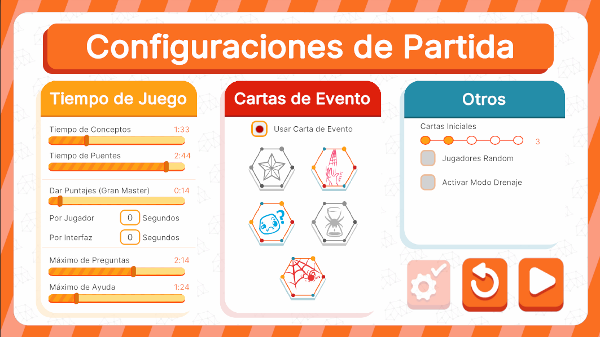

# MatchConfigUI



## Descripción

**MatchConfigUI** está diseñada para el manejo de las configuraciones generales de la partida. Las configuraciones se dividen en varias secciones, como los **tiempos de juego** (para cambiar límites de tiempo de conceptos, puentes, puntajes, etc.), **cartas de evento** (para activar o desactivar las cartas de evento en la partida) y **otras configuraciones** que no encajan en una categoría específica. Además, cuenta con un botón de **preconfiguración** para facilitar ajustes rápidos.

Esta interfaz se comporta de manera diferente según el flujo de ejecución al que pertenezca, ya que su funcionalidad varía dependiendo del controlador que la gestione. El controlador determina qué datos se muestran y cómo se interactúa con las opciones disponibles, permitiendo adaptaciones específicas según el contexto del juego o modalidad seleccionada. 

---

## Controlador: Modo Normal

Durante el flujo normal, **MatchConfigUI** es abierta por **PlayerSelectionUI** y la última pantalla antes de cambiar de escena y comenzar el juego. Maneja la mayoría de sus datos y configuraciones a través de listas o diccionarios. Se encarga de aplicar todas las configuraciones iniciales en los atributos y, por lógica, determina los límites de todos los elementos disponibles para configurar, como barras, toggles o textFields. Esta interfaz prepara la partida antes de pasar al juego y es fundamental para asegurarse de que todas las configuraciones estén correctamente establecidas.

```csharp
namespace UI.Controllers.Views.Menu
{
    public class MatchConfigUI : Core.UI
    {
        private GameObject _object;

        //Elementos UI
        private AragniOverlay _aragni; //Overlay de entrada
        private Dictionary<string, VisualElement> _containerBarOptionUI = new Dictionary<string, VisualElement>(); //Listado de contenedores que conteinen una barra
        private Dictionary<string, BarComponent> _bars = new Dictionary<string, BarComponent>(); //Lista de instanciado para barras
        private Dictionary<string, VisualElement> _containerTextFieldOptionUI = new Dictionary<string, VisualElement>();  //Listado de contenedores que conteinen un text Field
        private Dictionary<string, VisualElement> _containerSimpleToggleOptionUI = new Dictionary<string, VisualElement>(); //Listado de contenedores que conteinen un toggle simple
        private Dictionary<string, Toggle> _events; //listado de Toggles para activado de eventos
        private VisualElement _containerToggleListOptionUI; //Container con lista de opciones Toggle
        private ToggleListComponent _toggleList; //Lista Toggles Componente
        private VisualElement _containerMain; //contenedor Principal

        private Button _btnConfigPresets;
        private Button _btnReturn;
        private Button _btnPlay;

        //Auxiliar
        private GameManagerAttributes.GameManagerModelAttributes _attributes; //contexto Local (Guarda configuraciones)


        //----------FLUJO EJECUCION-----------
        public MatchConfigUI()
        {
            GameEventBus<GameManagerAttributes.GameManagerModelAttributes>.Subscribe("MatchConfiguration", Init);
            Debug.Log("CONSTRUYENDO: MatchConfigUI");
        }

        public override void InitInstance(GameObject ui)
        {
            _object = ui;
        }

        public override void Init(object attributes)
        {
            if (attributes.GetType() != typeof(GameManagerAttributes.GameManagerModelAttributes))
            {
                Debug.LogError("TIPO DE DATO DIFERENTE A NORMALMODE");
                return;
            }
            _attributes = attributes as GameManagerAttributes.GameManagerModelAttributes;
        }

        public override void SetOpen<T>(T context) where T : class
        {
            //Flujo ejecucion...
        }

        //Más métodos...
    }
}
```
