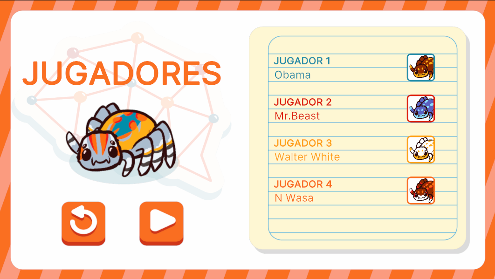

# PlayerSelectionUI



## Descripción

La interfaz **PlayerSelectionUI** está diseñada para permitir la configuración de hasta cuatro jugadores para una partida. Aquí, los jugadores pueden ser seleccionados, y sus opciones de configuración, como nombre y avatar, pueden ser modificadas antes de comenzar la partida.

Esta interfaz se comporta de manera diferente según el flujo de ejecución al que pertenezca, ya que su funcionalidad varía dependiendo del controlador que la gestione. El controlador determina qué datos se muestran y cómo se interactúa con las opciones disponibles, permitiendo adaptaciones específicas según el contexto del juego o modalidad seleccionada. 

---

## Controlador: Modo Normal

En el flujo normal, la interfaz **PlayerSelectionUI** es la tercera pantalla de configuración de la partida. Se abre después de **DeckSelectionUI** y maneja los datos a través de un **TextField** y un listado de contenedores para los hasta cuatro jugadores que se pueden ingresar. Esta pantalla continúa con la interfaz **MatchConfigUI** y puede abrir la interfaz **AvatarSelectionUI**.

Contiene un componente **Scrim**, auxiliares para el manejo de datos del **TextField** y para el manejo del cambio de avatar para un jugador, referencias directas y compuestas (debido a la lista de jugadores), y está vinculada al evento **PlayerSelection**.


```csharp
namespace UI.Controllers.Views.Menu
{
    public class PlayerSelectionUI : Core.UI
    {
        private GameObject _object;

        //Declaracion Elementos
        private List<VisualElement> _containersPlayerUI = new List<VisualElement>(); //Listado de contenedores UI (Jugador)
        private VisualElement _containerMain; //Contenedor Principal
        private ScrimOverlay _scrim; //Fondo oscuro al abrir un modal
        private Button _btnReturn;
        private Button _btnContinue;

        //Auxiliar
        private GameManagerAttributes.GameManagerModelAttributes _attributes; //contexto Local (Guarda configuraciones)
        private List<PlayerNormalMode> _playersData = new List<PlayerNormalMode>(); // Datos de Jugadores a retornar
        private int _currentPlayerIndex; //Jugador al que se esta cambiando su avatar actualmente
        private bool _isEventSubscribed; // Flag para ver si se esta subscrito a evento (Cerrar modal)

        //----------FLUJO EJECUCION-----------
        public PlayerSelectionUI()
        {
            GameEventBus<GameManagerAttributes.GameManagerModelAttributes>.Subscribe("PlayerSelection", Init);
            Debug.Log("CONSTRUYENDO: PlayerSelectionUI");
        }

        public override void InitInstance(GameObject ui)
        {
            _object = ui;
        }

        public override void Init(object attributes)
        {
            if (attributes.GetType() != typeof(GameManagerAttributes.GameManagerModelAttributes))
            {
                Debug.LogError("TIPO DE DATO DIFERENTE A NORMALMODE");
                return;
            }
            _attributes = attributes as GameManagerAttributes.GameManagerModelAttributes;

        }
        

        public override void SetOpen<T>(T context) where T : class
        {
            //Flujo ejecucion...
        }

        //Más métodos...
    }
}
```
