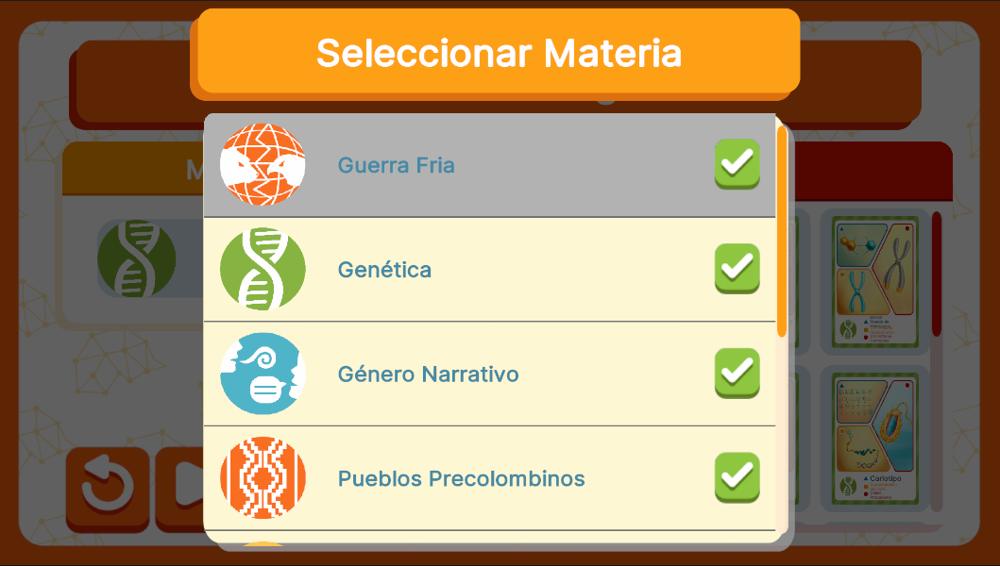

# SubjectSelectionUI



## Descripción

**SubjectSelectionUI** está diseñada para permitir la selección de la materia del mazo. En esta interfaz, se muestra un listado con todas las materias disponibles, permitiendo al usuario elegir la materia que desea asociar al mazo seleccionado.

Esta interfaz se comporta de manera diferente según el flujo de ejecución al que pertenezca, ya que su funcionalidad varía dependiendo del controlador que la gestione. El controlador determina qué datos se muestran y cómo se interactúa con las opciones disponibles, permitiendo adaptaciones específicas según el contexto del juego o modalidad seleccionada. 

---

## Controlador: Modo Normal

La interfaz **SubjectSelectionUI** es abierta exclusivamente desde **DeckSelectionUI**. Forma parte del mismo evento de suscripción para la obtención de atributos. Maneja un **ListView** que, al seleccionar una materia, envía una señal a **DeckSelectionUI** para actualizar el mazo según la materia seleccionada para luego cerrar automaticamente el modal. Este flujo asegura que la materia seleccionada por el jugador se asocie correctamente con el mazo y continúe con la configuración del juego.

```csharp
namespace UI.Controllers.Views.Menu
{
    public class SubjectSelectionUI : Core.UI
    {
        private GameObject _object;

        //Elementos UI
        private VisualElement _containerMain; //Contenedor Principal
        private ListView _subjectListView;

        //Auxiliar
        private GameManagerAttributes.GameManagerModelAttributes _attributes; //Contexto Local

        //----------FLUJO EJECUCION-----------
        public SubjectSelectionUI()
        {
            GameEventBus<GameManagerAttributes.GameManagerModelAttributes>.Subscribe("DeckSelection", Init);
            Debug.Log("CONSTRUYENDO: SubjectSelectionUI");
        }

        public override void InitInstance(GameObject ui)
        {
            _object = ui;
        }

        public override void Init(object attributes)
        {
            if (attributes.GetType() != typeof(GameManagerAttributes.GameManagerModelAttributes))
            {
                Debug.LogError("TIPO DE DATO DIFERENTE A NORMALMODE");
                return;
            }
            _attributes = attributes as GameManagerAttributes.GameManagerModelAttributes;
        }

        public override void SetOpen<T>(T context) where T : class
        {
            //Flujo ejecucion...
        }

        //Más métodos...
    }
}
```

