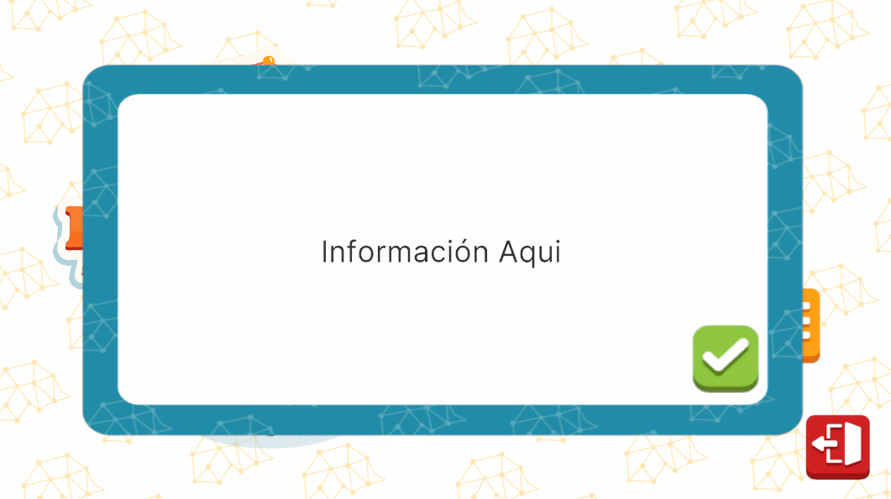

# InfoPopUpUI

## Descripción

**InfoPopUpUI** es una pantalla modal genérica, diseñada para ser llamada automáticamente cuando ocurra un evento fuera de lo común. Puede ser utilizada para mostrar mensajes de error, como un mal inicio de sesión, o para dar avisos importantes, como la expiración de una sesión o cualquier otra notificación relevante que el sistema necesite comunicar al usuario de manera inmediata.
