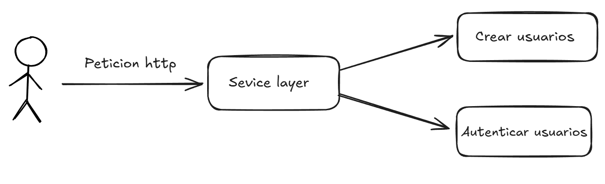

# Arquitectura del servicio

El patrón **Service Layer** es una arquitectura que organiza la lógica de negocio en capas bien definidas. Este modelo actúa como intermediario entre:

AuthModule y UserModule

## Diagrama ilustrativo de service layer:

## Por que se utiliza esta arquitectura?

## **Separación de Responsabilidades**
Asegura que cada capa del sistema tenga un rol claro. Esto se logra al aislar la lógica de negocio de otras capas como la autenticacion de usuarios y la creacion de usuarios

---

### **1. Reutilización de Código**
Los servicios permiten reutilizar la lógica de negocio en múltiples componentes del sistema, eliminando la necesidad de duplicar código.

---

### **2. Mantenibilidad**
Centralizar la lógica de negocio facilita realizar cambios y mejoras. En lugar de buscar modificaciones en diferentes capas o componentes, los desarrolladores pueden enfocarse en los servicios específicos.

---

### **3. Facilita las Pruebas**
Al mantener la lógica de negocio concentrada en los servicios, es más sencillo crear pruebas unitarias y de integración, asegurando que cada componente se comporte según lo esperado.

---

### **4. Escalabilidad**
La organización modular de la lógica de negocio permite manejar el crecimiento de la complejidad del sistema. Es posible extender y organizar las funciones sin afectar otras capas del sistema.

---

### **5. Consistencia**
Centralizar las reglas y procesos asegura que todas las partes del sistema apliquen las mismas normas, reduciendo errores y mejorando la confiabilidad.