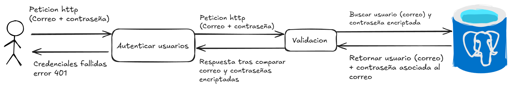
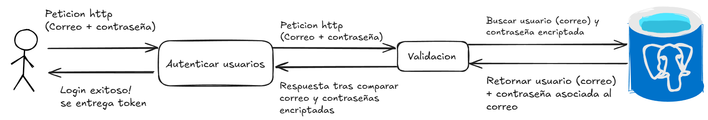
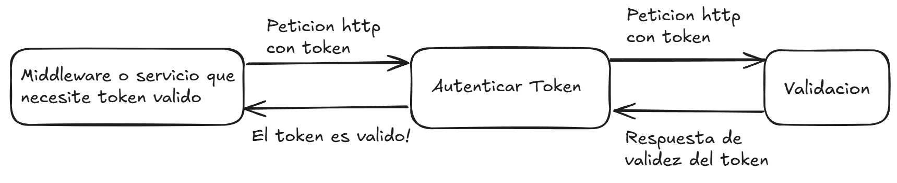
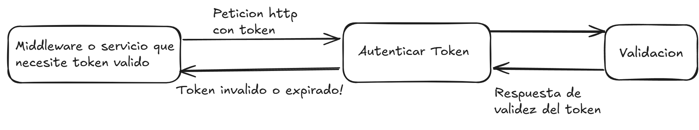

# Controlador de Autenticación (AuthController) y su uso

El **AuthController** es el responsable de manejar las rutas relacionadas con la autenticación de usuarios. En este controlador, tenemos dos rutas principales:

1. **POST `/auth/login`**: Realiza el inicio de sesión de un usuario, validando sus credenciales y generando un token JWT.
2. **POST `/auth/verify-token`**: Verifica la validez de un token JWT previamente generado, asegurando que el usuario sigue autenticado.

## 1. Ruta para Login (`/auth/login`)

La ruta `POST /auth/login` se utiliza para autenticar a un usuario. Esta ruta toma las **credenciales** proporcionadas (correo electrónico y contraseña) y devuelve un **token JWT** si las credenciales son válidas.

### 1. **Entrada (Request)**
   - Recibe un **body** con las siguientes propiedades:
     - `email`: Correo electrónico del usuario.
     - `password`: Contraseña del usuario.

Ejemplo de Petición:

```http
POST /auth/login HTTP/1.1
Host: your-api.com
Content-Type: application/json

{
  "email": "usuario@example.com",
  "password": "contraseña-segura"
}
```

### 2. **Validación**
   - El servicio de autenticación valida las credenciales del usuario contra la base de datos.
   - Si las credenciales son incorrectas, se retorna un **error 401 (Unauthorized)**.

Respuesta de error:

```json
{
  "message": "Credenciales inválidas",
  "statusCode": 401
}
```



### 3. **Generación del Token**
   - Si las credenciales son válidas, el servicio genera un **token JWT** que contiene la información del usuario (como el correo y rol).

Respuesta exitosa:

```json
{
  "message": "Login exitoso",
  "statusCode": 200,
  "token": "jwt-token-generado"
}
```



### 4. **Almacenamiento en Cookies**:
   - El token generado se almacena en una **cookie** segura para mantener la sesión activa.

```typescrypt
 const token = this.authService.generateToken();
```

## 2. Verificación de Token

La ruta `POST /auth/verify-token` permite verificar la validez de un token JWT. Esta ruta es útil para asegurarse de que un usuario sigue autenticado antes de realizar ciertas acciones en la aplicación.

### Entrada (Request)

- **Recibe** el **token JWT** de las cookies que fue almacenado previamente en el login.

### Ejemplo de Petición

```http
POST /auth/verify-token HTTP/1.1
Host: your-api.com
Content-Type: application/json
```

### Verificación del Token

- El **servicio de autenticación** verifica que el token no haya expirado y que sea válido.
- Si el token no es válido o ha expirado, se retorna un **error 403 (Forbidden)**.

### Respuestas (Response)

- Si el token es válido, se devuelve la información decodificada del token (como el correo electrónico y el rol del usuario). (Estado actual, despues solo sera enviada una respuesta de que el token es valido.)

### Respuesta (Actual) si el token es valido:

```json
{
  "message": "Token válido",
  "statusCode": 200,
  "user": {
    "email": "usuario@example.com",
    "rolId": 1
  }
}
```




### Respuesta de token no valido:

```json
{
  "message": "Token inválido o expirado",
  "statusCode": 403
}
```

