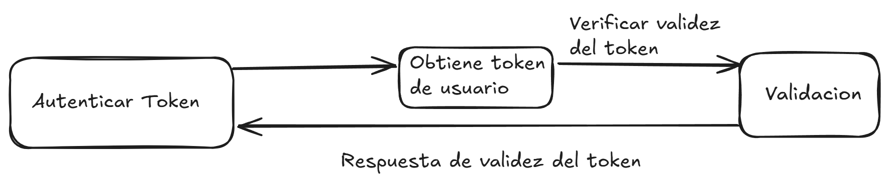

# Servicios de Autenticacion.

En esta sección, configuraremos el servicio de autenticación utilizando **NestJS** y **PostgreSQL**.

## Validación de Usuario

En esta sección, implementamos el método para validar las credenciales del usuario, como su **correo electrónico** y **contraseña**.

### Código para Validar al Usuario

El siguiente código consulta la base de datos para verificar si el correo electrónico proporcionado coincide con un usuario registrado. Luego, usa **bcrypt** para comparar las contraseñas de manera segura.

```typescript
async validateUser(email: string, password: string): Promise<any> {
  // Realiza una búsqueda del usuario con el correo proporcionado
  try {
    const user = await this.findUserByEmail(email);

    if (user) {
      // Verifica si la contraseña proporcionada es válida con el hash almacenado
      const isPasswordValid = await this.comparePassword(password, user.passwordHash);

      if (isPasswordValid) {
        // Si la contraseña es válida, guarda la información del usuario
        this.currentUser = {
          email: user.email,
          rolId: user.roleId,
        };
        return this.currentUser;
      } else {
        // Si la contraseña no es válida
        return null;
      }
    } else {
      // Si el usuario no existe
      return null;
    }
  } catch (error) {
    // Maneja los posibles errores sin exponer detalles
    throw new Error('Error al validar el usuario');
  }
}
```



## Generación de Tokens JWT

Aquí implementamos la funcionalidad para generar un **token JWT** cuando el usuario se autentica correctamente.

### Código para Generar un Token

Cuando el usuario se autentica correctamente, generamos un **token JWT** que incluye el correo electrónico y el rol del usuario.

```typescript
generateToken(): string {
  // Verifica si hay un usuario actual
  if (!this.currentUser) {
    throw new Error('No hay usuario actual para generar un token');
  }

  // Prepara el contenido del token con la información del usuario
  const payload = {
    email: this.currentUser.email,
    rolId: this.currentUser.rolId,
  };

  // Define una clave secreta y genera el token con un tiempo de expiración
  const secretKey = process.env.JWT_SECRET || 'clave_secreta_defecto';
  const token = this.createJWT(payload, secretKey, { expiresIn: '1h' });

  return token;
}
```

## Verificación de Tokens JWT

Este método se encarga de verificar la validez de un token JWT proporcionado. Si el token es válido, lo decodifica y devuelve la información contenida en él.

### Código para Verificar el Token

El siguiente código recibe un token, lo verifica y, si es válido, devuelve los datos decodificados (Actual):

```typescript
async verifyToken(token: string): Promise<any> {
  try {
    // Obtiene una clave secreta y verifica la validez del token
    const secretKey = process.env.JWT_SECRET || 'clave_secreta_defecto';
    const decodedToken = this.verifyJWT(token, secretKey);
    return decodedToken;  // Devuelve la información decodificada
  } catch (error) {
    // Si ocurre algún error en la verificación, retorna null
    return null;
  }
}
```


## Manejo de Cookies para Autenticación

En esta sección, gestionamos las cookies del navegador para almacenar el token JWT y permitir la autenticación persistente.

### Código para Agregar el Token a las Cookies

Cuando un usuario se autentica, podemos almacenar el token JWT en una cookie para que se mantenga entre sesiones.

```typescript
addTokenToCookies(res: Response, token: string): void {
  res.cookie('auth_token', token, {
    httpOnly: true,
    secure: process.env.NODE_ENV === 'production',
    sameSite: 'none',
    maxAge: 3600000, // 1 hora
  });
}
```

## Verificación del Token y Respuesta

Este método permite verificar el token JWT de una solicitud y responder al cliente con un mensaje adecuado.

### Código para Verificar el Token y Responder

El siguiente código maneja la verificación del token y responde al cliente con un mensaje de éxito o error según la validez del token.

```typescript
verifyTokenAndRespond(res: Response, token: string | null): void {
  if (token) {
    const decoded = this.verifyToken(token);
    if (decoded) {
      res.status(202).send({ message: 'Token válido', decoded });
    } else {
      res.status(204).send({ message: 'Token expirado o inválido' });
    }
  } else {
    res.status(204).send({ message: 'No token provided' });
  }
}
```