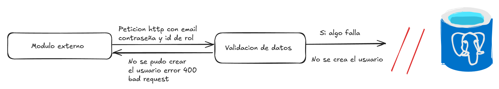
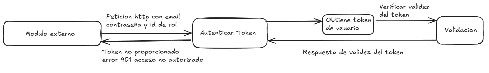
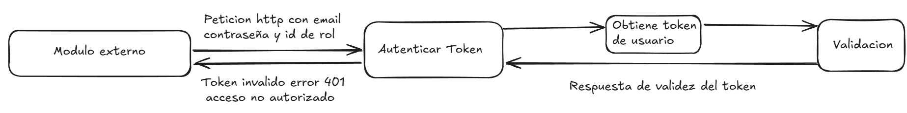
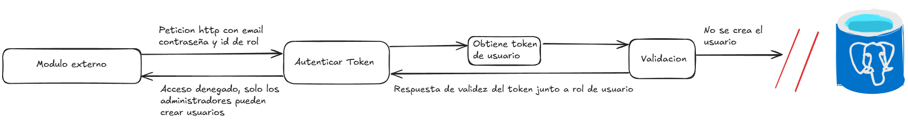
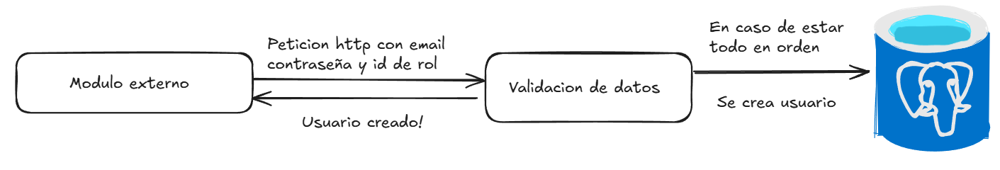

# Controlador para crear usuarios

El `UsersController` en NestJS se encarga de manejar las rutas relacionadas con los usuarios. En este caso, define una ruta para la creación de un nuevo usuario, que solo es accesible para administradores.

## Rutas Definidas

## 1. Ruta para Crear un Nuevo Usuario

#### Descripción
La ruta `POST /users/create` se utiliza para crear un nuevo usuario en el sistema. Solo los usuarios con rol de **administrador** (rol_id = 1) pueden realizar esta operación. Esta ruta recibe los datos necesarios (email, password, rol_id) para crear un nuevo usuario.

### Flujo de la Ruta

### 1. **Validación de Datos de Entrada**
   Se verifica que los parámetros requeridos (`email`, `password`, `rol_id`) estén presentes en el cuerpo de la solicitud. Si falta alguno de ellos, se responde con un **400 Bad Request**.

```typescript
if (!email || !password || !rol_id) {
  return res.status(HttpStatus.BAD_REQUEST).json({
    message: 'Faltan datos requeridos: email, password, o rol_id.',
  });
}
```



### 2. **Verificación del Token de Autenticación**
   Se obtiene el token JWT de las cookies de la solicitud a través del servicio de autenticación `auth.controller`. Si no se proporciona el token, se responde con un **401 Unauthorized**.

```typescript
const token = this.authService.getTokenFromCookies(req);

if (!token) {
  return res.status(HttpStatus.UNAUTHORIZED).json({
    message: 'Token no proporcionado. Acceso no autorizado.',
  });
}
```




### 3. **Verificación de la Validez del Token**
   El token es verificado mediante el servicio `AuthService`. Si el token no es válido o ha expirado, se responde con un **401 Unauthorized**.

```typescript
const decodedToken = await this.authService.verifyToken(token);

if (!decodedToken) {
  return res.status(HttpStatus.UNAUTHORIZED).json({
    message: 'Token inválido o expirado. Acceso no autorizado.',
  });
}
```



### 4. **Autorización del Rol del Usuario**
   Se extrae el `rolId` del token decodificado y se verifica que el usuario autenticado tenga el rol de **administrador** (rol_id = 1). Si no es así, se responde con un **403 Forbidden**.

```typescript
const userRolId = decodedToken.rolId;

if (userRolId !== 1) {
  return res.status(HttpStatus.FORBIDDEN).json({
    message: 'Acceso denegado. Solo los administradores pueden crear usuarios.',
  });
}
```



### 5. **Creación del Usuario**
   Si el usuario autenticado es un administrador, se procede a crear el nuevo usuario llamando al servicio `UsersService`. Si la operación es exitosa, se responde con un **201 Created** y los detalles del usuario creado.

```typescript
const result = await this.usersService.createUser(email, password, rol_id);
return res.status(HttpStatus.CREATED).json(result);
```

