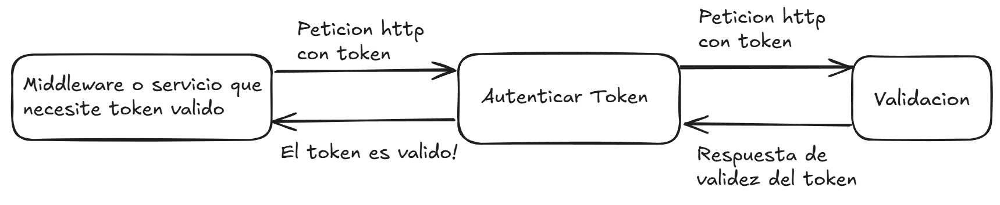
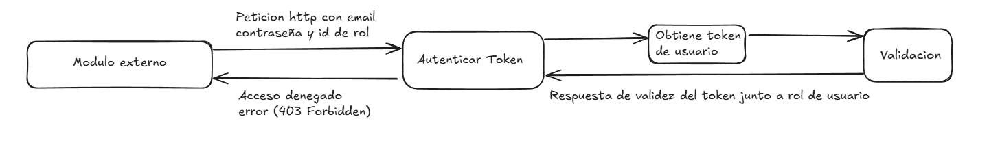
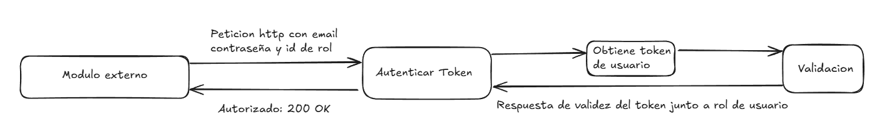

# Controlador para crear usuarios

El `UsersController` en NestJS se encarga de manejar las rutas relacionadas con los usuarios. En este caso, define una ruta para la creación de un nuevo usuario, que solo es accesible para administradores.

## Rutas Definidas

## 1. Verificar Rol de Usuario (Establecimiento o Profesor)

#### Descripción
La ruta `POST /users/verify-establecimiento-docente` verifica si el usuario autenticado tiene un rol de establecimiento o profesor. Esta verificación es necesaria para determinar si el usuario puede realizar ciertas acciones, como crear otros usuarios (Esta ruta se utilizara para los permisos).

### Bloque de codigo:

```typescript
@Post('verify-establecimiento-docente')
async verifyUserRoleEstablecimientoDocente(@Req() req, @Res() res) {
  const isAllowed = await this.verifyUserRole(req, []);
  if (!isAllowed) {
    return res.status(403).json({ message: 'Acceso denegado.' });
  }
  return res.status(200).json({ message: 'Rol verificado correctamente' });
}
```

### Flujo de la Ruta

1. **Obtención del Token**
Se extrae el token JWT de las cookies de la solicitud.
2. **Verificación del Token**
Se verifica la validez del token utilizando el servicio AuthService.

**Respuesta en caso de tener token invalido**


**Respuesta en caso de tener token valido**


3. **Extracción del Rol**
Se obtiene el rolId del token decodificado.

4. **Validación del Rol**
Se verifica si el rolId está dentro de los roles permitidos (administrador/profesor).

**Respuestas**
Si no tiene el rol permitido, se retorna un error (403 Forbidden).


Si el usuario tiene el rol permitido, se retorna una respuesta exitosa (200 OK).


## 2. Verificar Rol de Usuario (Solo Admin)

### Descripción
La ruta POST /users/verify-establecimiento verifica si el usuario autenticado tiene un rol de Establecimiento. Esta ruta es más restrictiva y solo permite el acceso a usuarios con permisos de administrador.

### Bloque de codigo:

```typescript
@Post('verify-establecimiento')
async verifyUserRoleEstablecimiento(@Req() req, @Res() res) {
  const isAllowed = await this.verifyUserRole(req, [1]);
  if (!isAllowed) {
    return res.status(403).json({ message: 'Acceso denegado.' });
  }
  return res.status(200).json({ message: 'Rol verificado correctamente' });
}
```

### Flujo de la Ruta

1. **Obtención del Token**
Se extrae el token JWT de las cookies de la solicitud.
2. **Verificación del Token**
Se verifica la validez del token utilizando el servicio AuthService.

**Respuesta en caso de tener token invalido**


**Respuesta en caso de tener token valido**


3. **Extracción del Rol**
Se obtiene el rolId del token decodificado.

4. **Validación del Rol**
Se verifica si el rolId está dentro de los roles permitidos (administrador/profesor).

**Respuestas**
Si no tiene el rol permitido, se retorna un error (403 Forbidden).


Si el usuario tiene el rol permitido, se retorna una respuesta exitosa (200 OK).


## 3. Crear un Nuevo Usuario
### Descripción
La ruta POST /users/create permite la creación de un nuevo usuario en el sistema. Solo los usuarios con rol de administrador (rolId = 1) pueden acceder a esta ruta.

### Bloque de codigo:

```typescript
@Post('create')
async createUser(@Body() body, @Req() req, @Res() res) {
  const { userId, email, password, rol_id } = body;
  if (!userId || !email || !password || !rol_id) {
    return res.status(400).json({ message: 'Faltan datos requeridos.' });
  }
  try {
    await this.usersService.createUser(userId, email, password, rol_id);
    return res.status(201).json({ message: 'Usuario creado exitosamente.' });
  } catch (error) {
    return res.status(500).json({ message: 'Error al crear el usuario.' });
  }
}
```

### Parámetros de Entrada
1. userId: Identificador único del usuario.
2. email: Dirección de correo electrónico del usuario.
3. password: Contraseña del usuario.
4. rol_id: Rol del usuario.

### Flujo de la Ruta
1. Validación de Datos : Se verifica que todos los campos necesarios estén presentes en el cuerpo de la solicitud. Si falta alguno, se devuelve un error 400 Bad Request.

2. Verificación del Token : Se obtiene el token JWT de las cookies y se verifica su validez.

**Respuesta en caso de tener token invalido**


**Respuesta en caso de tener token valido**


3. Creación del Usuario : Si todas las validaciones son exitosas, se llama al servicio UsersService para crear el usuario. Si la operación es exitosa, se devuelve un mensaje indicando que el usuario ha sido creado (201 Created).