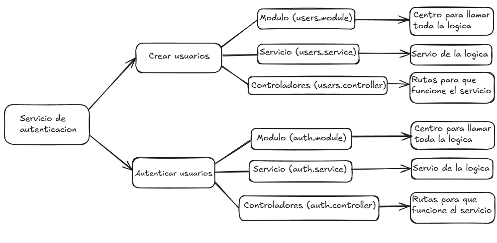

# Estructura del proyecto
```
AuthSystem/
│
├── public/                           # Archivos públicos accesibles desde el navegador
│   ├── assets/                       # Carpeta para recursos estáticos (imágenes, íconos, etc.)
│   ├── index.html                    # Página HTML principal
│   └── vite.svg                      # Icono o recurso de imagen relacionado con Vite
│
├── src/                              # Código fuente de la aplicación
│   ├── auth/                         # Módulo de autenticación
│   │   ├── auth.controller.ts        # Controlador de autenticación (maneja las solicitudes HTTP)
│   │   ├── auth.module.ts            # Módulo de autenticación (conecta los componentes relacionados)
│   │   └── auth.service.ts           # Servicio de autenticación (lógica de negocio)
│   │
│   ├── database/                     # Módulo de base de datos
│   │   └── database.module.ts        # Configuración de la base de datos y conexiones
│   │
│   ├── users/                        # Módulo de usuarios
│   │   ├── users.controller.ts       # Controlador de usuarios (gestiona las rutas relacionadas con usuarios)
│   │   ├── users.module.ts           # Módulo de usuarios (organiza el código relacionado con usuarios)
│   │   └── users.service.ts          # Servicio de usuarios (lógica relacionada con la gestión de usuarios)
│   │
│   ├── app.module.ts                 # Módulo principal de la aplicación
│   └── main.ts                       # Punto de entrada de la aplicación (arranca la app)
│
├── .env                              # Variables de entorno (configuración privada)
├── package.json                      # Dependencias y scripts del proyecto
├── tsconfig.json                     # Configuración de TypeScript
└── vite.config.ts                    # Configuración de Vite (si estás usando Vite como bundler)
```

## Diagrama del proyecto:

